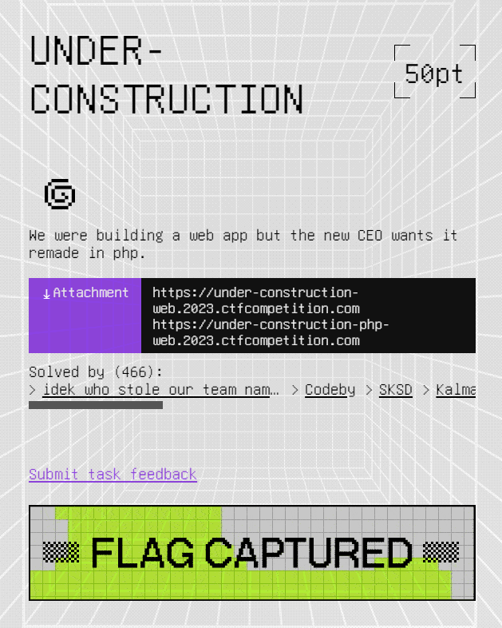
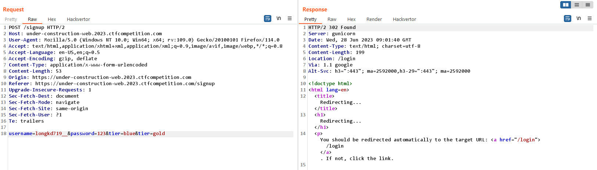
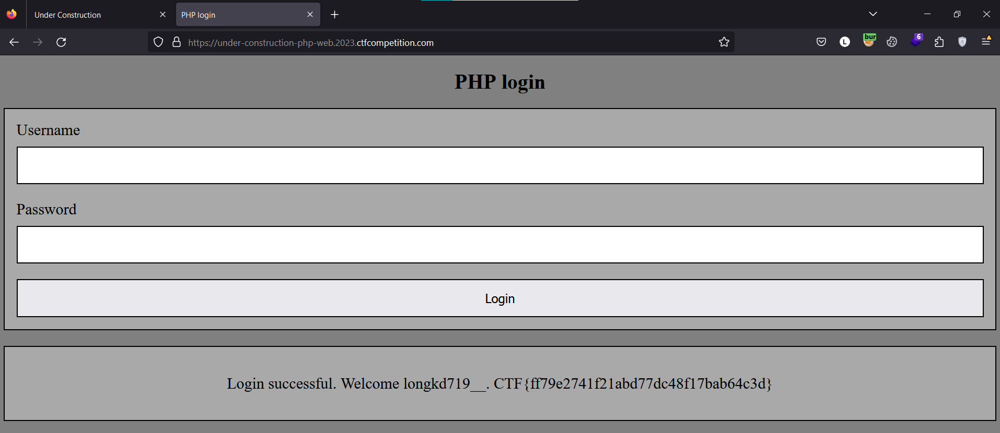

# UNDER-CONSTRUCTION



```
.
├── flask
│   ├── app.py
│   ├── authorized_routes.py
│   ├── models.py
│   ├── requirements.txt
│   ├── templates
│   │   ├── index.html
│   │   ├── login.html
│   │   ├── profile.html
│   │   ├── signup.html
│   │   └── wrapper.html
│   └── unauthorized_routes.py
└── php
    ├── account_cleanup.php
    ├── account_migrator.php
    ├── index.php
    └── style.css

3 directories, 14 files
```

Challenge này được dựng lên bởi 2 ứng dụng web sử dụng Flask và PHP

Ứng dụng Flask thì có các route `/login, /signup,/logout, /profile `

```python
import os
import logging
from flask_login import login_user, login_required, logout_user
from flask import Blueprint, render_template, redirect, url_for, request, flash
from werkzeug.security import generate_password_hash, check_password_hash
import models
import requests
from app import db, PHP_HOST, TOKEN

authorized = Blueprint('authorized', __name__)

@authorized.route('/login')
def login():
    return render_template('login.html')

@authorized.route('/login', methods=['POST'])
def login_post():
    username = request.form.get('username')
    password = request.form.get('password')
    remember = True if request.form.get('remember') else False

    user = models.User.query.filter_by(username=username).first()

    if not user or not check_password_hash(user.password, password):
        flash('Please check your login details and try again.')
        return redirect(url_for('authorized.login'))

    login_user(user, remember=remember)
    return redirect(url_for('unauthorized.profile'))

@authorized.route('/signup')
def signup():
    return render_template('signup.html', tiers=models.Tier)

@authorized.route('/signup', methods=['POST'])
def signup_post():
    raw_request = request.get_data()
    username = request.form.get('username')
    password = request.form.get('password')
    tier = models.Tier(request.form.get('tier'))

    if(tier == models.Tier.GOLD):
        flash('GOLD tier only allowed for the CEO')
        return redirect(url_for('authorized.signup'))

    if(len(username) > 15 or len(username) < 4):
        flash('Username length must be between 4 and 15')
        return redirect(url_for('authorized.signup'))

    user = models.User.query.filter_by(username=username).first()

    if user:
        flash('Username address already exists')
        return redirect(url_for('authorized.signup'))

    new_user = models.User(username=username, 
        password=generate_password_hash(password, method='sha256'), tier=tier.name)

    db.session.add(new_user)
    db.session.commit()

    requests.post(f"http://{PHP_HOST}:1337/account_migrator.php", 
        headers={"token": TOKEN, "content-type": request.headers.get("content-type")}, data=raw_request)
    return redirect(url_for('authorized.login'))

@authorized.route('/logout')
@login_required
def logout():
    logout_user()
    return redirect(url_for('unauthorized.index'))

```

Còn ứng dụng PHP thì có chức năng signup và login

```php
<?php

if ($_SERVER['REQUEST_METHOD'] !== 'POST') {
	http_response_code(400);
	exit();
}

if(!isset($_SERVER['HTTP_TOKEN'])) {
	http_response_code(401);
	exit();
}

if($_SERVER['HTTP_TOKEN'] !== getenv("MIGRATOR_TOKEN")) {
	http_response_code(401);
	exit();
}

if (!isset($_POST['username']) || !isset($_POST['password']) || !isset($_POST['tier'])) {
	http_response_code(400);
	exit();
}

if (!is_string($_POST['username']) || !is_string($_POST['password']) || !is_string($_POST['tier'])) {
	http_response_code(400);
	exit();
}

insertUser($_POST['username'], $_POST['password'], $_POST['tier']);


function insertUser($username, $password, $tier)
{
	$hash = password_hash($password, PASSWORD_BCRYPT);
	if($hash === false) {
		http_response_code(500);
		exit();
	}
	$host = getenv("DB_HOST");
	$dbname = getenv("MYSQL_DATABASE");
	$charset = "utf8";
	$port = "3306";

	$sql_username = "forge";
	$sql_password = getenv("MYSQL_PASSWORD");
	try {
		$pdo = new PDO(
			dsn: "mysql:host=$host;dbname=$dbname;charset=$charset;port=$port",
			username: $sql_username,
			password: $sql_password,
		);

		$pdo->exec("CREATE TABLE IF NOT EXISTS Users (username varchar(15) NOT NULL, password_hash varchar(60) NOT NULL, tier varchar(10) NOT NULL, PRIMARY KEY (username));");
		$stmt = $pdo->prepare("INSERT INTO Users Values(?,?,?);");
		$stmt->execute([$username, $hash, $tier]);
		echo "User inserted";
	} catch (PDOException $e) {
		throw new PDOException(
			message: $e->getMessage(),
			code: (int) $e->getCode()
		);
	}
}


?>

```

Tại `index.php` cho mình biết là mình sẽ có được flag nếu như account của mình có tier là GOLD

```php
<?php 
// Copyright 2023 Google LLC
//
// Licensed under the Apache License, Version 2.0 (the "License");
// you may not use this file except in compliance with the License.
// You may obtain a copy of the License at
//
//     https://www.apache.org/licenses/LICENSE-2.0
//
// Unless required by applicable law or agreed to in writing, software
// distributed under the License is distributed on an "AS IS" BASIS,
// WITHOUT WARRANTIES OR CONDITIONS OF ANY KIND, either express or implied.
// See the License for the specific language governing permissions and
// limitations under the License.
?>

<!DOCTYPE html>
<html>

<head>
    <meta name="viewport" content="width=device-width, initial-scale=1">
    <title>PHP login</title>
    <link rel="stylesheet" href="style.css">
</head>

<body>
    <h1>PHP login</h1>
    <div class="container">
        <form action="" method="POST">
            <label for="username">Username</label>
            <input type="text" name="username" id="username" required />
            <label for="password">Password</label>
            <input type="password" name="password" id="password" required />
            <button>Login</button>
        </form>
    </div>
    <?php
    $response = getResponse();
    if (isset($response)) {
        echo "<div class=\"container\">
            <p>{$response}</p>
        </div>";
    }
    ?>
</body>
</html>
<?php

function getResponse()
{
    if (!isset($_POST['username']) || !isset($_POST['password'])) {
        return NULL;
    }

    $username = $_POST['username'];
    $password = $_POST['password'];

    if (!is_string($username) || !is_string($password)) {
        return "Please provide username and password as string";
    }

    $tier = getUserTier($username, $password);

    if ($tier === NULL) {
        return "Invalid credentials";
    }

    $response = "Login successful. Welcome " . htmlspecialchars($username) . ".";

    if ($tier === "gold") {
        $response .= " " . getenv("FLAG");
    }

    return $response;
}

function getUserTier($username, $password)
{
    $host = getenv("DB_HOST");
    $dbname = getenv("MYSQL_DATABASE");
    $charset = "utf8";
    $port = "3306";

    $sql_username = "forge";
    $sql_password = getenv("MYSQL_PASSWORD");
    try {
        $pdo = new PDO(
            dsn: "mysql:host=$host;dbname=$dbname;charset=$charset;port=$port",
            username: $sql_username,
            password: $sql_password,
        );

        $stmt = $pdo->prepare("SELECT password_hash, tier FROM Users WHERE username = ?");
        $stmt->execute([$username]);
        if ($row = $stmt->fetch()) {
            if (password_verify($password, $row['password_hash'])) {
                return $row['tier'];
            }
            var_dump($row);
        }
        return NULL;

    } catch (PDOException $e) {
        throw new PDOException(
            message: $e->getMessage(),
            code: (int) $e->getCode()
        );
    }
}

?>
```

Vậy nên mục tiêu trước mắt của mình ở đây là reg được account có tier là GOLD. 

Tuy nhiên ở trong chức năng insert user trong ứng dụng PHP đã chặn các request từ user, chỉ có cho phép server thực hiện các request

```php
if ($_SERVER['REQUEST_METHOD'] !== 'POST') {
	http_response_code(400);
	exit();
}

if(!isset($_SERVER['HTTP_TOKEN'])) {
	http_response_code(401);
	exit();
}

if($_SERVER['HTTP_TOKEN'] !== getenv("MIGRATOR_TOKEN")) {
	http_response_code(401);
	exit();
}
```

Mình có để ý ở trong source code ở chức năng `/signup` của cả 2 ứng dụng

```python
# Flask 
@authorized.route('/signup', methods=['POST'])
def signup_post():
    raw_request = request.get_data()
    username = request.form.get('username')
    password = request.form.get('password')
    tier = models.Tier(request.form.get('tier'))

    if(tier == models.Tier.GOLD):
        flash('GOLD tier only allowed for the CEO')
        return redirect(url_for('authorized.signup'))

    if(len(username) > 15 or len(username) < 4):
        flash('Username length must be between 4 and 15')
        return redirect(url_for('authorized.signup'))

    user = models.User.query.filter_by(username=username).first()

    if user:
        flash('Username address already exists')
        return redirect(url_for('authorized.signup'))

    new_user = models.User(username=username, 
        password=generate_password_hash(password, method='sha256'), tier=tier.name)

    db.session.add(new_user)
    db.session.commit()

    requests.post(f"http://{PHP_HOST}:1337/account_migrator.php", 
        headers={"token": TOKEN, "content-type": request.headers.get("content-type")}, data=raw_request)
    return redirect(url_for('authorized.login'))
```

```php
// PHP
<?php

//  ...

if (!isset($_POST['username']) || !isset($_POST['password']) || !isset($_POST['tier'])) {
	http_response_code(400);
	exit();
}

if (!is_string($_POST['username']) || !is_string($_POST['password']) || !is_string($_POST['tier'])) {
	http_response_code(400);
	exit();
}

insertUser($_POST['username'], $_POST['password'], $_POST['tier']);


function insertUser($username, $password, $tier)
{
	$hash = password_hash($password, PASSWORD_BCRYPT);
	if($hash === false) {
		http_response_code(500);
		exit();
	}
	$host = getenv("DB_HOST");
	$dbname = getenv("MYSQL_DATABASE");
	$charset = "utf8";
	$port = "3306";

	$sql_username = "forge";
	$sql_password = getenv("MYSQL_PASSWORD");
	try {
		$pdo = new PDO(
			dsn: "mysql:host=$host;dbname=$dbname;charset=$charset;port=$port",
			username: $sql_username,
			password: $sql_password,
		);

		$pdo->exec("CREATE TABLE IF NOT EXISTS Users (username varchar(15) NOT NULL, password_hash varchar(60) NOT NULL, tier varchar(10) NOT NULL, PRIMARY KEY (username));");
		$stmt = $pdo->prepare("INSERT INTO Users Values(?,?,?);");
		$stmt->execute([$username, $hash, $tier]);
		echo "User inserted";
	} catch (PDOException $e) {
		throw new PDOException(
			message: $e->getMessage(),
			code: (int) $e->getCode()
		);
	}
}


?>

```

Ứng dụng Flask thì có kiểm tra đầu vào tier phải khác GOLD còn ứng dụng PHP thì không

```python
    if(tier == models.Tier.GOLD):
        flash('GOLD tier only allowed for the CEO')
        return redirect(url_for('authorized.signup'))
```

Mà ứng dụng Flask cũng tạo account bằng cách post data lên ứng dụng PHP để signup 

```python
    requests.post(f"http://{PHP_HOST}:1337/account_migrator.php", 
        headers={"token": TOKEN, "content-type": request.headers.get("content-type")}, data=raw_request)
```

Sự khác biệt giữa Flask và PHP khi lấy các giá trị param cũng là khác nhau. Ví dụ mình có một chuỗi query `a=1&a=2` thì Flask sẽ lấy giá trị đầu tiên là 1 còn PHP thì lấy giá trị cuối là 2 -> xảy ra lỗ hổng HTTP Parameter Pollution

`signup` với data như sau

```
username=longkd719__&password=123&tier=blue&tier=gold
```



Qua login bên ứng dụng PHP và mình có được flag



`Flag: CTF{ff79e2741f21abd77dc48f17bab64c3d}`