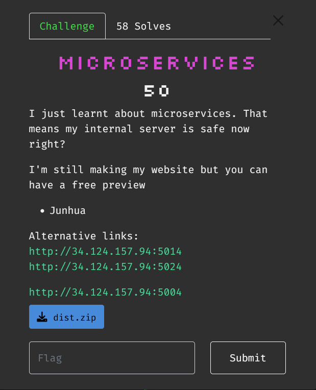
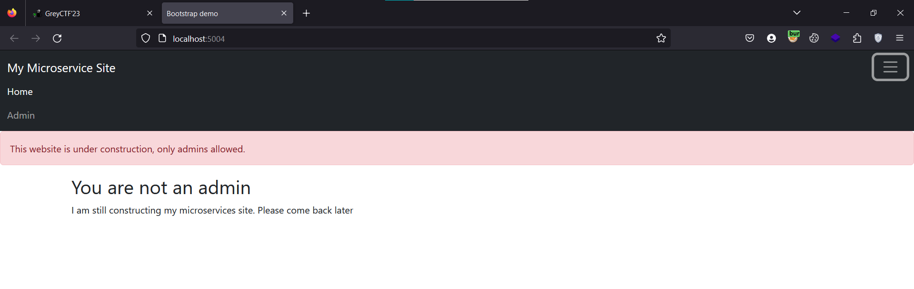
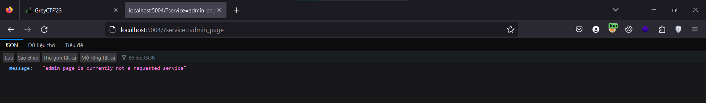
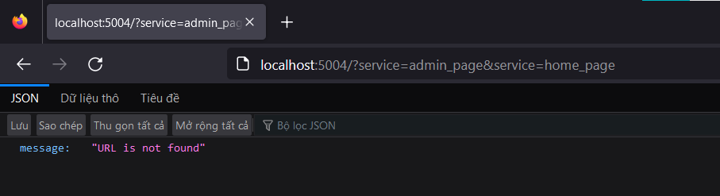
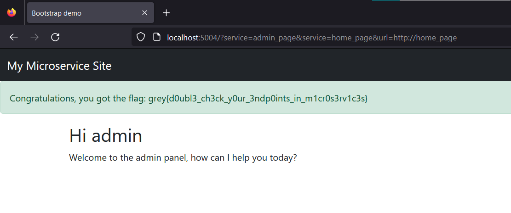

# Microservices



Khi mình truy cập vào `/` thì mình được một thông báo chỉ được admin mới cho phép truy cập, trong trang còn có 2 trang `Home và Admin`



Cả 2 trang này được truy cập thông qua param GET `/?service=` với giá trị là `home_page` và `admin_page`, ngoài ra mình không có các thông tin nào khác




Challenge cho mình source code, trong file `docker-compose.yml` này có 3 service là `admin, homepage, gateway`

```
version: '3.7'

x-common-variables: &common-variables
   ADMIN_COOKIE: fake_cookie
   FLAG: grey{fake_flag}


services:
  admin:
    build: ./admin_page
    container_name: microserv-admin_page
    environment:
       <<: *common-variables
    networks:
      - backend

  homepage:
    build: ./homepage
    container_name: microserv-home_page
    environment:
       <<: *common-variables
    networks:
      - backend
      

  gateway:
    build: ./gateway
    container_name: microserv-gateway
    ports:
      - 5004:80
    networks:
      - backend

networks:
  backend: {}

```

Về `admin service` tại `/admin_page/app.py` chỉ có 1 route `/`, chương trình kiểm tra GET param `service` phải khác với `"admin_page"`, qua được bước này thì chương trình gửi 1 request đến một địa chỉ url được GET param `url` với cookie của admin

```python
from fastapi import FastAPI, Request, Response
from dotenv import load_dotenv
from requests import get
import os

load_dotenv()
admin_cookie = os.environ.get("ADMIN_COOKIE", "FAKE_COOKIE")

app = FastAPI()


@app.get("/")
async def index(request: Request):
    """
    The base service for admin site
    """

    # Currently Work in Progress
    requested_service = request.query_params.get("service", None)
    if requested_service is None:
        return {"message": "requested service is not found"}

    # Filter external parties who are not local
    if requested_service == "admin_page":
        return {"message": "admin page is currently not a requested service"}

    # Legit admin on localhost
    requested_url = request.query_params.get("url", None)
    if requested_url is None:
        return {"message": "URL is not found"}

    # Testing the URL with admin
    response = get(requested_url, cookies={"cookie": admin_cookie})
    return Response(response.content, response.status_code)

```

Về `homepage service` tại file `/homepage/app.py` trong này chỉ có 1 route `/`, tại đây chương trình kiểm tra cookie của mình có giống cookie của admin hay không rồi trả về flag

```python
from flask import Flask, request, render_template, Response, make_response
from dotenv import load_dotenv
import os

load_dotenv()
admin_cookie = os.environ.get("ADMIN_COOKIE", "FAKE_COOKIE")
FLAG = os.environ.get("FLAG", "greyctf{This_is_fake_flag}")

app = Flask(__name__)


@app.route("/")
def homepage() -> Response:
    """The homepage for the app"""
    cookie = request.cookies.get("cookie", "Guest Pleb")

    # If admin, give flag
    if cookie == admin_cookie:
        return render_template("flag.html", flag=FLAG, user="admin")

    # Otherwise, render normal page
    response = make_response(render_template("index.html", user=cookie))
    response.set_cookie("cookie", cookie)
    return response


if __name__ == "__main__":
    app.run(debug=True)

```

Tại `gateway service` cũng chỉ có 1 route, `microservice` sẽ được gán với GET param `service` mặc định là `home_page` sau đó kiểm tra giá trị của `microservice` có tồn tại trong `routes` hay không, nếu có thì gửi một request GET đến service đã cho với các param mà mình đã gửi tới route này 

```python
// app.py
from flask import Flask, request, abort, Response
from requests import get
from constant import routes, excluded_headers
import sys

app = Flask(__name__)


@app.route("/", methods=["GET"])
def route_traffic() -> Response:
    """Route the traffic to upstream"""
    microservice = request.args.get("service", "home_page")
    route = routes.get(microservice, None)
    if route is None:
        return abort(404)

    # Fetch the required page with arguments appended
    raw_query_param = request.query_string.decode()
    print(f"Requesting {route} with q_str {raw_query_param}", file=sys.stderr)
    res = get(f"{route}/?{raw_query_param}")

    headers = [
        (k, v) for k, v in res.raw.headers.items() if k.lower() not in excluded_headers
    ]
    return Response(res.content, res.status_code, headers)


@app.errorhandler(400)
def not_found(e) -> Response:
    """404 error"""
    return Response(f"""Error 404: This page is not found: {e}""", 404)

// constant.py
routes = {"admin_page": "http://admin_page", "home_page": "http://home_page"}
excluded_headers = [
    "content-encoding",
    "content-length",
    "transfer-encoding",
    "connection",
]

```

Sau khi đọc kĩ source code trên thì mình có phát hiện ra ở `admin service` là sử dụng FastAPI còn 2 service còn lại là sử dụng Flask. Mình có tìm hiểu thì sự khác nhau ở 2 thư viện này ở đoạn GET param, ví dụ mình gửi đến cả 2 các param như sau `/?q=321&q=123` thì ở FastAPI sẽ GET param q có giá trị là 123 còn Flask sẽ có giá trị là 321. Vậy nên khi mình gửi tới gateway `/?service=admin_page&service=home_page` thì tại gateway chương trình sẽ hiểu là service ở đây là `admin_page` và gửi các param này đến `http://admin_page`, tại admin_page thì chương trình sẽ hiểu là service ở đây là `home_page` và mình bypass được đoạn check `admin_page`

Kết quả này cho mình thấy mình đã bypass được đoạn check `admin_page`



Mình thêm vào param `url` để chương trình gửi request với cookie của admin, url của mình ở đây sẽ là `http://home_page`

Kết quả



`Flag: grey{d0ubl3_ch3ck_y0ur_3ndp0ints_in_m1cr0s3rv1c3s}`