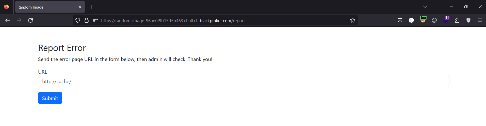

# random-image


Giao diện trang web là một trang hiển thị hình ảnh, các hình ảnh và nội dung được random 


Trong đó có chức năng `Report Error` gửi một URL và admin sẽ vào check



Trong source code có viết flag nằm ở cột `description` bảng `img`

```javascript
app.listen(PORT, HOST, () => {
    console.log(`Web is running on http://${HOST}:${PORT}`);
    db.serialize(() => {
        db.run('CREATE TABLE img (path TEXT, description TEXT)');
        db.run('INSERT INTO img values ("cat.jpg", "I\'m not sure why I like cats so much")');
        db.run('INSERT INTO img values ("sea.jpg", "All I need is a good dose of vitamin sea")');
        db.run(`INSERT INTO img values ("flag.jpg", "The flag for this challenge is ${process.env.FLAG}")`);
    });
});
```

Các nội dung và hình ảnh hiển thị trên trang web được lấy từ bảng `img` mà `description` chỉ hiển thị 42 kí tự đầu cho nên flag không được hiển thị hết

```javascript
app.get('/', (req, res) => {
    db.each('select path, substring(description, 0, 42) as description from img order by random() limit 1', (err, row) => {
        return res.render('index', { path: row.path, description: row.description });
    });
});
```

Trong chương trình có tồn tại chức năng của `admin` thực hiện truy vấn thông qua `/admin/:column/:table`, kiểm tra header `authorization` có phải là admin hay không và thực hiện kiểm tra các đầu vào của cột và bảng

```javascript
app.get('/admin/:column/:table', (req, res) => {
    if (!req.headers["authorization"] || req.headers["authorization"] !== process.env.AUTHZ_KEY) {
        return res.send("You don't have permission to view this page");
    }
	
	const hasUpperCase = (string) => /[A-Z]/.test(string);

    let column = req.params.column;
    let table = req.params.table;

    if (!column || typeof (column) !== "string") {
        return res.send("Missing column name");
    }
    if (column.length > 4) {
        return res.send("Column name is too long");
    }

    if (!table || typeof (table) !== "string") {
        return res.send("Missing table name");
    }
    if (table.length > 30) {
        return res.send("Table name is too long");
    }
	
	if (hasUpperCase(column) || hasUpperCase(table)) {
		return res.send('Allow lowercase character only!');
	}

    let regex = /path|description|img/gi;
    column = regex.test(column) ? "*" : column;
    table = regex.test(table) ? "sqlite_schema" : table;
    try {
        db.all(`select ${column} from ${table}`, (err, rows) => {
            return res.send(rows);
        });
    } catch (e) {
        return res.send("Query error!");
    }
})
```

Chức năng `/report` truy cập vào trang web với quyền admin mà không qua kiểm tra url kĩ càng nên mình có thể lấy được `authorization` của admin bằng cách gửi tới exploit server của mình

```javascript
app.get('/report', (req, res) => {
    return res.render('report');
})

app.post('/report', async (req, res) => {
    let url = req.body.url;
    console.log(url);
    if (!url || typeof (url) !== "string") {
        return res.send("Missing URL");
    }
    let response = await fetch(`http://browser:8002/report`, {
        method: "POST",
        headers: { 'Content-Type': 'application/json' },
        body: JSON.stringify({
            url: url,
        }),
    })
    response = await response.json();
    console.log(response);
    if (response.error === 0) return res.send("Report OK. Admin will check soon!");
    return res.send(response.data);
});

// report.js
const puppeteer = require('puppeteer');

async function run(url) {
	let browser;

	try {
		module.exports.open = true;
		browser = await puppeteer.launch({
			headless: true,
			pipe: true,
			args: ['--incognito', '--no-sandbox', '--disable-setuid-sandbox'],
		});

		let page = (await browser.pages())[0];
		await page.setExtraHTTPHeaders({
			"authorization": process.env.AUTHZ_KEY
		})
		await page.goto(url, { waitUntil: "load", timeout: 5000 });
		await browser.close();
	} catch (e) {
		console.error(e);
		try { await browser.close() } catch (e) { }
	}

	module.exports.open = false;
}

module.exports = { open: false, run }
```


Có được `authorization` mình có thể thực hiện truy vấn


Cột và bảng của mình phải đảm bảo các điều kiện như trong code như độ dài của cột phải <=4, độ dài của bảng phải <=30,...

```javascript
    let column = req.params.column;
    let table = req.params.table;

    if (!column || typeof (column) !== "string") {
        return res.send("Missing column name");
    }
    if (column.length > 4) {
        return res.send("Column name is too long");
    }

    if (!table || typeof (table) !== "string") {
        return res.send("Missing table name");
    }
    if (table.length > 30) {
        return res.send("Table name is too long");
    }
	
	if (hasUpperCase(column) || hasUpperCase(table)) {
		return res.send('Allow lowercase character only!');
	}

```

Sau đó sử dụng regex để kiểm tra cột và bảng có khớp hay không, nếu true thì gán thành `*` và `sqlite_schema` tương ứng

```javascript
    let regex = /path|description|img/gi;
    column = regex.test(column) ? "*" : column;
    table = regex.test(table) ? "sqlite_schema" : table;
    try {
        db.all(`select ${column} from ${table}`, (err, rows) => {
            return res.send(rows);
        });
    } catch (e) {
        return res.send("Query error!");
    }
```

Và ở đây có một lỗi ở `regex.test()` với tag `/g` chỉ match được 1 lần, nên nếu như mình gửi `/admin/img/img` thì câu query của mình sẽ là `select * from img` -> ra flag


`Flag: HCMUS-CTF{8a5701368ff8e52328b25901d8d8996b}`