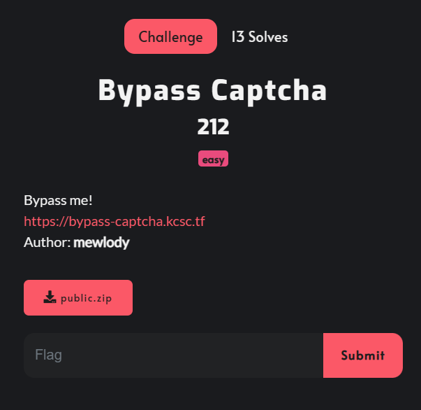
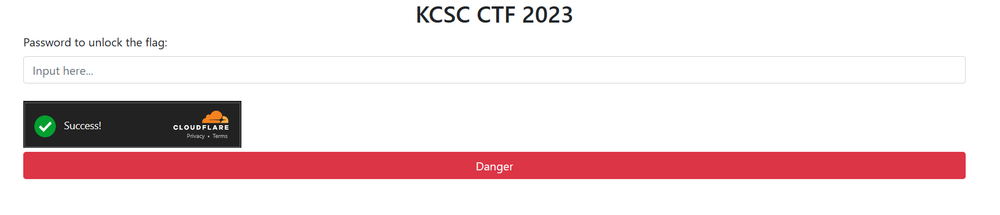
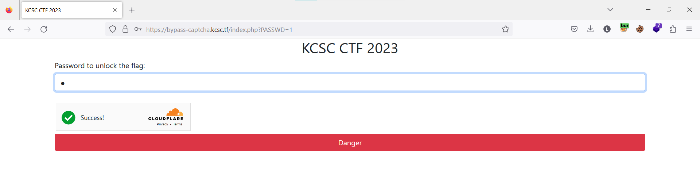
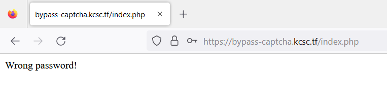
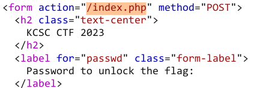
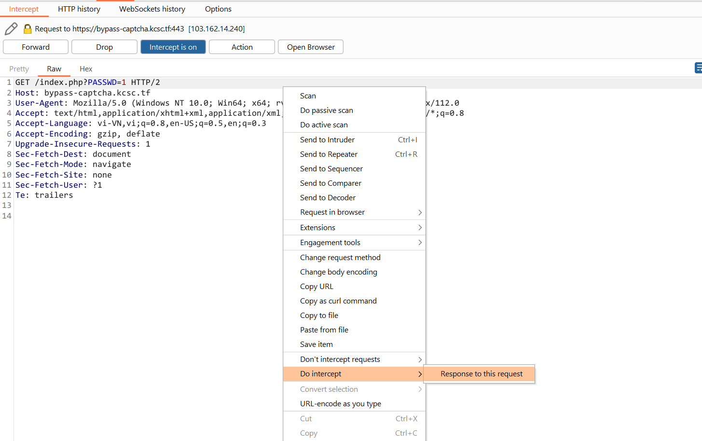
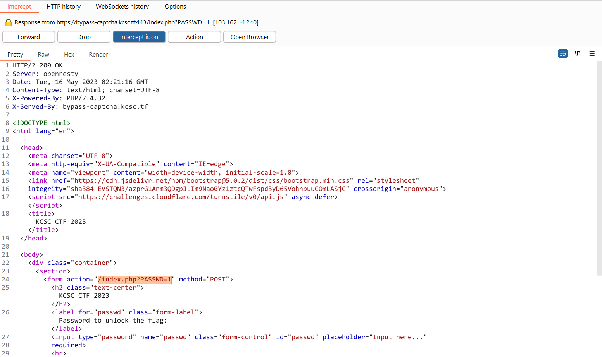
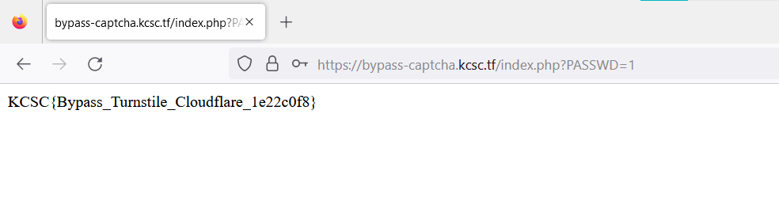

# Bypass Captcha



Challenge cho mình source code

```
public
├── Dockerfile
├── docker-compose.yml
├── src
│   ├── config.php
│   └── index.php
└── www-data.conf
```

`index.php`

```php
<?php
include 'config.php';

if ($_SERVER['REQUEST_METHOD'] == 'POST') {
    $passwd = $_POST['passwd'];
    $response = $_POST['cf-turnstile-response'];
    if ($passwd === '' || $response === '') {
        die('Pls verify captcha or input password');
    }
    $ch = curl_init($SITE_VERIFY);
    curl_setopt($ch, CURLOPT_POST, true);
    curl_setopt($ch, CURLOPT_POSTFIELDS, [
        'secret' => $SECRET_KEY,
        'response' => $response
    ]);
    curl_setopt($ch, CURLOPT_RETURNTRANSFER, true);
    $data = curl_exec($ch);
    curl_close($ch);
    $data = json_decode($data);
    $now = time();
    $challenge_ts = strtotime($data->challenge_ts);
    if ($data->success == 1 && $now - $challenge_ts <= 5) {
        if ($passwd === $PASSWD) {
            die($FLAG);
        } else {
            die('Wrong password!');
        }
    } else {
        die('Verify captcha failed!');
    }
}
?>
```

Chương trình cho phép mình nhập vào password, cùng với đó là một reCAPTCHA được tạo bằng CloudFlare



Chương trình sẽ thực hiện kiểm tra password mình nhập vào có phải là PASSWD của chương trình đã define trước đó hay không, nếu đúng thì trả về flag. Nhưng mà trước đó thì chương trình phải kiểm tra bước xác thực captcha có thành công hay không và thời gian xác thực phải <=5

```php
    if ($data->success == 1 && $now - $challenge_ts <= 5) {
        if ($passwd === $PASSWD) {
            die($FLAG);
        } else {
            die('Wrong password!');
        }
    } else {
        die('Verify captcha failed!');
    }
```

Trong file `config.php` có các biến được khởi tạo từ các biến môi trường

```php
<?php

$SITE_VERIFY = getenv('SITE_VERIFY');
$PASSWD = getenv('PASSWD');
$FLAG = getenv('FLAG');
$SITE_KEY = getenv('SITE_KEY');
$SECRET_KEY = getenv('SECRET_KEY');
parse_str($_SERVER['QUERY_STRING']);
error_reporting(0);
```

Ban đầu mình không đọc kĩ file config này nên mình đã đi rất rất xa :))). Trong file này có config `parse_str($_SERVER['QUERY_STRING']);`, có nghĩa là nó sử dụng hàm `parse_str()` để phân tích chuỗi truy vấn trong biến `$_SERVER['QUERY_STRING']`. Hàm `parse_str()` chuyển đổi chuỗi truy vấn thành các biến và giá trị tương ứng. Ví dụ như nếu chuỗi truy vấn của mình là `POST /?PASSWD=1` thì sau khi gọi `parse_str()`, mình có thể sử dụng các biến `$PASSWD` với giá trị tương ứng là `1`

Ban đầu mình cũng làm theo ý tưởng như vậy



Nhưng kết quả là fail



Lý dó là vì form này gửi request đến `/index.php` mà không phải là `/index.php?PASSWD=1`



Vậy nên mình cần phải sửa đổi lại response ở đoạn này để chương trình request đến `/index.php?PASSWD=1`

Để làm được như vậy mình mở Intercept và bắt request `GET /index.php?PASSWD=1`, sau đó chọn `Response to this request` như hình dưới, sau đó chọn `Forward`



Sau đó mình có được response của request vừa rồi, mình sẽ sửa lại form này thành `/index.php?PASSWD=1` và tắt nhanh Intercept



Nhanh tay nhập password và gửi form đi vậy là mình có được flag



`Flag: KCSC{Bypass_Turnstile_Cloudflare_1e22c0f8}`