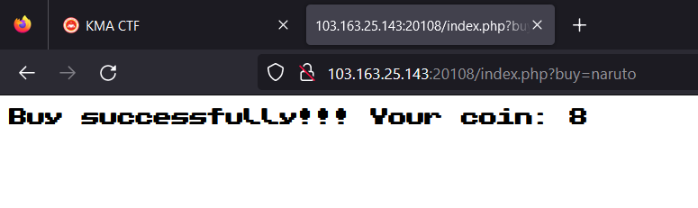
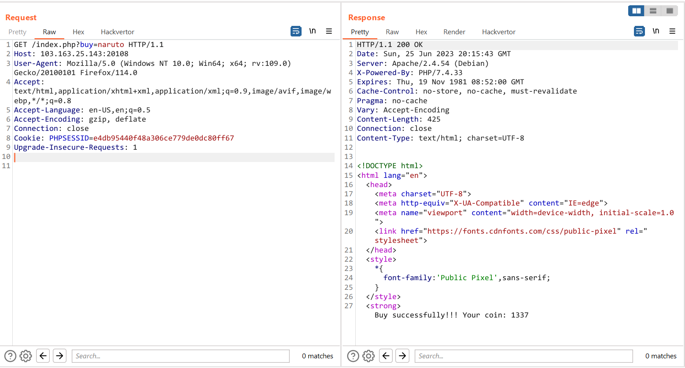

# Ninja Shop


Trang web trả về một login form, có cả chức năng register


Mình thử reg 1 account và login thử thì trang web trả về một trang `Ninja Shop` 


`Buy Flag` thì trả về `Try harder!!! =))) ` :v


Còn các Ninja còn lại thì đồng giá 1 xu



Challenge cho source code như sau

```
.
├── Dockerfile
├── db
│   └── db.sql
├── docker-compose.yml
├── php.ini
└── src
    ├── config.php
    ├── imgs
    │   ├── flag.png
    │   ├── kakashi.png
    │   ├── naruto.png
    │   └── sasuke.png
    ├── index.php
    ├── login.php
    ├── profile.php
    └── register.php

3 directories, 13 files
```

Challenge này sử dụng MySQL để thực hiện các thao tác với database

Trong file `config.php` có khởi tạo một hàm `waf()` kiểm tra đầu vào để phòng chống sqli

```php
function waf($input) {
    // Prevent sqli -.-
    $blacklist = join("|", ["sleep", "benchmark", "order", "limit", "exp", "extract", "xml", "floor", "rand", "count", "or" ,"and", ">", "<", "\|", "&","\(", "\)", "\\\\" ,"1337", "0x539"]);
    if (preg_match("/${blacklist}/si", $input)) die("<strong>Stop! No cheat =))) </strong>");
    return TRUE;
}
```

Ở phần register và login thì đều có thể sqli được ở username, giới hạn độ dài của username là 26 và fullname là 10

```php
// register.php

<?php require 'config.php'; ?>

<?php
    if (!empty($_SESSION['username']) && !empty($_SESSION['uid']) )
        header('Location: index.php');
    
    if ( $_SERVER['REQUEST_METHOD'] !== "POST" )
        die(<<<EOF
        ... HTML ...
        EOF);

    foreach (array("username", "password", "fullname") as $value) {
        if (empty($_POST[$value])) die("<aside>Missing parameter!</aside>");
        waf($_POST[$value]);
    }
    if (strlen($_POST["username"]) > 26) die("<aside>Username too long<aside>");
    if (strlen($_POST["fullname"]) > 10) die("<aside>Fullname too long<aside>");
    
    // check account is exists
    if ( $connection->query(sprintf('SELECT * FROM users WHERE username="%s" and password="%s"', $_POST["username"], md5($_POST["password"])))->fetch_assoc()["uid"] )
        die("<strong>User is exists</strong>");

    $result = $connection->query(sprintf('INSERT INTO users(username, password, fullname) VALUES ("%s", "%s", "%s")', $_POST["username"], md5($_POST["password"]), $_POST["fullname"]));

    if ($result) {
        $uid = $connection->query(sprintf('SELECT uid FROM users WHERE username="%s" and password="%s" limit 0,1', $_POST["username"], md5($_POST["password"])))->fetch_assoc()["uid"];
        if ($uid) {
            if ($connection->query(sprintf('INSERT INTO coins(coin, uid) VALUES (100, %d)', (int)$uid)))
                die("<strong>User created successfully</strong>");
        }
    } else die("<strong>Something went wrong! Try again!</strong>");
?>
    
// login.php
<?php require 'config.php'; ?>

<?php
    if (!empty($_SESSION['username']) && !empty($_SESSION['uid']) )
        header('Location: index.php');

        if ( $_SERVER['REQUEST_METHOD'] !== "POST" )
        die(<<<EOF
            ... HTML ...
            EOF
        );
    
    foreach (array("username", "password") as $value) {
        if (empty($_POST[$value])) die("<aside>Missing parameter!</aside>");
        waf($_POST[$value]);
    }

    if (strlen($_POST["username"]) > 26) die("<aside>Username too long<aside>");
    $result = $connection->query(sprintf('SELECT * FROM users WHERE username="%s" AND password="%s" limit 0,1', $_POST["username"], md5($_POST["password"])))->fetch_assoc();
    if(empty($result))
        die(<<<EOF
            <strong>Username or password is wrong</strong>
            <meta http-equiv="refresh" content="1;url=login.php" />
        EOF);
    else {
        $_SESSION["username"] = $result['username'];
        $_SESSION["uid"] = $result['uid'];
        die(<<<EOF
            <strong>Welcome brooo!! Buy flag with me !!!! </strong>
            <meta http-equiv="refresh" content="1;url=index.php" />
        EOF);
    }

?>

```

Tại `index.php` cho mình biết được là mình cần có 1337 xu để có được `flag`

```php
<?php require 'config.php'; ?>

<?php
if (empty($_SESSION['username']) || empty($_SESSION['uid']) )
    die(<<<EOF
        <meta http-equiv="refresh" content="0;url=login.php" />
    EOF);

$ninjas = ["naruto", "sasuke", "kakashi", "flag"];
if ( isset($_GET["buy"]) ) {
    if (!in_array($_GET["buy"], $ninjas)) die("<aside>Product not available yet</aside>");
    $coin = $connection->query(sprintf("SELECT coin FROM coins WHERE uid=%d limit 0,1", (int)$_SESSION["uid"]))->fetch_assoc()["coin"];
    if ($_GET["buy"] === "flag") {
        if ( (int)$coin === 1337 /*(int)$coin > 1337 */  ) {        // must be 1337 :v
            $connection->query(sprintf("UPDATE coins SET coin=%d-1337 WHERE uid=%d", (int)$coin, (int)$_SESSION["uid"]));
            die("<strong>Nice brooo!! Are you a millionaire??? Here your flag: $FLAG</strong>");
        }
        else die("<strong>Try harder!!! =))) </strong>");
    }
    else {
        if ((int)$coin > 1) {
            $result = $connection->query(sprintf("UPDATE coins SET coin=%d-1 WHERE uid=%d", (int)$coin, (int)$_SESSION["uid"]));
            if ($result) die(sprintf("<strong>Buy successfully!!! Your coin: %d", (int)$coin - 1));
        }
        else die("<strong>Coin do not enough!! =(( </strong>");
    }
}
?>
```

`profile.php` là trang hiển thị thông tin của user, có chức năng update coin thông qua `GET["new_balance"]`, giá trị mới này có giới hạn độ dài là 2 và phải pass được qua hàm `waf()`

```php
<?php require 'config.php'; ?>

<h1>Profile</h1>
<?php
    if (empty($_SESSION['username']) || empty($_SESSION['uid']) )
        die(<<<EOF
            <meta http-equiv="refresh" content="0;url=login.php" />
        EOF);
    
    $fullname = $connection->query(sprintf("SELECT fullname FROM users WHERE username='%s' limit 0,1", $_SESSION["username"]));
    if (gettype($fullname) !== "boolean") echo "<h2>Hello: ". $fullname->fetch_assoc()["fullname"] ."</h2>";
    else echo "<h2>Hello: Anonymous </h2>";
    $coin = $connection->query(sprintf("SELECT * FROM coins WHERE uid=%d limit 0,1", (int)$_SESSION["uid"]))->fetch_assoc()["coin"];
    echo <<<EOF
        <h2>Your coin: $coin</h2>
    EOF;

    // Ran out of money?? No need to worry, you can reset carefree!! But only limited from 1-99 coins =)))
    if ( isset($_GET["new_balance"]) and waf($_GET["new_balance"]) ) {
        if (strlen($_GET["new_balance"]) > 2) die("<strong>Only allow from 1 to 99</strong>");
        else {
            $result = $connection->query(sprintf("UPDATE coins SET coin=%s WHERE uid=%d", $_GET["new_balance"], (int) $_SESSION['uid']));
            if ($result) die("<strong>Your coin has been updated</strong>");
            else die("<strong>0ops!!! Coin update has failed</strong>");
        }
    } 
?>
```


Flag là một biến môi trường, không hề nằm trong database, vậy nên mục tiêu của mình chỉ có thể là khiến cho số coin của mình = 1337 hoặc lớn hơn xíu bởi vì hàm `waf()` đã có filter `1337`, để đạt được mục đích này thì mình cần phải inject vào database bằng một cách nào đó rồi đổi giá trị coin của mình

Tại các phần register và login thì mình cũng đã thử inject được và thành công nhưng mình lại không biết cách để làm sao update được số coin của mình, tại đây mình chỉ có thể inject để login và register thành công thôi chứ không còn làm gì được khác


Mình cũng thử tìm ở các trang khác thì có trang `profile.php` cũng có thể inject được ở phần số coin


Nhưng mà độ dài ở đây giới hạn là 2 nên mình cũng không làm gì được hơn nữa. 

Sau khi mình xin thêm hint của anh trai @nhienit thì mình đã biết rằng mình đã bỏ qua một số thứ đáng chú ý, cụ thể là ở trang `profile.php` có thực hiện câu query này

```php
$fullname = $connection->query(sprintf("SELECT fullname FROM users WHERE username='%s' limit 0,1", $_SESSION["username"]));
```

Ban đầu mình cũng không để ý cho lắm nhưng mà ở đây có một sự bất thường là `username='%s'` sử dụng kí tự `'` khác với các trang register và login là `"`. Đây chính là lỗi `Second-order SQL injection`, về lỗ hổng này xảy ra khi mình inject một đoạn query nhưng không thực thi ở câu query này mà lại thực thi ở câu query khác. Cụ thể hơn là nếu như mình reg một account có username là `a'#` thì khi login thì chương trình vẫn nhận `a'#` là một user hợp lệ, nhưng khi vào trang profile thì lại xảy ra lỗi SQLI vì khi này câu query của mình có dạng

```sql
SELECT fullname FROM users WHERE username='a'#' limit 0,1
```

Vậy nên lúc này chương trình sẽ select fullname của user có `username='a'` chứ không phải là `a'#` như mình đã đăng kí ở trên. Oke vậy giờ mình cần phải làm gì khi mà mình chỉ có thể update coin với 2 kí tự :D ?

Mình stuck đoạn này khá lâu và được gợi ý cách sử dụng một variable có giá trị mình cần :D, rồi sau đó sử dụng biến này để set cho coin bởi vì tại câu query set coin sử dụng `%s` nên mình có thể làm được điều này

```sql
UPDATE coins SET coin=%s WHERE uid=%d
```

Tạo một user có username là một câu query khởi tạo biến `@z:=1339`


Login


Set coin bằng biến `@z` -> thành công 


Mua naruto để giảm coin xuống 1337



Mua flag :D


`Flag: KMACTF{Bruhhhhhh!!Lmaoooooo!!m4ke_SQL1_gr34t_4g4in!!!!!}`
