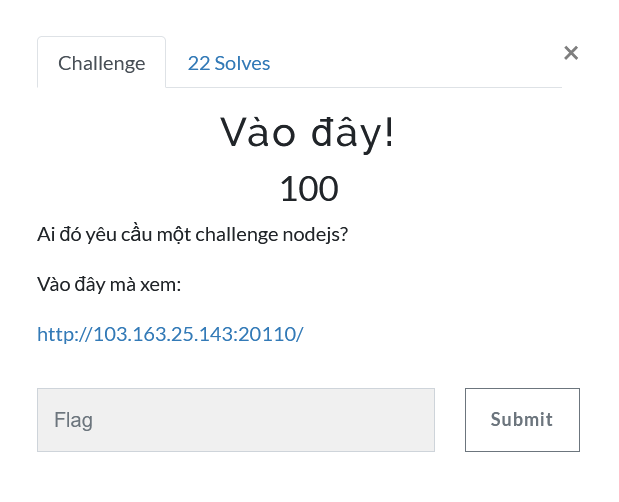
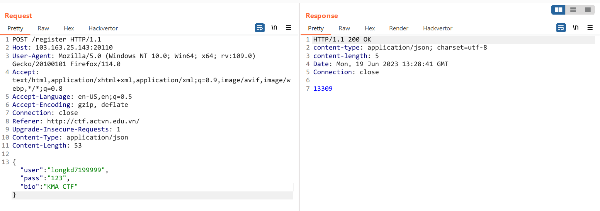
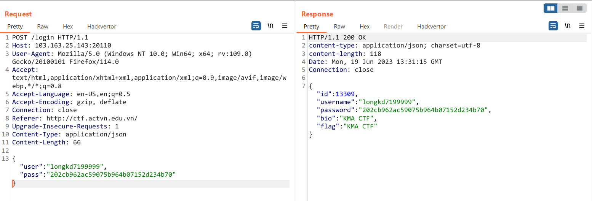
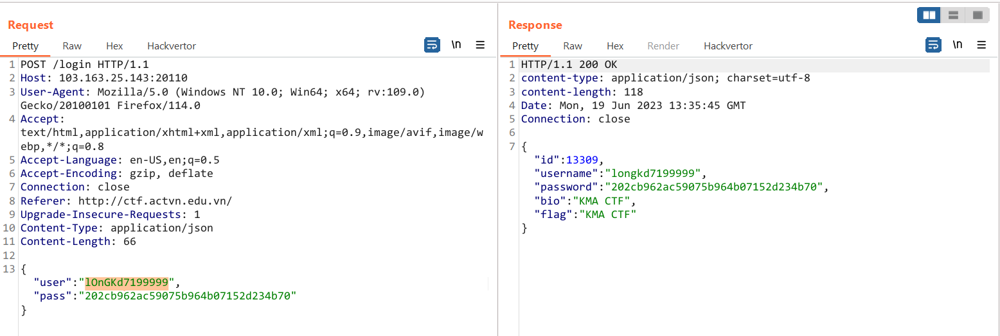
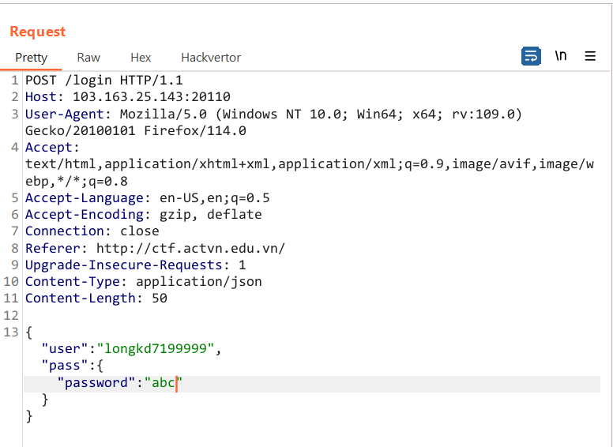
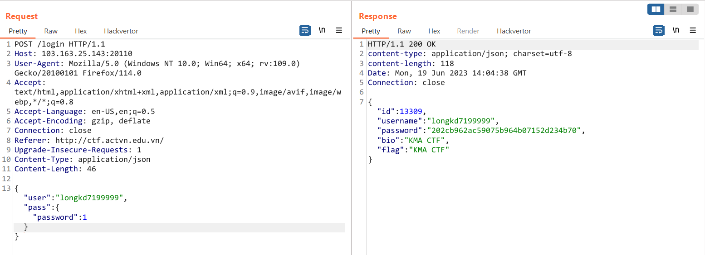
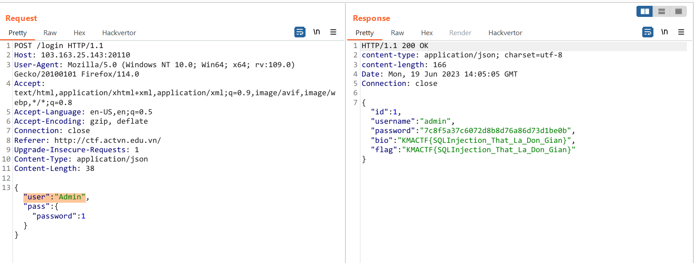

# Vào đây!



Truy cập vào trang web thì mình nhận được source code

```php
const fs = require('fs')
const app = require('fastify')()
const crypto = require('crypto')
const md5 = d => crypto.createHash('md5').update(d).digest('hex')
const dbPromisePool = require('mysql2').createPool({
  host: 'mysql',
  user: 'root',
  database: 'local_db',
  password: 'local_password'
}).promise()


// app.setErrorHandler((error, req, resp) => {
//   console.error(`[fastify]`, error)
//   resp.status(503).send({ error: 'Vui lòng thử lại sau.' })
// })

app.addHook('preHandler', async (req, resp) => {
  resp.status(200).header('Content-Type', 'application/json')
})

app.post('/login', async req => {
  if (req.body.user === 'admin') return;
  const [rows] = await dbPromisePool.query(`select *, bio as flag from users where username = ? and password = ? limit 1`, [req.body.user, req.body.pass])
  return rows[0]
})

app.post('/register', async req => {
  const [rows] = await dbPromisePool.query(`insert users(username, password, bio) values(?, ?, ?)`, [req.body.user, md5(req.body.pass), req.body.bio])
  if (rows.insertId) return String(rows.insertId)
  return { error: 'Lỗi, vui lòng thử lại sau' }
})

app.get('/', async (req, resp) => {
  resp.status(200).header('Content-Type', 'text/plain')
  return fs.promises.readFile(__filename)
})

app.listen({ port: 3000, host: '0.0.0.0' }, () => console.log('Running', app.addresses()))
```

Như trong source code đã viết thì ở bài này mình chỉ có 2 chức năng register và login. 

Chức năng register sử dụng câu truy vấn `insert users(...)` để thêm thông tin người dùng vào database với đầu vào là các giá trị `user, pass, bio` được post lên với format json



Còn chức năng login thì sử dụng câu truy vấn `select` để lấy dữ liệu với các dữ liệu tương ứng `user và password encrypt hash md5` 



Mình có để ý ở dòng này có ghi `if (req.body.user === 'admin') return;` nên mình dự đoán flag nằm ở cột bio của user admin, và dòng này mình có thể bypass được bằng cách uppercase  



Challenge này sử dụng mysql2 để truyền các param vào câu query cho an toàn hơn, tuy nhiên chương trình không có các thao tác kiểm tra đầu vào dữ liệu, nên việc mình có thể truyền vào các object hay một dữ liệu khác là hoàn toàn có thể

Ví dụ như khi mình truyền vào một param là một object như bên dưới thì khi đó câu query của mình sẽ là 

```sql
select *, bio as flag from users where username = longkd7199999 and password = `password` = 'abc' limit 1
```



Rồi mình search các tips/tricks về trường hợp này và tìm được một bài wu [google-ctf-2020/web/log-me-in.md](https://github.com/eskildsen/google-ctf-2020/blob/master/web/log-me-in.md)

Đối với trường hợp này câu truy vấn của mình sẽ kiểm tra 

```
password = `password` = 'abc'
```

thay vì kiểm tra `password = 'abc'`

```
password = `password` sẽ trả về giá trị là 1 vì đây là so sánh 2 cột với nhau -> kết quả trả về 1
rồi sau đó kiểm tra 1 = 'abc' trả về giá trị 0 vì nó sai :D 
khi này mình sửa lại abc thành 1 là kết quả của câu query sẽ là 1, login thành công mà không cần password, SQL Injection thành công
```



Đổi lại `"user":"Admin"` và có flag



`Flag: KMACTF{SQLInjection_That_La_Don_Gian}`