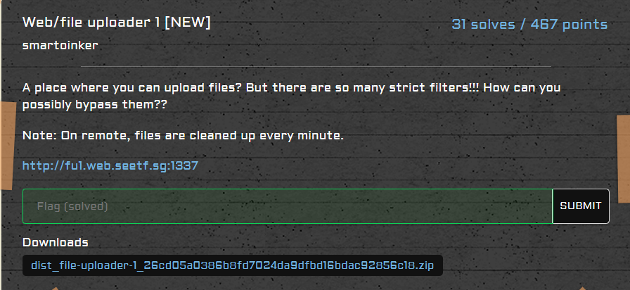
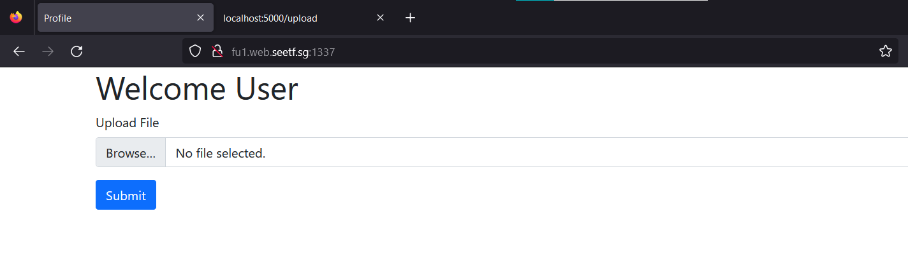
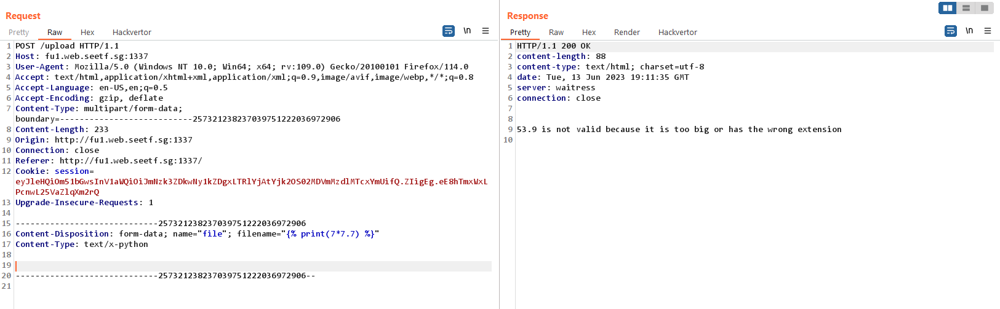
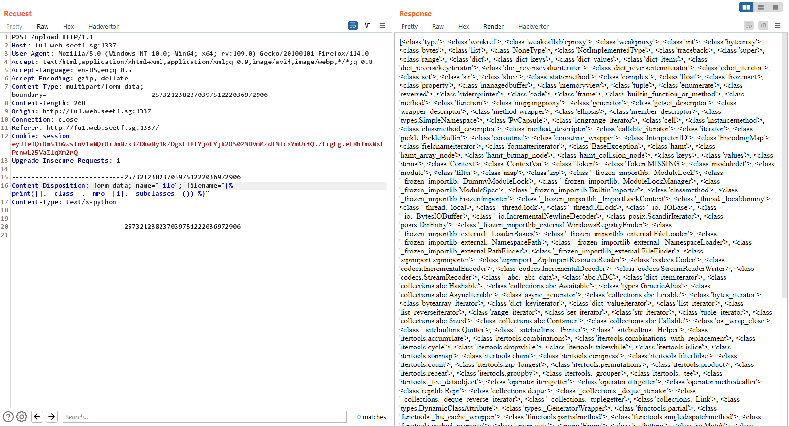
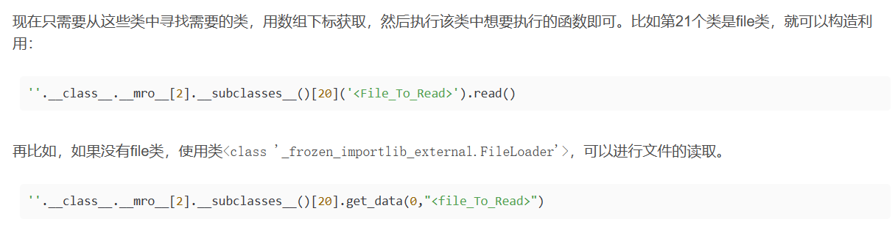
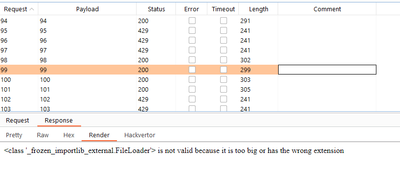
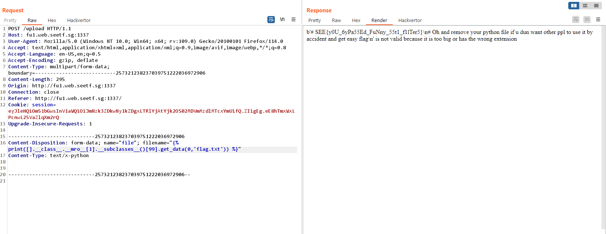

# Web/file uploader 1 [NEW]



Giao diện trang web là một trang upload file bình thường, ngoài ra không có chức năng nào khác



Đọc source code 

```python
UPLOAD_FOLDER = './static'
ALLOWED_EXTENSIONS = {'pdf', 'png', 'jpg', 'jpeg', 'gif'}


def get_fileext(filename):
    fileext = filename.rsplit('.', 1)[1].lower()
    if '.' in filename and filename.rsplit('.', 1)[1].lower() in ALLOWED_EXTENSIONS:
        return fileext
    return None

@app.route('/upload', methods=['GET', 'POST'])
def upload_file():
    if request.method != 'POST':
        return redirect(url_for('profile'))
    
    # check if the post request has the file part
    if 'file' not in request.files:
            return redirect(url_for('profile'))
    file = request.files['file']

    # If the user does not select a file, the browser submits an empty file without a filename.
    if file.filename == '':
        return redirect(url_for('profile'))
    
    fileext = get_fileext(file.filename)

    file.seek(0, 2) # seeks the end of the file
    filesize = file.tell() # tell at which byte we are
    file.seek(0, 0) # go back to the beginning of the file

    if fileext and filesize < 10*1024*1024:
        if session['ext'] and os.path.exists(os.path.join(UPLOAD_FOLDER, session['uuid']+"."+session['ext'])):
            os.remove(os.path.join(UPLOAD_FOLDER, session['uuid']+"."+session['ext']))
        session['ext'] = fileext
        filename = session['uuid']+"."+session['ext']
        file.save(os.path.join(UPLOAD_FOLDER, filename))
        return redirect(url_for('profile'))
    else:
        template = f"""
            {file.filename} is not valid because it is too big or has the wrong extension
        """
        l1 = ['+', '{{', '}}', '[2]', 'flask', 'os','config', 'subprocess', 'debug', 'read', 'write', 'exec', 'popen', 'import', 'request', '|', 'join', 'attr', 'globals', '\\'] 

        l2 = ['aa-exec', 'agetty', 'alpine', ... , 'zypper']
        

        for i in l1:
            if i in template.lower():
                print(template, i, file=sys.stderr)
                template = "nice try"
                break
        matches = re.findall(r"['\"](.*?)['\"]", template)
        for match in matches:
            print(match, file=sys.stderr)
            if not re.match(r'^[a-zA-Z0-9 \/\.\-]+$', match):
                template = "nice try"
                break
            for i in l2:
                if i in match.lower():
                    print(i, file=sys.stderr)
                    template = "nice try"
                    break
        return render_template_string(template)
```

Ban đầu mình dự đoán bài này là lỗi upload file nhưng mà nhìn vào các blacklist `l1, l2` để filter `template` thì mình nghi ngờ đến lỗi SSTI

Fuzzing các kiểu với file upload nhưng mà không thành công, mình quay qua phân tích source code để thử khai thác với lỗi SSTI

```python
		template = f"""
            {file.filename} is not valid because it is too big or has the wrong extension
        """        
    	l1 = ['+', '{{', '}}', '[2]', 'flask', 'os','config', 'subprocess', 'debug', 'read', 'write', 'exec', 'popen', 'import', 'request', '|', 'join', 'attr', 'globals', '\\'] 

        l2 = ['aa-exec', 'agetty', 'alpine', ... , 'zypper']
		for i in l1:
            if i in template.lower():
                print(template, i, file=sys.stderr)
                template = "nice try"
                break
        matches = re.findall(r"['\"](.*?)['\"]", template)
        for match in matches:
            print(match, file=sys.stderr)
            if not re.match(r'^[a-zA-Z0-9 \/\.\-]+$', match):
                template = "nice try"
                break
            for i in l2:
                if i in match.lower():
                    print(i, file=sys.stderr)
                    template = "nice try"
                    break
        return render_template_string(template)
```

Mình có thể control được `filename` nên khả năng xảy ra lỗi SSTI là khá cao, `filename` được đưa vào `template`, đầu tiên là kiểm tra với blacklist `l1`, trong danh sách này là các hàm, toán tử thường được sử dụng trong khai thác SSTI

```python
matches = re.findall(r"['\"](.*?)['\"]", template)
```

`matches` được khởi tạo bằng `re.findall` regex với `template`, kết quả của `matches` là các đoạn nằm trong dấu nháy đơn, nháy kép ví dụ như `'longkd719', "KCSC", 'KMA',...` 

 ```python
         for match in matches:
             print(match, file=sys.stderr)
             if not re.match(r'^[a-zA-Z0-9 \/\.\-]+$', match):
                 template = "nice try"
                 break
             for i in l2:
                 if i in match.lower():
                     print(i, file=sys.stderr)
                     template = "nice try"
                     break
 ```

Với từng kết quả của `matches` tiếp tục kiểm tra `re.match(r'^[a-zA-Z0-9 \/\.\-]+$', match)` phải khớp với regex này. Tiếp tục kiểm tra với blacklist `l2`, danh sách này là tập hợp các lệnh thực thi hệ thống

Thử fuzz với `filename=""` thì mình có kết quả



Tới đây thì khả năng cao mình cần phải bypass blacklist để khai thác SSTI, cụ thể là RCE hoặc là đọc file `flag.txt`

Nhưng mà vì chương trình đã filter gần hết các object mình thường dùng rồi nên mình cần phải tìm một class nào đó có thể thực hiện được mục đích của mình. Như ở đây mình đã có thể liệt kê được các `__subclasses__`, mình cần phải tìm một trong số class này

 

Mình có tìm được một nguồn [【WEB】SSTI | 狼组安全团队公开知识库 (wgpsec.org)](https://wiki.wgpsec.org/knowledge/ctf/SSTI.html) có liệt kê một số class 

```
75 <class '_frozen_importlib._ModuleLock'>
76 <class '_frozen_importlib._DummyModuleLock'>
77 <class '_frozen_importlib._ModuleLockManager'>
78 <class '_frozen_importlib._installed_safely'>
79 <class '_frozen_importlib.ModuleSpec'>
91 <class '_frozen_importlib_external.FileLoader'>
92 <class '_frozen_importlib_external._NamespacePath'>
93 <class '_frozen_importlib_external._NamespaceLoader'>
95 <class '_frozen_importlib_external.FileFinder'>
103 <class 'codecs.IncrementalEncoder'>
104 <class 'codecs.IncrementalDecoder'>
105 <class 'codecs.StreamReaderWriter'>
106 <class 'codecs.StreamRecoder'>
128 <class 'os._wrap_close'>
129 <class '_sitebuiltins.Quitter'>
130 <class '_sitebuiltins._Printer'>
```

Tiếp tục tìm với các class này để tìm cách khai thác [web安全-SSTI模板注入漏洞_ssti漏洞_Pattie.的博客-CSDN博客](https://blog.csdn.net/weixin_61956136/article/details/126076747)



Ở đây người ta nói rằng sử dụng `<class '_frozen_importlib_external.FileLoader'>` để đọc file

Tìm class này ở index 99 `filename=""`



payload

```
filename=""
```



`Flag: SEE{y0U_6yPa55Ed_FuNny_55t1_f1lTer5}`